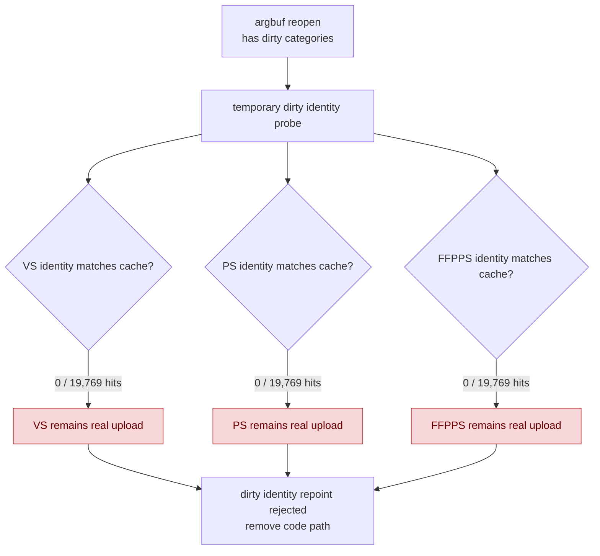

# Dirty Cbuf Identity Repoint Probe

**Question / hypothesis.** After [[state-churn-encode-encode-phase.10]], the
remaining cbuf update bucket is mostly real dirty uploads:
`encode_draw_argbuf_cbuf_update_cpu_ms=1779.695`, with VS as the largest child
(`1037.303ms / 401,319 calls`). Test whether the small
`reopen_partial_candidates` path marks categories dirty even when the current
VS/PS/FFPPS identity still matches the encoder-local cbuf cache. If so, dirty
categories could be repointed to cached slices instead of rebuilt/uploaded.

**Implementation tried.** A temporary branch added a `dirty_identity_probe`
inside the `hasAnyCbufDirty` reopen path. For dirty VS/PS/FFPPS categories it
computed the same category identity used by the no-dirty payload-mismatch probe,
checked the encoder-local `ArgbufCbufCache`, and would have cleared the dirty bit
after repointing the cached binding. FFPVS stayed untouched because it is still
deferred for viewport/pre-transformed patching.

The temporary branch was removed after the run because it produced zero hits and
added only probe overhead. It is recorded here as a rejected experiment, not as
part of the retained implementation.

**Method.**

```bash
bash scripts/tools/run_3dmark05_perf_probe.sh \
  --suffix argbuf-dirty-identity-r1 \
  --frame 50 \
  --no-gputrace \
  --no-encoder-breakdown \
  --timeout 180
```

The run hit the expected watchdog status `124` after writing artifacts.
`actual.png` is a normal visible GT1 frame with robot, flare, and HUD visible
(`FPS: 16`, `Time: 0:55.79`, `Frame: 987`).

**Result.** The A/B shape is close enough for a rejection: both runs reached
`1680` presents, draw density moved only `-0.13%`, and GPU command-buffer time
changed `+0.53%`. The probe itself found no reusable dirty identities.

| Counter | Fast append | Dirty identity probe | Delta / reading |
|---|---:|---:|---|
| `present_encoded` | 1,680 | 1,680 | same run length |
| `draw_calls` | 1,235,709 | 1,234,108 | -0.13% |
| `encode_draw_cpu_ms` | 16,911.650 | 16,918.967 | +0.04%, no CPU win |
| `encode_draw_argbuf_setup_cpu_ms` | 3,564.075 | 3,530.972 | noisy/slightly down |
| `encode_draw_argbuf_cbuf_update_cpu_ms` | 1,779.695 | 1,769.361 | noisy/slightly down |
| `dirty_identity_probe_cpu_ms` | - | 8.609 | added overhead |
| `dirty_identity_probe_calls` | - | 19,769 | only the partial-dirty reopen path |
| `dirty_identity_probe_vs_hits/misses` | - | 0 / 19,769 | no VS reuse opportunity |
| `dirty_identity_probe_ps_hits/misses` | - | 0 / 19,769 | no PS reuse opportunity |
| `dirty_identity_probe_ffp_ps_hits/misses` | - | 0 / 19,769 | no FFPPS reuse opportunity |
| `encode_draw_argbuf_cbuf_update_vs_cpu_ms` | 1,037.303 | 1,035.601 | unchanged |
| `encode_draw_argbuf_cbuf_update_ps_cpu_ms` | 466.415 | 463.302 | unchanged |
| `encode_draw_argbuf_cbuf_update_ffp_ps_cpu_ms` | 107.314 | 106.536 | unchanged |



**Verdict.** Rejected. The partial-dirty reopen path is not a hidden cache-reuse
opportunity for GT1; dirty VS/PS/FFPPS categories have different identities when
they are dirty. Keeping the probe would add overhead without reducing uploads.

**Next.** Do not pursue dirty-category identity repoint for GT1. The remaining
cbuf work needs a different mechanism: reduce how often dirty upload records are
emitted upstream, make the VS/PS build/upload path cheaper, or move to a more
structural constants layout. Backend encode work outside cbuf still has larger
named buckets (`binding_packet`, `stream_bind`, texture/sampler bind, issue).

**Related.** [[state-churn-encode]] ·
[[state-churn-encode-encode-phase.10]] · [[present-pacing]].
