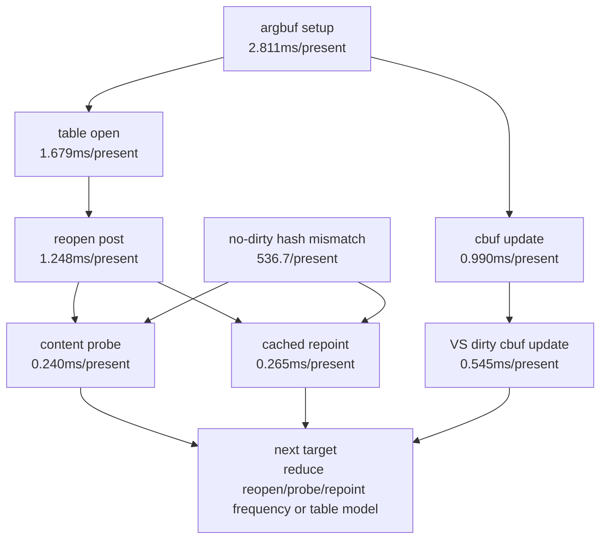

# State-Churn Encode 110 - Argbuf Reopen Probe Split Rerun

## Question

With `Argbuf CPU Derived` now ranking reopen/post and cbuf probe children, which
argbuf lane should be treated as the next implementation target?

## Method

Run a 120s no-gputrace attribution scout with both argbuf split timers enabled:

```sh
DXMT9_PERF_ARGBUF_REOPEN_SPLIT=1 \
DXMT9_PERF_ARGBUF_CBUF_PROBE_SPLIT=1 \
bash scripts/tools/run_3dmark05_perf_probe.sh \
  --suffix argbuf-reopen-cbuf-probe-split-rerun \
  --frame 60 \
  --no-gputrace \
  --no-encoder-breakdown \
  --frame-sampling \
  --timeout 120 \
  --wait-unlocked-sec 1 \
  --wait-unlocked-interval-sec 1
```

The run timeout-finalized through the wrapper and produced complete artifacts:

| Field | Value |
|---|---:|
| `status` | `pass` |
| `timed_out` | `true` |
| `returncode` | `143` |
| `present_encoded` | `1,800` |
| `sampled_avg_fps` | `16.953` |

`actual.png` is a normal GT1 scene. It contains visible bloom, muzzle flash,
tracer, sparks, and particle effects, so this is not a black-screen or missing
effect sample.

## Result

The global shape is still P4/no-enqueue plus backend encode:

| Metric | Value |
|---|---:|
| `gpu_command_buffer_time_ms_per_present` | `3.186` |
| `completion_wait_ms_per_present` | `26.770` |
| `completion_wait_without_enqueue_ms_per_present` | `26.698` |
| `completion_wait_overlap_share` | `0.268%` |
| `commit_chunk_replay_cpu_ms_per_present` | `8.177` |
| `encode_chunk_cpu_ms_per_present` | `11.464` |
| `encode_draw_cpu_ms_per_present` | `9.501` |

Argbuf remains the largest local encode owner, but the split run identifies the
subtree:

| Rank | Counter | ms/present | Share of argbuf setup |
|---:|---|---:|---:|
| 1 | `encode_draw_argbuf_setup_cpu_ms` | `2.811` | `100.00%` |
| 2 | `encode_draw_argbuf_open_cpu_ms` | `1.679` | `59.72%` |
| 3 | `encode_draw_argbuf_reopen_post_cpu_ms` | `1.248` | `44.39%` |
| 4 | `encode_draw_argbuf_cbuf_update_cpu_ms` | `0.990` | `35.23%` |
| 5 | `encode_draw_argbuf_cbuf_update_vs_cpu_ms` | `0.545` | `19.39%` |
| 7 | `encode_draw_argbuf_cbuf_cached_repoint_cpu_ms` | `0.265` | `9.41%` |
| 8 | `encode_draw_argbuf_cbuf_content_probe_cpu_ms` | `0.240` | `8.54%` |

Mechanism counters explain why the reopen path is expensive:

| Metric | Value |
|---|---:|
| `argbuf_cbuf_no_dirty_hash_mismatch_per_present` | `536.694` |
| `argbuf_cbuf_cached_repoint_calls_per_present` | `959.256` |
| `argbuf_cbuf_content_probe_vs_hit_share` | `15.38%` |
| `argbuf_cbuf_content_probe_ps_hit_share` | `66.83%` |
| `argbuf_cbuf_content_probe_ffp_ps_hit_share` | `96.52%` |

Correctness counters are clean:

| Counter | Value |
|---|---:|
| `draw_skipped_no_pipeline` | `0` |
| `gpu_command_buffer_errors` | `0` |
| `render_split_hazard` | `0` |



## Decision

Accepted as attribution, not an FPS proof. The split timers add overhead, so
the `sampled_avg_fps` value should not be compared directly with default
low-overhead runs. The useful result is ownership: the next argbuf work should
target table open/reopen frequency or the no-dirty cbuf hash-mismatch path
before more narrow FFP PS cleanup. Dirty VS cbuf update is still the largest
true cbuf update child, but cached repoint plus content probe is now large
enough to rank as a separate candidate.

**Related.** [[state-churn-encode-encode-phase.104]] ·
[[state-churn-encode-encode-phase.109]] · [[state-churn-encode]].
