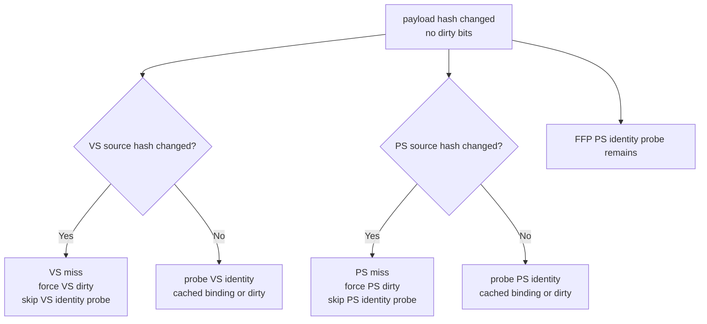

# State-Churn Encode 111 - Argbuf Source-Changed Fast Miss

## Question

In the no-dirty argbuf cbuf hash-mismatch path, can VS/PS identity probes be
skipped when the previous and current shader-constant source hashes already
prove the lane cannot match the cached binding?

## Change

`encodeChunk` already tracks the previous draw's argbuf payload key. The patch
passes two source-change booleans into `encodeDraw`:

- `argbufVsPayloadSourceChanged`
- `argbufPsPayloadSourceChanged`

For the no-dirty mismatch path, a changed VS or PS source hash is now counted as
a miss and marked dirty directly. The expensive identity probe is still used
when the source hash did not change, and FFP PS still uses its render-state /
texture-stage identity probe.

## Result

Both runs use the argbuf reopen + cbuf probe split timers, so they are
attribution samples rather than FPS proofs:

| Metric | Before | After | Delta |
|---|---:|---:|---:|
| `present_encoded` | `1,800` | `1,800` | `0` |
| `argbuf_setup_ms_per_present` | `2.811` | `2.728` | `-0.083` |
| `argbuf_open_ms_per_present` | `1.679` | `1.603` | `-0.076` |
| `argbuf_reopen_post_ms_per_present` | `1.248` | `1.163` | `-0.085` |
| `argbuf_cbuf_update_ms_per_present` | `0.990` | `0.989` | `-0.001` |
| `argbuf_cbuf_cached_repoint_ms_per_present` | `0.265` | `0.258` | `-0.007` |
| `argbuf_cbuf_content_probe_ms_per_present` | `0.240` | `0.159` | `-0.081` |
| `argbuf_cbuf_content_probe_vs_ms_per_present` | `0.046` | `0.006` | `-0.040` |
| `argbuf_cbuf_content_probe_ps_ms_per_present` | `0.036` | `0.027` | `-0.009` |
| `argbuf_cbuf_content_probe_ffp_ps_ms_per_present` | `0.037` | `0.035` | `-0.002` |

The hit/miss shape stays stable, which is the intended behavior:

| Counter | Before | After |
|---|---:|---:|
| `content_probe_calls` | `966,049` | `966,438` |
| `content_probe_vs_hits` | `148,607` | `148,675` |
| `content_probe_vs_misses` | `817,442` | `817,763` |
| `content_probe_ps_hits` | `645,656` | `646,037` |
| `content_probe_ps_misses` | `320,393` | `320,401` |
| `content_probe_ffp_ps_hits` | `932,398` | `932,779` |
| `content_probe_ffp_ps_misses` | `33,651` | `33,659` |

Correctness counters remain clean and `actual.png` shows the normal GT1 bloom,
muzzle flash, tracer, spark, and particle-heavy frame:

| Counter | Value |
|---|---:|
| `draw_skipped_no_pipeline` | `0` |
| `gpu_command_buffer_errors` | `0` |
| `render_split_hazard` | `0` |

## Decision

Accepted as a local cleanup. The patch removes redundant VS/PS identity work
when source hashes already prove a miss, reducing total content-probe CPU by
about `0.081ms/present` in the split attribution run. It is not an FPS proof:
the same run still has `completion_wait_without_enqueue ~= 26.7ms/present`, and
split-timer overhead/noise keeps `encode_chunk` from being a clean A/B signal.

The next argbuf work should still target the larger table open/reopen model or
dirty VS cbuf update. This patch only trims the probe leaf under
`reopen_post`.

**Related.** [state-churn-encode-encode-phase.63](state-churn-encode-encode-phase.63.md) ·
[state-churn-encode-encode-phase.110](state-churn-encode-encode-phase.110.md) · [state-churn-encode](index.md).
