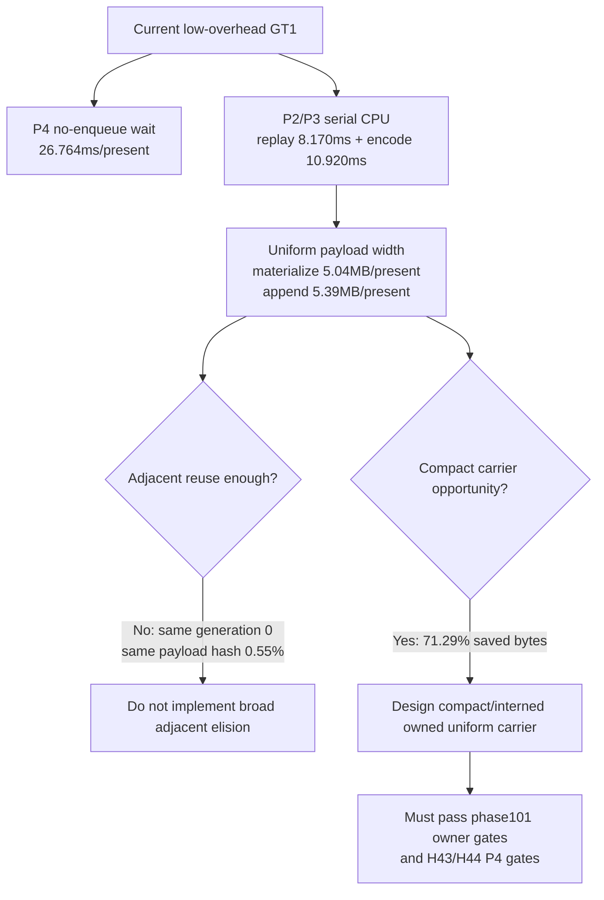

# State-Churn Encode 112 - Fresh Uniform Compact-Carrier Baseline

## Question

After the recent argbuf and xctrace-summary tooling work, does the current
low-overhead GT1 run still justify a compact or interned uniform payload
carrier, and does the average-FPS owner still sit in the P4 no-enqueue plus
P2/P3 serial CPU path?

## Run

```sh
bash scripts/tools/run_3dmark05_perf_probe.sh \
  --suffix uniform-compact-current-r1 \
  --frame 60 \
  --no-gputrace \
  --no-encoder-breakdown \
  --frame-sampling \
  --timeout 120 \
  --wait-unlocked-sec 1 \
  --wait-unlocked-interval-sec 1 \
  --require-current-uniform-compact-saved-bytes-present
```

The wrapper rebuilt/restaged as needed, ran with `status=pass`, and
timeout-finalized normally (`returncode=143`, `timed_out=true`). The screenshot
is a normal GT1 frame with heavy sparks/particles, bloom, and visible muzzle
flash/tracer effects.

## Result

| Metric | Value |
|---|---:|
| `present_encoded` | `1,800` |
| `sampled_avg_fps` | `16.981` |
| `frame wall_ms` p50 / p95 | `53.485 / 83.005` |
| `frame fps` p50 / p95 | `18.697 / 27.067` |
| `gpu_command_buffer_time_ms_per_present` | `3.159` |
| `completion_wait_ms_per_present` | `26.883` |
| `completion_wait_with_enqueue_ms_per_present` | `0.119` |
| `completion_wait_without_enqueue_ms_per_present` | `26.764` |
| `completion_wait_no_enqueue_share` | `99.557%` |
| `commit_chunk_replay_cpu_ms_per_present` | `8.170` |
| `commit_chunk_queue_draw_submission_cpu_ms_per_present` | `4.050` |
| `d3d9_snapshot_draw_submission_cpu_ms_per_present` | `3.352` |
| `d3d9_snapshot_cache_lookup_cpu_ms_per_present` | `2.795` |
| `encode_chunk_cpu_ms_per_present` | `10.920` |
| `encode_draw_cpu_ms_per_present` | `8.959` |

Uniform payload shape:

| Metric | Value |
|---|---:|
| `d3d9_snapshot_uniform_materialized` | `886,815` |
| `d3d9_snapshot_uniform_materialized_bytes` | `9,080,985,600` |
| `d3d9_snapshot_uniform_materialized_compact_candidate_bytes` | `2,606,962,560` |
| `d3d9_snapshot_uniform_materialized_compact_saved_bytes` | `6,474,023,040` |
| `uniform_materialized_bytes_per_present` | `5,044,992.000` |
| `uniform_compact_candidate_bytes_per_present` | `1,448,312.533` |
| `uniform_compact_saved_bytes_per_present` | `3,596,679.467` |
| `uniform_compact_saved_share_of_materialized_bytes` | `71.29%` |
| `draw_uniform_payload_appends` | `945,459` |
| `draw_uniform_payload_append_bytes` | `9,696,627,504` |
| `uniform_append_bytes_per_present` | `5,387,015.280` |
| `uniform_append_bytes_per_append` | `10,256.000` |
| `uniform_append_records_per_materialized_snapshot` | `1.066` |
| `uniform_append_bytes_share_of_materialized_bytes` | `106.78%` |
| `uniform_snapshot_elision_share` | `0.00%` |

The adjacent-uniform evidence remains negative for copy-elision:

| Counter | Value |
|---|---:|
| `d3d9_snapshot_uniform_adjacent_same_generation` | `0` |
| `d3d9_snapshot_uniform_adjacent_same_payload_hash` | `4,861` |
| `d3d9_snapshot_uniform_adjacent_same_payload_hash_same_state_lane` | `1` |
| `d3d9_snapshot_uniform_adjacent_same_payload_hash_diff_generation` | `4,861` |

Correctness and state-copy checks:

| Counter | Value |
|---|---:|
| `draw_skipped_no_pipeline` | `0` |
| `gpu_command_buffer_errors` | `0` |
| `render_split_hazard` | `0` |
| `d3d9_snapshot_state_elided` | `414,010` |
| `submit_draw_run_batch_discarded_state_records` | `3,893` |



## Decision

Accepted as the current baseline for the uniform carrier lane. The run repeats
the main conclusion from [state-churn-encode-encode-phase.102](state-churn-encode-encode-phase.102.md) on current
code: adjacent uniform copy-elision is not a live lever, but full
`DrawUniformPayload` materialization and backend append width remain large.

This is still not an average-FPS proof. `completion_wait_without_enqueue` is
`26.764ms/present` and `completion_wait_no_enqueue_share` is `99.557%`, so a
uniform carrier change must be judged with the existing P2/P3 owner gates and a
P4/frame-sampling gate before it is promoted beyond local CPU cleanup.

## Next Gate

The next implementation candidate should be a compact or interned owned
uniform payload carrier, not another adjacent-equality shortcut. The proof
should require:

- `--require-uniform-materialized-bytes-decrease` or a new compact-carrier byte
  gate;
- `--require-uniform-append-bytes-decrease`;
- targeted CPU gates from [state-churn-encode-encode-phase.101](state-churn-encode-encode-phase.101.md);
- a P4 gate from [present-pacing-compare-gates.37](../present-pacing/present-pacing-compare-gates.37.md) or frame-sampling movement.

**Related.** [state-churn-encode-encode-phase.102](state-churn-encode-encode-phase.102.md) ·
[state-churn-encode-encode-phase.111](state-churn-encode-encode-phase.111.md) ·
[present-pacing-summary-triage-current.41](../present-pacing/present-pacing-summary-triage-current.41.md) · [state-churn-encode](index.md).
