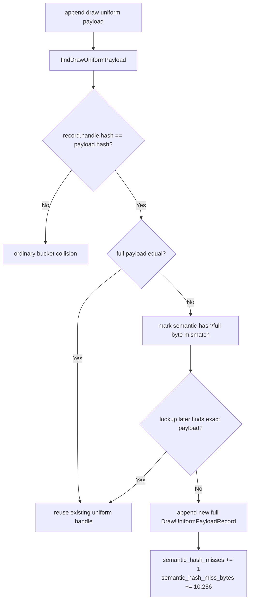

# Encode Phase 113 - Uniform Semantic-Hash Dedup Miss Probe

**Question.** Phase 112 shows a large compact-carrier byte opportunity, but it
does not tell whether backend uniform append width is purely unique data or
whether `ChunkSlot::findDrawUniformPayload()` is rejecting reusable records
because it requires full `DrawUniformPayload` equality after the usage-aware
payload hash matches.

**Implementation.**

The backend lookup path remains behavior-preserving: it still returns a handle
only when the existing `DrawUniformPayloadRecord` has the same handle hash and
the full payload compares equal. The new counters only record the miss shape:

| Counter | Meaning |
|---|---|
| `draw_uniform_payload_lookup_semantic_hash_misses` | lookup missed after seeing at least one record with the same usage-aware payload hash but different full payload bytes |
| `draw_uniform_payload_lookup_semantic_hash_miss_bytes` | upper-bound storage width of those missed append opportunities, counted as `sizeof(DrawUniformPayloadRecord)` per miss |

The summary and A/B compare tools expose:

| Derived metric | Meaning |
|---|---|
| `uniform_semantic_hash_misses` | raw miss count in the single-run summary |
| `uniform_semantic_hash_miss_bytes_per_present` | missed full-record byte width normalized by presents |
| `uniform_semantic_hash_misses_per_present` | A/B compare normalization for candidate runs |



**Runtime result.** The follow-up low-overhead scout completed with
`status=pass`, `returncode=0`, and a normal GT1 frame containing heavy bloom,
muzzle/tracer, and particle effects:

```sh
bash scripts/tools/run_3dmark05_perf_probe.sh \
  --suffix uniform-semantic-hash-current-r1 \
  --frame 60 \
  --no-gputrace \
  --no-encoder-breakdown \
  --frame-sampling \
  --timeout 120 \
  --wait-unlocked-sec 1 \
  --wait-unlocked-interval-sec 1 \
  --require-current-uniform-compact-saved-bytes-present
```

| Metric | Value |
|---|---:|
| `present_encoded` | `1,843` |
| `sampled_avg_fps` | `16.850` |
| `gpu_command_buffer_time_ms_per_present` | `3.208` |
| `completion_wait_ms_per_present` | `27.931` |
| `completion_wait_without_enqueue_ms_per_present` | `27.126` |
| `commit_chunk_replay_cpu_ms_per_present` | `8.233` |
| `encode_chunk_cpu_ms_per_present` | `10.920` |
| `d3d9_snapshot_uniform_materialized_bytes` | `9,243,156,480` |
| `d3d9_snapshot_uniform_materialized_compact_saved_bytes` | `6,591,069,360` |
| `draw_uniform_payload_append_bytes` | `9,875,974,176` |
| `draw_uniform_payload_lookup_semantic_hash_misses` | `15,945` |
| `draw_uniform_payload_lookup_semantic_hash_miss_bytes` | `163,531,920` |
| `uniform_semantic_hash_miss_bytes_per_present` | `88,731.373` |
| semantic miss bytes / append bytes | `1.66%` |
| `draw_skipped_no_pipeline` | `0` |
| `gpu_command_buffer_errors` | `0` |
| `render_split_hazard` | `0` |

**Decision.** Accepted current attribution. Semantic-hash/full-byte mismatch is
real, but it is too small to explain the backend uniform append width by
itself: `88.7KB/present` versus `5.36MB/present` appended full records. The
next uniform storage change should not start with a broad semantic-dedup
rewrite. The larger remaining owner is still compact or interned owned storage
for the `DrawUniformPayload` carrier and its frontend materialization width.

**Next gate.** A compact-carrier implementation should still run with the
phase 112 compact-saved gate and the phase 101 CPU owner gates. This probe adds
one interpretation row:

Interpretation:

| Result | Follow-up |
|---|---|
| high semantic-hash miss bytes | add exact semantic/live comparison or component-keyed payload storage before a broader compact carrier |
| low semantic-hash miss bytes | skip semantic dedup as the first change and design compact owned storage directly |
| any CPU decrease without P4/frame movement | keep as local P2/P3 cleanup, not an average-FPS proof |

**Verification.**

- `python3 -m pytest tests/scripts/test_summarize_3dmark05_perf.py tests/scripts/test_compare_3dmark05_perf_counters.py -q`
- `meson compile -C build-arm64-nowine`
- `meson test -C build-arm64-nowine dxmt9-state-draw-transform-spec dxmt9-dod-replay-observer-spec`
- `meson test -C build-arm64-nowine dxmt9-perf-docs-source-audit`
- `git diff --check -- src/dxmt9/dxmt9_perf_counters.hpp src/dxmt9/dxmt9_perf_counters.cpp src/dxmt9/dxmt9_backend_types.hpp scripts/check/assert_perf_counters.py scripts/tools/summarize_3dmark05_perf.py scripts/tools/compare_3dmark05_perf_counters.py tests/scripts/test_summarize_3dmark05_perf.py tests/scripts/test_compare_3dmark05_perf_counters.py`

**Related.** [state-churn-encode-encode-phase.112](state-churn-encode-encode-phase.112.md) ·
[state-churn-encode-encode-phase.102](state-churn-encode-encode-phase.102.md) ·
[state-churn-encode-encode-phase.101](state-churn-encode-encode-phase.101.md) · [state-churn-encode](../state-churn-encode.md).
