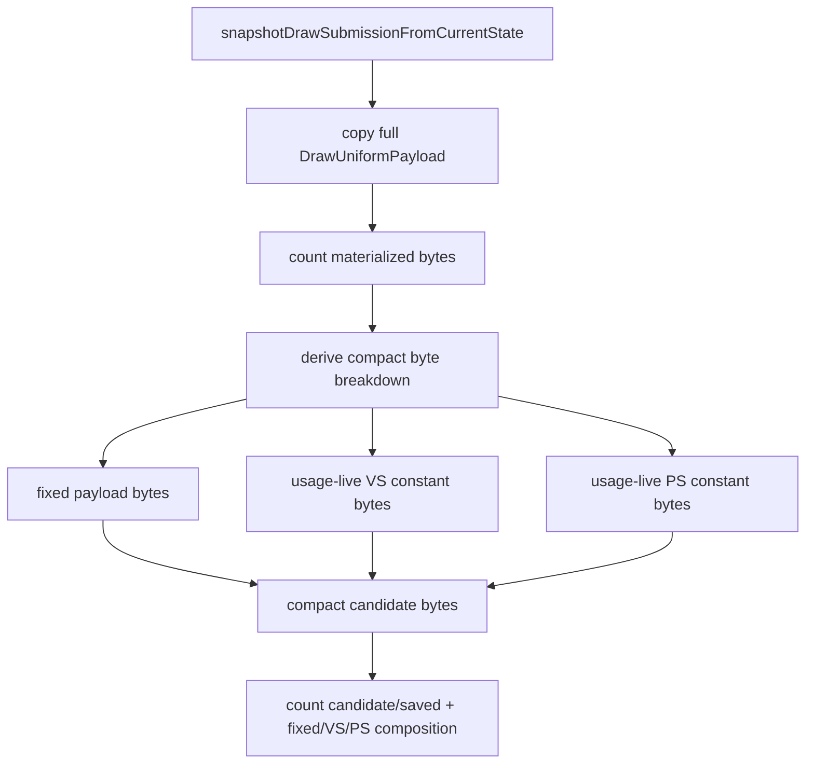

# Encode Phase 114 - Uniform Compact-Carrier Byte Breakdown

**Question.** Phases 112 and 113 show that the uniform payload width is still a
large P2/P3 owner, and that semantic-hash/full-byte dedup misses are not the
first-order backend append owner. The remaining design choice is whether a
compact carrier should first attack shader constant ranges or the fixed
non-shader `DrawUniformPayload` body.

**Implementation.** The snapshot path already computes a conservative compact
candidate as:

```text
fixed DrawUniformPayload fields
+ usage-live VS constant bytes
+ usage-live PS constant bytes
```

Phase 114 keeps the existing `candidate` and `saved` counters and adds three
composition counters:

| Counter | Meaning |
|---|---|
| `d3d9_snapshot_uniform_materialized_compact_fixed_bytes` | non-VS/PS portion retained by the compact candidate |
| `d3d9_snapshot_uniform_materialized_compact_vertex_bytes` | usage-live `VertexShaderConstants` bytes retained by the candidate |
| `d3d9_snapshot_uniform_materialized_compact_pixel_bytes` | usage-live `PixelShaderConstants` bytes retained by the candidate |

The summary and A/B compare reports now expose per-present bytes plus each
component's share of `compact_candidate_bytes`.



**Runtime result.** The low-overhead scout was run after rebuilding and staging
the Wine builtin artifacts:

```sh
bash scripts/tools/run_3dmark05_perf_probe.sh \
  --suffix uniform-compact-breakdown-current-r1 \
  --frame 60 \
  --no-gputrace \
  --no-encoder-breakdown \
  --frame-sampling \
  --timeout 120 \
  --wait-unlocked-sec 1 \
  --wait-unlocked-interval-sec 1 \
  --require-current-uniform-compact-saved-bytes-present
```

The run timeout-finalized with `status=pass`, `returncode=143`, and complete
artifacts, which is valid for 3DMark05 final-frame hangs. The screenshot lands
on a high-effect GT1 frame with bloom, muzzle beams, and particles; runtime
health counters stay clean (`draw_skipped_no_pipeline=0`,
`gpu_command_buffer_errors=0`, `render_split_hazard=0`).

| Metric | Value |
|---|---:|
| `present_encoded` | `1,800` |
| `sampled_avg_fps` | `16.920` |
| `gpu_command_buffer_time_ms_per_present` | `3.124` |
| `completion_wait_ms_per_present` | `27.018` |
| `completion_wait_without_enqueue_ms_per_present` | `26.803` |
| `commit_chunk_replay_cpu_ms_per_present` | `8.177` |
| `encode_chunk_cpu_ms_per_present` | `10.872` |
| `d3d9_snapshot_uniform_materialized_bytes` | `9,078,640,640` |
| `d3d9_snapshot_uniform_materialized_compact_candidate_bytes` | `2,601,749,616` |
| `d3d9_snapshot_uniform_materialized_compact_saved_bytes` | `6,476,891,024` |
| `uniform_materialized_bytes_per_present` | `5,043,689.244` |
| `uniform_compact_candidate_bytes_per_present` | `1,445,416.453` |
| `uniform_compact_saved_bytes_per_present` | `3,598,272.791` |
| `uniform_compact_fixed_bytes_per_present` | `992,976.320` |
| `uniform_compact_vertex_bytes_per_present` | `420,454.071` |
| `uniform_compact_pixel_bytes_per_present` | `31,986.062` |
| `uniform_compact_candidate_share_of_materialized_bytes` | `28.66%` |
| `uniform_compact_saved_share_of_materialized_bytes` | `71.34%` |
| `uniform_compact_fixed_share_of_candidate_bytes` | `68.70%` |
| `uniform_compact_vertex_share_of_candidate_bytes` | `29.09%` |
| `uniform_compact_pixel_share_of_candidate_bytes` | `2.21%` |
| `draw_uniform_payload_append_bytes` | `9,693,725,056` |
| semantic miss bytes / append bytes | `1.67%` |

Supporting context from existing counters: cache batch misses reused
non-constant/fixed component hashes `380,306` times and rebuilt them `41,785`
times. This is not a unique fixed-payload count, but it says the fixed component
identity is already stable often enough to justify a split/interned storage
design instead of only shrinking shader constant ranges.

**Decision.** Accepted current attribution. The first-order opportunity remains
the compact owned carrier itself: not carrying the unused full VS/PS constant
arrays would remove `71.34%` of frontend materialized uniform bytes. But the
residual compact candidate is mostly fixed non-shader payload (`68.70%`), with
VS live constants a smaller second owner (`29.09%`) and PS live constants
negligible (`2.21%`). The next implementation should therefore avoid a broad
semantic-dedup rewrite and design the owned storage as split components:
fixed-payload interning or sharing plus segmented shader-constant ranges.

Interpretation:

| Result | Interpretation |
|---|---|
| fixed share dominates candidate bytes | split or intern fixed FFP/material/light/texture-transform payload before micro-optimizing shader ranges |
| VS or PS live bytes dominate | prioritize segmented shader constant storage and direct upload from compact ranges |
| candidate bytes remain high but saved share is low | compact carrier is no longer the right owner; return to producer cadence / encode overlap |

**Verification.**

- `python3 -m pytest tests/scripts/test_summarize_3dmark05_perf.py tests/scripts/test_compare_3dmark05_perf_counters.py -q`
- `meson compile -C build-arm64-nowine`
- `meson compile -C build-x86_64-builtin`
- `meson compile -C build-win32-x64-builtin`
- `meson compile -C build-win32-x86-builtin`
- `meson test -C build-arm64-nowine dxmt9-state-draw-transform-spec dxmt9-dod-replay-observer-spec`
- `meson test -C build-arm64-nowine dxmt9-perf-docs-source-audit`

**Related.** [[state-churn-encode-encode-phase.113]] ·
[[state-churn-encode-encode-phase.112]] · [[state-churn-encode]].
