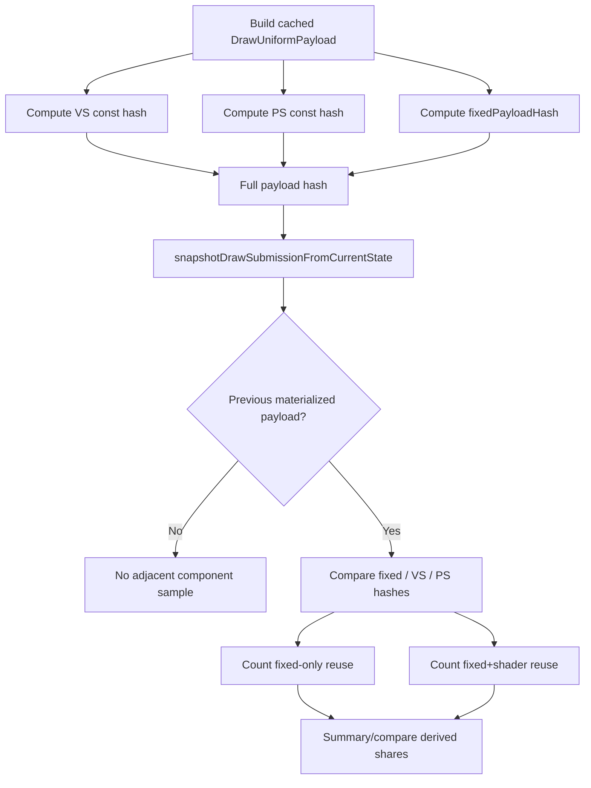

# Encode Phase 115 - Uniform Fixed-Payload Reuse Gate

**Question.** Phase 114 shows that the compact uniform carrier's retained bytes
are dominated by the fixed non-shader payload. Before implementing split owned
storage, measure whether adjacent submissions often share the fixed payload even
when VS/PS constants change.

**Implementation.** `DrawUniformPayload` now carries `fixedPayloadHash` next to
the existing VS, PS, and full payload hashes. The hash combines only the
non-shader fields: fixed-function matrices, material, lights, blend matrices,
texture transforms, clip mask, and clip planes. It deliberately excludes
`VertexShaderConstants`, `PixelShaderConstants`, and hash metadata.

The snapshot path compares the current cached payload against the previous
materialized payload and emits these counters:

| Counter | Meaning |
|---|---|
| `d3d9_snapshot_uniform_adjacent_previous_payload` | adjacent pair had a previous materialized payload to compare |
| `d3d9_snapshot_uniform_adjacent_same_fixed_payload_hash` | fixed/non-shader payload matched |
| `d3d9_snapshot_uniform_adjacent_same_fixed_payload_hash_same_state_lane` | fixed match also shared state generation/lane |
| `d3d9_snapshot_uniform_adjacent_same_fixed_payload_hash_diff_generation` | fixed match crossed a uniform generation change |
| `d3d9_snapshot_uniform_adjacent_same_fixed_and_shader_const_hashes` | fixed payload, VS constants, and PS constants all matched |

The summary and compare scripts derive:

| Metric | Meaning |
|---|---|
| `uniform_adjacent_same_fixed_payload_hash_share` | adjacent fixed-payload reuse opportunity |
| `uniform_adjacent_same_fixed_and_shader_const_hashes_share` | full segmented-component reuse opportunity |



**Runtime result.** The 120s no-gputrace scout was run with the same low
overhead profile:

```sh
bash scripts/tools/run_3dmark05_perf_probe.sh \
  --suffix uniform-fixed-reuse-current-r1 \
  --frame 60 \
  --no-gputrace \
  --no-encoder-breakdown \
  --frame-sampling \
  --timeout 120 \
  --wait-unlocked-sec 1 \
  --wait-unlocked-interval-sec 1 \
  --require-current-uniform-compact-saved-bytes-present
```

The run timeout-finalized with `status=pass`, `returncode=143`, and complete
artifacts. The screenshot is a normal high-effect GT1 frame with heavy bloom,
tracers, muzzle flashes, particles, and HUD. Health counters stayed clean:
`draw_skipped_no_pipeline=0`, `gpu_command_buffer_errors=0`, and
`render_split_hazard=0`.

| Metric | Value |
|---|---:|
| `present_encoded` | `1,860` |
| `sampled_avg_fps` | `17.003` |
| `completion_wait_ms_per_present` | `26.969` |
| `completion_wait_without_enqueue_ms_per_present` | `26.900` |
| `commit_chunk_replay_cpu_ms_per_present` | `8.104` |
| `encode_chunk_cpu_ms_per_present` | `10.809` |
| `uniform_materialized_bytes_per_present` | `5,013,850.529` |
| `uniform_compact_candidate_bytes_per_present` | `1,436,848.181` |
| `uniform_compact_saved_bytes_per_present` | `3,577,002.348` |
| `uniform_compact_fixed_share_of_candidate_bytes` | `68.65%` |
| `uniform_compact_vertex_share_of_candidate_bytes` | `29.15%` |
| `uniform_compact_pixel_share_of_candidate_bytes` | `2.20%` |
| `d3d9_snapshot_uniform_adjacent_previous_payload` | `809,459` |
| `d3d9_snapshot_uniform_adjacent_same_fixed_payload_hash` | `809,459` |
| `uniform_adjacent_same_fixed_payload_hash_share` | `100.00%` |
| `uniform_adjacent_same_fixed_and_shader_const_hashes_share` | `0.63%` |
| `draw_uniform_payload_append_bytes` | `9,967,708,520` |

**Decision.** Accepted current attribution. This does not reduce copies yet, but
it turns the next uniform-storage choice into a direct mechanism decision:

- `uniform_adjacent_same_fixed_payload_hash_share=100.00%` says the fixed
  payload is stable across every adjacent materialized sample in this run.
- `uniform_adjacent_same_fixed_and_shader_const_hashes_share=0.63%` says whole
  payload reuse is still not the path; shader constants keep changing.
- Implement split storage with fixed-payload handles plus segmented
  shader-constant ranges before attempting broad whole-payload elision.

Future interpretation still holds for other workloads:

- If fixed reuse is high while full payload hash reuse stays low, implement
  split storage with fixed-payload handles plus segmented shader-constant
  ranges.
- If fixed reuse is low, fixed interning is not enough; prioritize compact
  fixed payload layout and direct-build append instead.
- If fixed+shader reuse is high, there is still an unexploited whole-payload
  elision path, but earlier same-generation/full-hash counters suggest this is
  unlikely for GT1.

**Verification.**

- `python3 -m pytest tests/scripts/test_summarize_3dmark05_perf.py tests/scripts/test_compare_3dmark05_perf_counters.py -q`
- `meson compile -C build-arm64-nowine`
- `meson test -C build-arm64-nowine dxmt9-draw-uniforms-layout-spec dxmt9-state-draw-transform-spec dxmt9-dod-replay-observer-spec`
- `meson test -C build-arm64-nowine dxmt9-perf-docs-source-audit`

**Related.** [state-churn-encode-encode-phase.114](state-churn-encode-encode-phase.114.md) ·
[state-churn-encode](../state-churn-encode.md).
