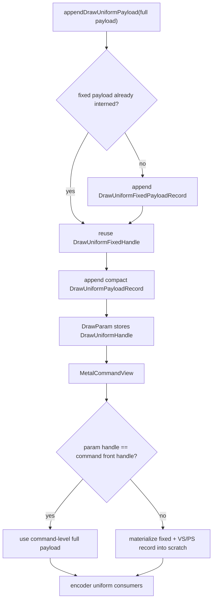

# Encode Phase 116 - Backend Uniform Fixed-Payload Split Storage

**Question.** Phase 115 proved that GT1 adjacent materialized uniform payloads
share the fixed non-shader payload at `100.00%`, while full fixed+VS+PS payload
reuse is only `0.63%`. Implement the first storage split and verify whether it
reduces the backend append width and the P2/P3 CPU owners.

**Implementation.** `ChunkSlot` now interns a `DrawUniformFixedPayloadRecord`
separately from the per-uniform `DrawUniformPayloadRecord`. The compact uniform
record carries a fixed-payload handle plus VS/PS constants and component hashes;
the fixed record carries matrices, material, lights, texture transforms, and
clip planes.

The command view still exposes a command-level `DrawUniformPayload` for existing
encoder consumers, so this is deliberately a partial split: per-command front
payloads are still materialized, and non-front per-draw payloads can be
materialized through a stack scratch when their handle differs.



The deterministic coverage now checks both old semantics and the new storage
shape:

- batched draws with different VS constants keep distinct per-draw uniform
  payloads,
- those records share the same fixed payload handle when only shader constants
  differ,
- command views no longer rely on pointer identity for interned payloads;
  equality is by handle and payload value.

After the runtime scout below, the aggregate append-byte counter was split with
`draw_uniform_fixed_payload_appends` and
`draw_uniform_fixed_payload_append_bytes`. The phase116 scout itself does not
contain those two counters; they are next-run attribution for separating fixed
record bytes from compact per-uniform record bytes.

**Runtime result.** The 120s no-gputrace scout used the standard low-overhead
profile:

```sh
bash scripts/tools/run_3dmark05_perf_probe.sh \
  --suffix uniform-fixed-storage-current-r1 \
  --frame 60 \
  --no-gputrace \
  --no-encoder-breakdown \
  --frame-sampling \
  --timeout 120 \
  --wait-unlocked-sec 1 \
  --wait-unlocked-interval-sec 1 \
  --require-current-uniform-compact-saved-bytes-present
```

The run completed with `status=pass`. The screenshot is a normal high-effect GT1
frame with bloom, muzzle flashes, tracers, and particle debris. Health counters
stayed clean: `draw_skipped_no_pipeline=0`, `gpu_command_buffer_errors=0`, and
`render_split_hazard=0`.

| Metric | Phase 115 | Phase 116 | Movement |
|---|---:|---:|---:|
| `present_encoded` | `1,860` | `1,740` | lower sample count |
| `sampled_avg_fps` | `17.003` | `16.357` | no FPS win |
| `completion_wait_without_enqueue_ms_per_present` | `26.900` | `26.629` | flat/noisy |
| `commit_chunk_replay_cpu_ms_per_present` | `8.104` | `8.827` | worse |
| `encode_chunk_cpu_ms_per_present` | `10.809` | `11.199` | worse |
| `draw_uniform_payload_append_bytes` | `9,967,708,520` | `7,593,975,840` | `-23.82%` total |
| `draw_uniform_payload_append_bytes_per_present` | `5,358,983.075` | `4,364,353.931` | `-18.56%` |
| `draw_uniform_payload_append_bytes_per_append` | `10,256.000` | `8,291.818` | narrower backend record |
| `submit_draw_run_batch_append_uniform_cpu_ms_per_present` | not recorded | `0.771` | current owner only |
| `draw_uniform_payload_append_copy_cpu_ms_per_present` | not recorded | `0.286` | current child only |

The opportunity counters remain unchanged in shape:

| Metric | Value |
|---|---:|
| `uniform_compact_saved_share_of_materialized_bytes` | `71.34%` |
| `uniform_compact_fixed_share_of_candidate_bytes` | `68.64%` |
| `adjacent_same_fixed_payload_hash_share` | `100.00%` |
| `adjacent_same_fixed_and_shader_hash_share` | `0.61%` |

**Decision.** Accepted as a local byte-width cleanup, rejected as the FPS owner.
The backend append byte counter moved in the intended direction, but the
frame-level and parent CPU owners did not. The likely reason is that this first
split only removes fixed fields from the per-uniform record; it still stores
full VS/PS constant arrays and keeps a command-level full-payload copy for
existing encoder consumers. It can also add per-draw materialization work in the
encoder for non-front payload handles.

Next work should not repeat whole-payload elision. The remaining target is
segmented shader-constant storage and direct compact consumption:

- store VS/PS constants as usage-live ranges or interned constant segments,
- let PSO prefetch and encoder uniform builders consume compact records without
  rebuilding a full `DrawUniformPayload` when possible,
- add fixed-record append counters so later runs can separate fixed-record bytes
  from compact per-uniform bytes,
- require both `draw_uniform_payload_append_bytes` and the relevant CPU parent
  (`submit_draw_run_batch_append_uniform_cpu_ms`,
  `commit_chunk_queue_draw_submission_cpu_ms`, or `encode_chunk_cpu_ms`) to move
  before claiming a performance win.

**Verification.**

- `meson test -C build-arm64-nowine dxmt9-dod-replay-observer-spec dxmt9-state-draw-transform-spec dxmt9-backend-key-descriptor-spec dxmt9-render-traditional-backend-spec`
- `meson compile -C build-arm64-nowine`
- `python3 scripts/check/assert_perf_counters.py build-arm64-nowine/tests/native/backend/dxmt9-allocation-counter-spec`
- `python3 -m pytest tests/scripts/test_summarize_3dmark05_perf.py tests/scripts/test_compare_3dmark05_perf_counters.py -q`
- `meson compile -C build-x86_64-builtin`
- `meson compile -C build-win32-x64-builtin`
- `meson compile -C build-win32-x86-builtin`
- `bash scripts/tools/run_3dmark05_perf_probe.sh --suffix uniform-fixed-storage-current-r1 --frame 60 --no-gputrace --no-encoder-breakdown --frame-sampling --timeout 120 --wait-unlocked-sec 1 --wait-unlocked-interval-sec 1 --require-current-uniform-compact-saved-bytes-present`

**Related.** [state-churn-encode-encode-phase.115](state-churn-encode-encode-phase.115.md) ·
[state-churn-encode](index.md).
