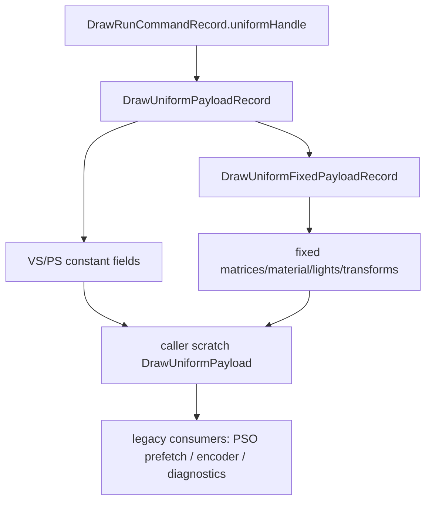

# Encode Phase 117 - Command-Front Uniform Payload Copy Elision

**Question.** Phase 116 split fixed non-shader uniform fields into a shared
record, but each draw-run command still kept a command-front full
`DrawUniformPayload` copy for legacy consumers. Can that leftover full-copy lane
be removed without changing draw-run semantics?

**Implementation.** `ChunkSlot::drawRunUniformPayloads` was removed. Command
views now expose only uniform record spans plus the draw-run `uniformHandle`.
Consumers that need a legacy full `DrawUniformPayload` resolve it through
`drawRunUniformPayloadForHandle()` or `drawRunUniformPayloadForParam()`, which
materializes `DrawUniformPayloadRecord + DrawUniformFixedPayloadRecord` into
caller-owned scratch.



The converted consumers are:

- encode-slot PSO prefetch,
- draw-run command encoding,
- framegraph draw emission,
- queue diagnostics / compat-flag summarization.

The framegraph path now resolves per-param uniform handles inside the draw loop
instead of reusing the command-front payload for the whole emitted range.

**Runtime result.** The 120s no-gputrace scout used the standard low-overhead
profile:

```sh
bash scripts/tools/run_3dmark05_perf_probe.sh \
  --suffix uniform-front-copy-elision-current-r1 \
  --frame 60 \
  --no-gputrace \
  --no-encoder-breakdown \
  --frame-sampling \
  --timeout 120 \
  --wait-unlocked-sec 1 \
  --wait-unlocked-interval-sec 1 \
  --require-current-uniform-compact-saved-bytes-present
```

The run completed with `status=pass`. The screenshot is visually normal for the
heavy-effects GT1 window: muzzle flashes, bloom, tracers, sparks, and fog are
present. Health counters stayed clean: `draw_skipped_no_pipeline=0`,
`gpu_command_buffer_errors=0`, and `render_split_hazard=0`.

| Metric | Phase 116 | Phase 117 | Movement |
|---|---:|---:|---:|
| `present_encoded` | `1,740` | `1,800` | different sample count |
| `sampled_avg_fps` | `16.357` | `16.803` | noisy, not a proof |
| `completion_wait_ms_per_present` | not recorded | `27.261` | still dominant |
| `completion_wait_without_enqueue_ms_per_present` | `26.629` | `26.939` | flat/worse |
| `completion_wait_with_enqueue_ms_per_present` | `0.000` | `0.323` | tiny overlap only |
| `commit_chunk_replay_cpu_ms_per_present` | `8.827` | `8.309` | better/noisy |
| `commit_chunk_queue_draw_submission_cpu_ms_per_present` | `4.168` | `4.069` | better/noisy |
| `encode_chunk_cpu_ms_per_present` | `11.199` | `11.195` | flat |
| `submit_draw_run_batch_append_uniform_cpu_ms_per_present` | `0.771` | `0.746` | small local movement |
| `draw_uniform_payload_append_copy_cpu_ms_per_present` | `0.286` | `0.278` | small local movement |
| `uniform_append_bytes_per_present` | `4,364,353.931` | `4,347,240.640` | tiny local movement |
| `uniform_append_bytes_per_append` | `8,291.818` | `8,291.830` | unchanged record width |
| `uniform_fixed_append_bytes_share_of_append_bytes` | not recorded | `0.05%` | fixed records now shared |

**Decision.** Accepted as local copy cleanup, rejected as the FPS owner. This
closes the phase116 leftover command-front full-payload storage path, but it is
not a complete compact uniform design:

- `DrawUniformPayloadRecord` still stores full VS/PS constant arrays,
- existing uniform builders still consume a materialized legacy
  `DrawUniformPayload`,
- completion wait and encode chunk did not move enough to claim average-FPS
  ownership.

The next storage step remains usage-live or segmented VS/PS constant storage
with direct compact consumption in prefetch/encoder paths.

**Verification.**

- `meson test -C build-arm64-nowine dxmt9-state-draw-transform-spec dxmt9-dod-replay-observer-spec`
- `meson test -C build-arm64-nowine dxmt9-dod-replay-observer-spec dxmt9-state-draw-transform-spec dxmt9-backend-key-descriptor-spec dxmt9-render-traditional-backend-spec dxmt9-perf-docs-source-audit`
- `python3 -m pytest tests/scripts/test_summarize_3dmark05_perf.py tests/scripts/test_compare_3dmark05_perf_counters.py -q`
- `git diff --check`
- `meson compile -C build-x86_64-builtin`
- `meson compile -C build-win32-x64-builtin`
- `meson compile -C build-win32-x86-builtin`
- `bash scripts/tools/run_3dmark05_perf_probe.sh --suffix uniform-front-copy-elision-current-r1 --frame 60 --no-gputrace --no-encoder-breakdown --frame-sampling --timeout 120 --wait-unlocked-sec 1 --wait-unlocked-interval-sec 1 --require-current-uniform-compact-saved-bytes-present`

**Related.** [state-churn-encode-encode-phase.116](state-churn-encode-encode-phase.116.md) ·
[state-churn-encode](../state-churn-encode.md).
