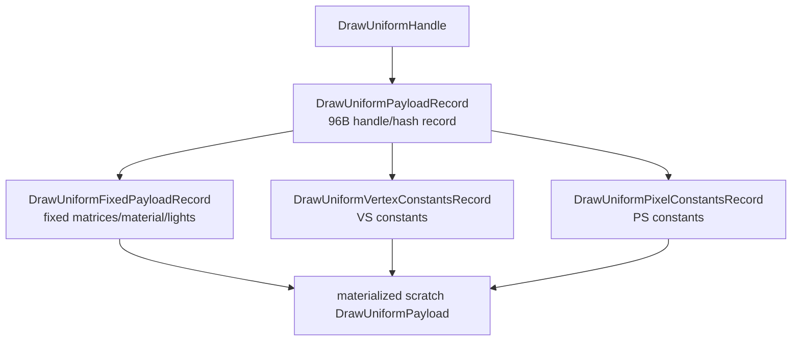

# Encode Phase 118 - Uniform Stage Constants Record Split

**Question.** Phase 117 removed the command-front full uniform payload copy,
but `DrawUniformPayloadRecord` still owned full VS and PS constant arrays. Can
those shader-constant halves be split into reusable stage records so the
per-payload record becomes a small handle carrier?

**Implementation.** `DrawUniformPayloadRecord` now stores handles to three
owned components instead of embedding the full payload:



Slot-local hash chains were added for the VS and PS constant records, parallel
to the existing whole-payload lookup. The legacy `DrawUniformPayload`
materialization helpers still exist for current encoder/prefetch consumers, but
the command storage no longer copies VS/PS arrays into every payload record.

The measured storage shape is:

| Type | Size |
|---|---:|
| `DrawUniformPayloadRecord` | `96B` |
| `DrawUniformFixedPayloadRecord` | `2008B` |
| `DrawUniformVertexConstantsRecord` | `4384B` |
| `DrawUniformPixelConstantsRecord` | `3872B` |
| legacy `DrawUniformPayload` | `10248B` |

**Instrumentation.** `draw_uniform_payload_append_bytes` remains the aggregate
backend uniform storage counter for existing compare gates. New counters split
the aggregate:

- `draw_uniform_vertex_constants_appends`
- `draw_uniform_vertex_constants_append_bytes`
- `draw_uniform_pixel_constants_appends`
- `draw_uniform_pixel_constants_append_bytes`

The summary/compare tools now report per-present bytes, records per payload
append, and append-byte shares for fixed, VS, and PS stage records. This avoids
misreading aggregate bytes as payload-record-only bytes after the split.

**Runtime result.** The authoritative post-counter scout is:

```sh
bash scripts/tools/run_3dmark05_perf_probe.sh \
  --suffix uniform-stage-constants-split-current-r2 \
  --frame 60 \
  --no-gputrace \
  --no-encoder-breakdown \
  --frame-sampling \
  --timeout 120 \
  --wait-unlocked-sec 1 \
  --wait-unlocked-interval-sec 1 \
  --require-current-uniform-compact-saved-bytes-present
```

The run completed with `status=pass`. The screenshot is visually normal for
the heavy-effects GT1 window: bloom, tracers, sparks, fog, and lit particles
are present. Health counters stayed clean: `draw_skipped_no_pipeline=0`,
`gpu_command_buffer_errors=0`, and `render_split_hazard=0`.

| Metric | Phase 117 | Phase 118 r2 | Movement |
|---|---:|---:|---:|
| `present_encoded` | `1,800` | `1,800` | same |
| `sampled_avg_fps` | `16.803` | `16.847` | noise band |
| `uniform_append_bytes_per_present` | `4,347,240.640` | `2,392,941.084` | `-44.96%` |
| `uniform_append_bytes_per_append` | `8,291.830` | `4,558.972` | `-45.02%` |
| `uniform_payload_record_append_bytes_per_append` | `8,291.830` | `96.000` | record body fixed |
| `draw_uniform_payload_append_copy_cpu_ms_per_present` | `0.278` | `0.030` | local copy win |
| `submit_draw_run_batch_append_uniform_cpu_ms_per_present` | `0.746` | `0.982` | worse/noisy; stage lookup cost visible |
| `commit_chunk_replay_cpu_ms_per_present` | `8.309` | `8.617` | no win |
| `encode_chunk_cpu_ms_per_present` | `11.195` | `11.116` | flat |
| `completion_wait_without_enqueue_ms_per_present` | `26.939` | `26.692` | still dominant |

The remaining append bytes are now explicitly stage-owned:

| Component | Bytes / present | Records / payload append | Share of append bytes |
|---|---:|---:|---:|
| fixed payload | `2,008.000` | `0.002` | `0.08%` |
| VS constants | `1,914,492.800` | `0.832` | `80.01%` |
| PS constants | `426,051.218` | `0.210` | `17.80%` |
| payload record body | implied `90,700,320B / run` | `1.000` | about `2.1%` |

**Decision.** Accepted as storage-width cleanup, rejected as an FPS owner. The
record-width smoking gun is closed: the per-payload record is now only a
handle/hash carrier. The residual aggregate uniform storage is not the payload
record anymore; it is VS constants first, then PS constants. The outer
`submit_draw_run_batch_append_uniform` bucket did not improve because the new
stage lookup/intern work now dominates the local path.

The next useful work is therefore not another full-payload record split. It is
one of:

- usage-live or shader-keyed segmented VS constant records,
- direct compact consumers that avoid materializing legacy `DrawUniformPayload`
  in encoder/prefetch paths,
- reducing VS constant change frequency before backend append,
- or the larger P4 producer/consumer overlap problem if the target is average
  FPS rather than local storage width.

**Verification.**

- `meson test -C build-arm64-nowine dxmt9-dod-replay-observer-spec dxmt9-state-draw-transform-spec dxmt9-perf-docs-source-audit`
- `python3 -m pytest tests/scripts/test_summarize_3dmark05_perf.py tests/scripts/test_compare_3dmark05_perf_counters.py -q`
- `meson compile -C build-x86_64-builtin`
- `meson compile -C build-win32-x64-builtin`
- `meson compile -C build-win32-x86-builtin`
- `bash scripts/tools/run_3dmark05_perf_probe.sh --suffix uniform-stage-constants-split-current-r2 --frame 60 --no-gputrace --no-encoder-breakdown --frame-sampling --timeout 120 --wait-unlocked-sec 1 --wait-unlocked-interval-sec 1 --require-current-uniform-compact-saved-bytes-present`

**Related.** [[state-churn-encode-encode-phase.117]] ·
[[state-churn-encode]].
