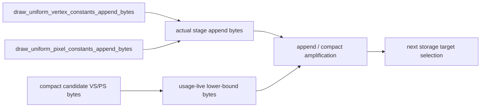

# Encode Phase 119 - Uniform Stage Append Amplification Attribution

**Question.** Phase 118 proves that `DrawUniformPayloadRecord` is no longer the
wide backend uniform record. How much residual storage remains in full VS/PS
stage constants compared with the existing usage-live compact candidate?

**Instrumentation.** The summary and compare tools now derive the stage
constant residual directly:

- `uniform_stage_constants_append_bytes_per_present`
- `uniform_vertex_append_amplification_vs_compact_vertex`
- `uniform_pixel_append_amplification_vs_compact_pixel`
- `uniform_stage_append_amplification_vs_compact_stage`

These are computed from already-emitted counters. No runtime behavior changes.

**Measured r2 residual.** Re-running the summarizer on
`app-d3d9-3dmark05-uniform-stage-constants-split-current-r2` gives:

| Metric | Value |
|---|---:|
| `uniform_stage_constants_append_bytes_per_present` | `2,340,544.018` |
| `uniform_vertex_append_amplification_vs_compact_vertex` | `4.524x` |
| `uniform_pixel_append_amplification_vs_compact_pixel` | `13.319x` |
| `uniform_stage_append_amplification_vs_compact_stage` | `5.142x` |
| `uniform_vertex_constants_append_bytes_share_of_append_bytes` | `80.01%` |
| `uniform_pixel_constants_append_bytes_share_of_append_bytes` | `17.80%` |

**Interpretation.** The phase118 split did not just move bytes around. It
isolated the next actual storage owner:

- payload-record body is now only `96B/append`,
- fixed-payload storage is effectively solved for this workload (`0.08%` of
  append bytes),
- full VS constants are the first residual owner,
- full PS constants are a smaller absolute owner but have the largest
  compact-candidate amplification.

The combined stage constants are still `5.142x` larger than the current
usage-live candidate estimate. That is the storage ceiling for segmented or
usage-live stage records. It is not automatically an FPS ceiling, because r2
still has `completion_wait_without_enqueue_ms_per_present=26.692` and
`encode_chunk_cpu_ms_per_present=11.116`; local storage work must still prove
P2/P3 or P4 movement.

**Next target.** The next implementation should be framed as one of:

- a VS-first usage-live/segmented stage-constant carrier,
- a direct compact encoder/prefetch consumer that avoids materializing full
  `DrawUniformPayload`,
- or an upstream constant-churn reduction that reduces
  `draw_uniform_vertex_constants_appends` before backend storage.

Do not spend more work on the payload-record body unless a new counter shows it
growing again; phase118/119 make it a residual, not the owner.

**Verification.**

- `python3 -m pytest tests/scripts/test_summarize_3dmark05_perf.py tests/scripts/test_compare_3dmark05_perf_counters.py -q`
- `python3 scripts/tools/summarize_3dmark05_perf.py experiments/output/app-d3d9-3dmark05-uniform-stage-constants-split-current-r2 --require-uniform-compact-saved-bytes-present`

**Related.** [state-churn-encode-encode-phase.118](state-churn-encode-encode-phase.118.md) ·
[state-churn-encode](../state-churn-encode.md).
