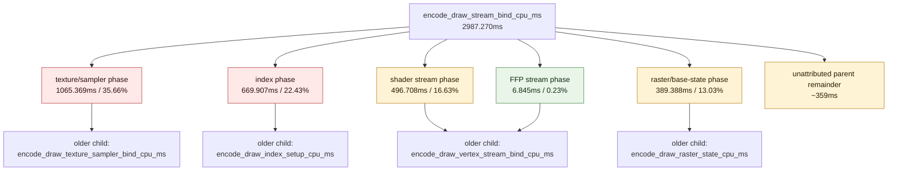

# Stream Bind Phase Split

**Question / hypothesis.** After [[state-churn-encode-encode-phase.10]] and
the rejected dirty-identity probe in [[state-churn-encode-encode-phase.11]],
`encode_draw_stream_bind_cpu_ms` remains one of the larger backend encode
buckets (`2574.049ms` over the fast-append baseline). Split the parent bucket
into raster-state, FFP stream, shader stream, texture/sampler, and index phases
before attempting another mutating optimization.

**Implementation.** Retained attribution counters now wrap the existing
`encode_draw_stream_bind_cpu_ms` subregions:

- `encode_draw_stream_bind_raster_phase_*`
- `encode_draw_stream_bind_ffp_stream_*`
- `encode_draw_stream_bind_shader_stream_*`
- `encode_draw_stream_bind_texture_phase_*`
- `encode_draw_stream_bind_index_phase_*`

These timers are nested under the existing parent counter and partly overlap
with older child buckets such as `encode_draw_raster_state_cpu_ms`,
`encode_draw_vertex_stream_bind_cpu_ms`,
`encode_draw_texture_sampler_bind_cpu_ms`, and
`encode_draw_index_setup_cpu_ms`. Treat them as attribution, not exclusive wall
time.

**Method.**

```bash
bash scripts/tools/run_3dmark05_perf_probe.sh \
  --suffix stream-bind-phase-split-r1 \
  --frame 50 \
  --no-gputrace \
  --no-encoder-breakdown \
  --timeout 180

python3 scripts/tools/compare_3dmark05_perf_counters.py \
  experiments/output/app-d3d9-3dmark05-argbuf-reserve-fastappend-r1 \
  experiments/output/app-d3d9-3dmark05-stream-bind-phase-split-r1 \
  --before-label argbuf-reserve-fastappend \
  --after-label stream-bind-phase-split \
  --output experiments/output/app-d3d9-3dmark05-stream-bind-phase-split-r1/dxmt9-perf-counter-comparison-vs-fastappend.md
```

The run hit the expected watchdog status `124` after writing artifacts.
`actual.png` is a normal visible GT1 frame with robot, flare, and HUD visible
(`FPS: 19`, `Time: 0:54.80`, `Frame: 992`).

**Result.** The run length differs from the fast-append baseline
(`1680 -> 1740` presents), so raw deltas are not a CPU-win claim. Per-present
GPU and completion wait are flat/noisy (`gpu_command_buffer_time_ms` per
present `3.078 -> 3.051ms`, `completion_wait_ms` per present
`22.742 -> 22.769ms`). The useful output is the stream-bind phase distribution.

| Counter | Fast append | Stream split | Reading |
|---|---:|---:|---|
| `present_encoded` | 1,680 | 1,740 | different run length |
| `draw_calls` | 1,235,709 | 1,274,427 | `draws_per_present` stays close (`735.541 -> 732.429`) |
| `encode_draw_cpu_ms` / present | 10.066 | 10.157 | timer overhead/noise, no win claimed |
| `encode_draw_stream_bind_cpu_ms` / present | 1.532 | 1.717 | parent rose with extra nested timers |
| `encode_draw_stream_bind_texture_phase_cpu_ms` | - | 1,065.369 | largest child, 35.66% of parent |
| `encode_draw_stream_bind_index_phase_cpu_ms` | - | 669.907 | second child, 22.43% of parent |
| `encode_draw_stream_bind_shader_stream_cpu_ms` | - | 496.708 | 1,257,037 calls, nearly every draw |
| `encode_draw_stream_bind_raster_phase_cpu_ms` | - | 389.388 | 427,714 base-state binds |
| `encode_draw_stream_bind_ffp_stream_cpu_ms` | - | 6.845 | small, 17,390 calls |
| `encode_draw_texture_sampler_bind_cpu_ms` / present | 0.581 | 0.587 | texture phase is the load-bearing stream child |
| `encode_draw_index_setup_cpu_ms` / present | 0.334 | 0.308 | noisy, still a named child |



**Verdict.** Accepted attribution. `stream_bind` is not a single Metal bind
class. The largest named child is texture/sampler binding, followed by index
setup, shader stream binding, and raster/base-state work. FFP stream binding is
not worth optimizing for GT1.

**Next.** Before mutating, split or sample the largest child owners:
texture/sampler table changes and skip opportunities, index setup/source
resolve path, and shader-stream binding diversity. Do not treat this run as a
performance regression or improvement; the added timers intentionally perturb
the parent path and the run processed more presents.

**Related.** [[state-churn-encode]] · [[state-churn-encode-encode-phase.10]] ·
[[state-churn-encode-encode-phase.11]] · [[present-pacing]].
