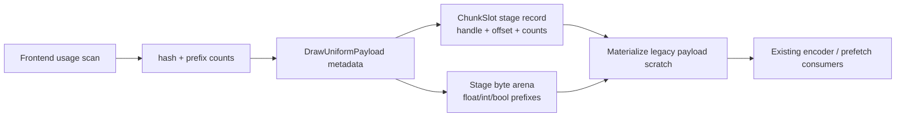

# Encode Phase 120 - Compact Stage-Constant Storage

**Question.** Phase 119 showed that the residual uniform append width was full
VS/PS stage constants. Can backend storage use the existing usage-live constant
metadata without changing the legacy `DrawUniformPayload` consumer surface?

**Implementation.** `DrawUniformPayload` now carries the shader-constant
float/int/bool prefix counts produced by the usage-aware hash scan. `ChunkSlot`
stores `DrawUniformVertexConstantsRecord` and
`DrawUniformPixelConstantsRecord` as handle + `{offset, size, counts}` records,
with the actual compact bytes in slot-local stage arenas. The command view
exposes those arenas, and `drawRunUniformPayloadFor*()` still materializes a
legacy full payload into caller-owned scratch by zero-filling and copying only
the stored prefixes.

This keeps the hot storage flat and owned: records are POD-like, bytes live in
slot-local vectors, and no per-draw heap object is introduced. Full/unknown and
indexed-int/bool cases keep full counts. Indexed-float-only keeps full float
constants plus the scanned int/bool prefixes, matching the prior hash safety
rule.

**Measured current run.** `uniform-stage-compact-storage-current-r1` is visually
normal and clean:

| Metric | Value |
|---|---:|
| `status` | `pass` |
| `draw_skipped_no_pipeline` | `0` |
| `gpu_command_buffer_errors` | `0` |
| `render_split_hazard` | `0` |
| `sampled_avg_fps` | `16.742` |
| `uniform_append_bytes_per_present` | `490,549.644` |
| `uniform_append_bytes_per_append` | `952.507` |
| `uniform_stage_constants_append_bytes_per_present` | `439,100.791` |
| `uniform_vertex_append_amplification_vs_compact_vertex` | `1.004x` |
| `uniform_pixel_append_amplification_vs_compact_pixel` | `0.527x` |
| `uniform_stage_append_amplification_vs_compact_stage` | `0.971x` |
| `uniform_payload_record_append_bytes_per_append` | `96.000` |

Compared with phase118/119's `2,340,544.018` stage bytes per present and
`5.142x` combined amplification, the backend stage-storage width is now at the
usage-live compact floor for this workload. The old full-stage storage owner is
closed.

**Interpretation.** This is a large local storage-width win, not an average-FPS
promotion. The same run still has:

| Metric | Value |
|---|---:|
| `completion_wait_without_enqueue_ms_per_present` | `26.500` |
| `completion_wait_no_enqueue_share` | `99.903%` |
| `commit_chunk_replay_cpu_ms_per_present` | `8.297` |
| `encode_chunk_cpu_ms_per_present` | `10.972` |
| `encode_draw_cpu_ms_per_present` | `8.471` |

The next owner is therefore no longer uniform append width. Keep moving on
P2/P3 replay/encode serialization or P4 overlap/producer cadence. Remaining
uniform work should only continue if it removes frontend full materialization,
reduces stage append count, or lets encoder consumers avoid the legacy scratch
payload entirely.

**Verification.**

- `meson test -C build-arm64-nowine dxmt9-dod-replay-observer-spec dxmt9-state-draw-transform-spec`
- `meson test -C build-arm64-nowine dxmt9-backend-key-descriptor-spec dxmt9-render-traditional-backend-spec dxmt9-core-device-com-spec dxmt9-draw-uniforms-dirty-spec`
- `meson compile -C build-x86_64-builtin`
- `meson compile -C build-win32-x64-builtin`
- `meson compile -C build-win32-x86-builtin`
- `bash scripts/tools/run_3dmark05_perf_probe.sh --suffix uniform-stage-compact-storage-current-r1 --frame 60 --no-gputrace --no-encoder-breakdown --frame-sampling --timeout 120 --wait-unlocked-sec 1 --wait-unlocked-interval-sec 1 --require-current-uniform-compact-saved-bytes-present`

**Related.** [state-churn-encode-encode-phase.118](state-churn-encode-encode-phase.118.md) ·
[state-churn-encode-encode-phase.119](state-churn-encode-encode-phase.119.md) · [state-churn-encode](index.md).
