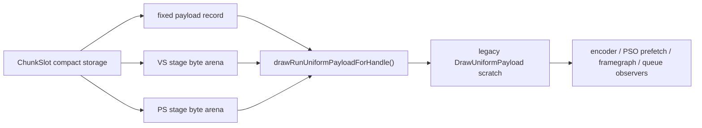

# Encode Phase 121 - Backend Uniform Payload Materialization Counter

**Question.** Phase 120 compacted backend uniform storage to the usage-live
stage-constant floor, but the existing encoder, prefetch, framegraph, and queue
diagnostic consumers still read a legacy `DrawUniformPayload` view. How much
full-payload scratch materialization remains after storage compaction?

**Instrumentation.** `drawRunUniformPayloadForHandle()` now counts successful
legacy scratch materializations and fallback cases:

- `draw_uniform_payload_materialized`
- `draw_uniform_payload_materialized_bytes`
- `draw_uniform_payload_materialize_cpu_ms`
- `draw_uniform_payload_materialize_fallbacks`

The summary and A/B compare tools expose derived rows under the Uniform Payload
block.

**Measured run.** `uniform-backend-materialize-counter-r1` is visually normal:
bloom, muzzle flashes, sparks, fog-like particles, and HUD are present. Health
counters are clean (`draw_skipped_no_pipeline=0`,
`gpu_command_buffer_errors=0`, `render_split_hazard=0`).

| Metric | Value |
|---|---:|
| `status` | `pass` |
| `sampled_avg_fps` | `17.021` |
| `uniform_backend_materialized_bytes_per_present` | `17,541,528.791` |
| `uniform_backend_materialize_cpu_ms_per_present` | `0.616` |
| `uniform_backend_materialized_bytes_per_call` | `10,264.000` |
| `uniform_backend_materialize_fallbacks` | `0` |
| `uniform_materialized_bytes_per_present` | `5,029,767.914` |
| `uniform_append_bytes_per_present` | `489,810.741` |
| `completion_wait_without_enqueue_ms_per_present` | `26.555` |
| `commit_chunk_replay_cpu_ms_per_present` | `8.131` |
| `encode_chunk_cpu_ms_per_present` | `10.991` |
| `encode_draw_cpu_ms_per_present` | `8.353` |

**Interpretation.** This confirms a remaining byte-amplification path after the
compact-storage work: backend consumers materialize about `17.5MB/present` of
full legacy uniform payload scratch even though backend append storage is now
only about `0.49MB/present`. The measured CPU cost is real but bounded
(`0.616ms/present`), so it is not an average-FPS owner by itself. It is a
valid cleanup target only if the next implementation removes direct consumer
materialization or reduces materialization call count; it should not displace
larger P4/P2/P3 work unless frame sampling and completion-wait counters move.

**Next implication.** Prefer direct compact consumers where the consumer only
needs hashes, fixed payload fields, or stage byte prefixes. Avoid rebuilding a
full `DrawUniformPayload` for PSO/prefetch/resource-shape decisions that can be
served from `DrawUniformPayloadRecord`, fixed records, and stage spans.

**Verification.**

- `python3 tests/scripts/test_summarize_3dmark05_perf.py`
- `python3 tests/scripts/test_compare_3dmark05_perf_counters.py`
- `meson test -C build-arm64-nowine dxmt9-dod-replay-observer-spec dxmt9-state-draw-transform-spec`
- `meson compile -C build-x86_64-builtin`
- `meson compile -C build-win32-x64-builtin`
- `meson compile -C build-win32-x86-builtin`
- `bash scripts/tools/run_3dmark05_perf_probe.sh --suffix uniform-backend-materialize-counter-r1 --frame 60 --no-gputrace --no-encoder-breakdown --frame-sampling --timeout 120 --wait-unlocked-sec 1 --wait-unlocked-interval-sec 1 --require-current-uniform-compact-saved-bytes-present`

**Related.** [state-churn-encode-encode-phase.120](state-churn-encode-encode-phase.120.md) · [state-churn-encode](index.md).
