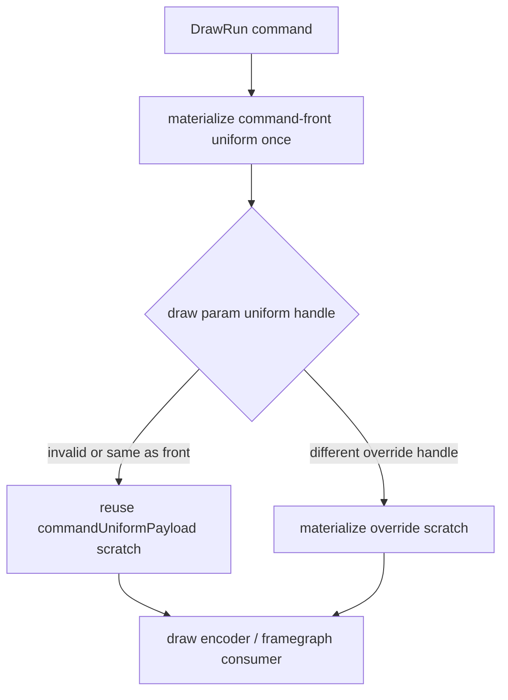

# Encode Phase 122 - Command-Front Uniform Payload Scratch Reuse

**Question.** Phase 121 proved that compact backend storage still feeds many
legacy `DrawUniformPayload` scratch materializations. A command-front draw-run
already materializes the front uniform payload once. Can encoder/framegraph
paths reuse that scratch for base-handle draws instead of resolving the same
handle repeatedly?

**Change.** The draw encoder and framegraph linearizer now materialize the
command/front uniform payload once and reuse it when a draw param has no
override handle or the same handle as the command front. Per-draw override
handles still resolve through `drawRunUniformPayloadForHandle()`.

**Measured A/B.** Baseline is `uniform-backend-materialize-counter-r1`.
Candidate is `uniform-backend-materialize-reuse-base-r1`. The candidate output
is visually normal, with bloom, muzzle/particle effects, scene geometry, and
HUD present. Health counters remain clean: `draw_skipped_no_pipeline=0`,
`gpu_command_buffer_errors=0`, and `render_split_hazard=0`.

| Metric | Before | After | Delta |
|---|---:|---:|---:|
| `sampled_avg_fps` | `17.021` | `17.122` | `+0.101` |
| `uniform_backend_materialized_bytes_per_present` | `17,541,528.791` | `12,345,386.694` | `-29.62%` |
| `uniform_backend_materialize_cpu_ms_per_present` | `0.616` | `0.449` | `-27.17%` |
| `uniform_backend_materialized_bytes_per_call` | `10,264.000` | `10,264.000` | `0.00%` |
| `uniform_backend_materialize_fallbacks_per_present` | `0.000` | `0.000` | `0` |
| `encode_chunk_cpu_ms_per_present` | `10.991` | `10.820` | `-1.55%` |
| `encode_draw_cpu_ms_per_present` | `8.353` | `8.394` | `+0.48%` |
| `commit_chunk_replay_cpu_ms_per_present` | `8.131` | `8.110` | `-0.26%` |
| `completion_wait_without_enqueue_ms_per_present` | `26.555` | `26.695` | `+0.53%` |

**Interpretation.** This is a clean local byte/CPU reduction: the call count
falls from `3,182,222` to `2,250,411`, and the backend no longer rebuilds a
full legacy uniform view for base-handle draws that can use the command-front
scratch. The unchanged `10,264B` per materialization confirms the win is call
count reduction, not narrower scratch width.

It does not promote to an FPS or P4 fix. `completion_wait_without_enqueue`
remains about `26.7ms/present`, encode/draw movement is within run noise, and
the local CPU gain is only `0.167ms/present`. Treat this as a correctness-safe
cleanup under the compact-storage work. The remaining uniform work should
either remove legacy scratch consumers entirely or be ranked behind larger
P2/P3/P4 serialization work.

**Verification.**

- `meson test -C build-arm64-nowine dxmt9-dod-replay-observer-spec dxmt9-state-draw-transform-spec dxmt9-render-framegraph-backend-spec`
- `python3 tests/scripts/test_summarize_3dmark05_perf.py`
- `python3 tests/scripts/test_compare_3dmark05_perf_counters.py`
- `meson compile -C build-x86_64-builtin`
- `meson compile -C build-win32-x64-builtin`
- `meson compile -C build-win32-x86-builtin`
- `bash scripts/tools/run_3dmark05_perf_probe.sh --suffix uniform-backend-materialize-reuse-base-r1 --frame 60 --no-gputrace --no-encoder-breakdown --frame-sampling --timeout 120 --wait-unlocked-sec 1 --wait-unlocked-interval-sec 1 --require-current-uniform-compact-saved-bytes-present`
- `python3 scripts/tools/compare_3dmark05_perf_counters.py experiments/output/app-d3d9-3dmark05-uniform-backend-materialize-counter-r1 experiments/output/app-d3d9-3dmark05-uniform-backend-materialize-reuse-base-r1 --output /tmp/dxmt9-uniform-materialize-ab.md`

**Related.** [[state-churn-encode-encode-phase.121]] · [[state-churn-encode]].
