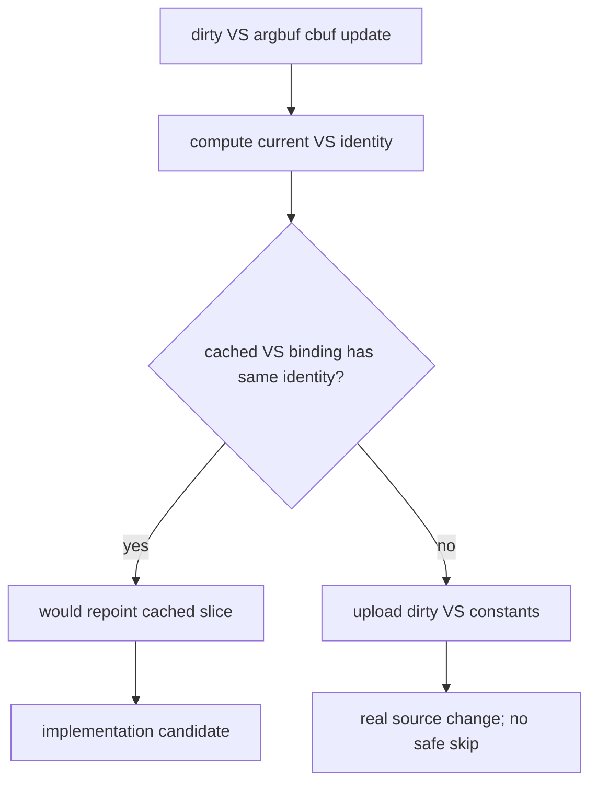

# Encode Phase 123 - Current Dirty VS Argbuf Identity Probe

**Question.** After compact uniform storage and command-front scratch reuse,
does the dirty VS argbuf cbuf lane still contain same-content uploads that
could be repointed from `ArgbufCbufCache` instead of rebuilding/uploading VS
constants?

**Probe.** Run the default low-overhead GT1 scout with the dirty VS identity
probe enabled:

```sh
DXMT9_PERF_ARGBUF_CBUF_DIRTY_IDENTITY=1 \
bash scripts/tools/run_3dmark05_perf_probe.sh \
  --suffix argbuf-dirty-vs-identity-current-r1 \
  --frame 60 \
  --no-gputrace \
  --no-encoder-breakdown \
  --frame-sampling \
  --timeout 120 \
  --wait-unlocked-sec 1 \
  --wait-unlocked-interval-sec 1 \
  --require-current-uniform-compact-saved-bytes-present
```

The run completed with `status=pass` and clean health counters:
`draw_skipped_no_pipeline=0`, `gpu_command_buffer_errors=0`, and
`render_split_hazard=0`.



## Result

| Metric | Value |
|---|---:|
| `sampled_avg_fps` | `17.125` |
| `encode_draw_argbuf_cbuf_dirty_vs_identity_probe_calls` | `862,747` |
| `encode_draw_argbuf_cbuf_dirty_vs_identity_hits` | `0` |
| `encode_draw_argbuf_cbuf_dirty_vs_identity_misses` | `840,847` |
| `encode_draw_argbuf_cbuf_dirty_vs_identity_no_cache` | `21,900` |
| `encode_draw_argbuf_cbuf_dirty_vs_identity_hit_bytes` | `0` |
| `encode_draw_argbuf_cbuf_dirty_vs_identity_miss_bytes` | `992,153,728` |
| `encode_draw_argbuf_cbuf_update_vs_calls` | `862,747` |
| `encode_draw_argbuf_cbuf_update_vs_bytes` | `1,000,460,864` |
| `argbuf_setup_cpu_ms_per_present` | `1.868` |
| `argbuf_cbuf_update_cpu_ms_per_present` | `0.941` |
| `argbuf_cbuf_update_vs_cpu_ms_per_present` | `0.520` |
| `completion_wait_without_enqueue_ms_per_present` | `28.646` |
| `encode_chunk_cpu_ms_per_present` | `10.826` |
| `commit_chunk_replay_cpu_ms_per_present` | `8.228` |

## Interpretation

Reject dirty VS identity repoint as a current implementation target. The probe
found no hits across `862,747` dirty VS candidates, and almost all bytes were
classified as identity misses. The current dirty VS cbuf lane is therefore not
caused by false dirty bits carrying unchanged VS content. It is dominated by
real VS constant source changes.

This also keeps the average-FPS owner unchanged. The run remains
`under-pipelined-no-enqueue`, with `completion_wait_without_enqueue` around
`28.6ms/present` and encode chunk around `10.8ms/present`. The local argbuf
ranking still names `argbuf_setup` first, split between cbuf update and table
open, but this specific VS identity shortcut has no safe hit set.

## Next Candidate

Do not implement a dirty VS identity skip for GT1. The next argbuf work should
target a different mechanism:

- reduce fresh argbuf table open/reserve/bind frequency without sharing mutable
  descriptor tables across draws;
- reduce true VS constant update frequency upstream, before the dirty bit is
  set; or
- move to a larger P2/P3/P4 serialization design that makes CPU reductions
  overlap with present completion wait.

**Related.** [state-churn-encode-encode-phase.110](state-churn-encode-encode-phase.110.md) ·
[state-churn-encode-encode-phase.111](state-churn-encode-encode-phase.111.md) · [state-churn-encode](../state-churn-encode.md).
