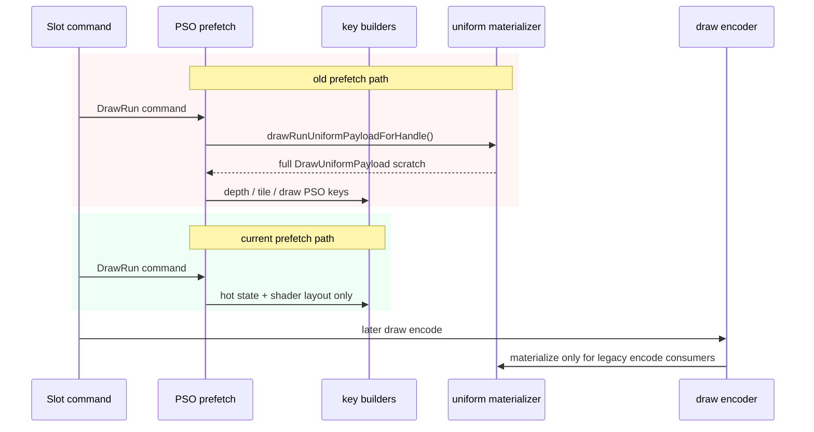

# Encode Phase 125 - PSO Prefetch Uniform Materialization Elision

**Question.** Does encode-slot PSO prefetch need to reconstruct the legacy
`DrawUniformPayload` view for every draw-run command?

**Implementation.** `CommandQueue::prefetchSlotPipelines()` now copies the
compact `DrawRunRecord` state view directly and no longer calls
`drawRunUniformPayloadForHandle()` while building prefetch keys. The prefetch
path only needs hot state and shader-layout data for depth-state keys, tile-FFP
classification, argbuf selector selection, and draw PSO variant lookup. The
actual draw encoder still materializes a legacy scratch view where existing
consumers require one.



**Contract.** `dxmt9-backend-key-descriptor-spec` now compares full-uniform and
null-uniform `FlatDrawStateView` inputs for the prefetch-owned key builders:
`makeDepthStencilKey()`, `classifyTileFfpForPass()`, and
`makeShaderVariantKey()`. Those keys must remain identical without uniform
payload values.

**Probe.**

```sh
bash scripts/tools/run_3dmark05_perf_probe.sh \
  --suffix uniform-pso-prefetch-no-materialize-r1 \
  --frame 60 \
  --no-gputrace \
  --no-encoder-breakdown \
  --frame-sampling \
  --timeout 120 \
  --wait-unlocked-sec 1 \
  --wait-unlocked-interval-sec 1
```

The run completed with `status=pass`, normal heavy-effect GT1 visual output,
and clean health counters: `draw_skipped_no_pipeline=0`,
`gpu_command_buffer_errors=0`, `render_split_hazard=0`, and
`draw_uniform_payload_materialize_fallbacks=0`.

## Result

Baseline is `uniform-backend-materialize-reuse-base-r1`; candidate is
`uniform-pso-prefetch-no-materialize-r1`.

| Metric | Baseline | Candidate | Delta |
|---|---:|---:|---:|
| `draw_uniform_payload_materialized` | `2,250,411` | `1,641,775` | `-608,636` |
| `uniform_backend_materialized_bytes_per_present` | `12,345,386.694` | `9,011,325.455` | `-27.01%` |
| `uniform_backend_materialize_cpu_ms_per_present` | `0.449` | `0.337` | `-24.83%` |
| `encode_slot_pso_prefetch_state_copy_cpu_ms_per_present` | `0.150` | `0.016` | `-89.21%` |
| `encode_slot_pso_prefetch_cpu_ms_per_present` | `1.352` | `1.130` | `-16.44%` |
| `encode_slot_pso_prefetch_draw_lookup_cpu_ms_per_present` | `0.218` | `0.212` | `-2.96%` |
| `encode_chunk_cpu_ms_per_present` | `10.820` | `10.789` | `-0.28%` |
| `commit_chunk_replay_cpu_ms_per_present` | `8.110` | `8.078` | `-0.40%` |
| `completion_wait_without_enqueue_ms_per_present` | `26.695` | `26.632` | `-0.24%` |
| `completion_wait_overlap_share_pct` | `0.086` | `0.498` | still near zero |

## Interpretation

The removed prefetch materialization is real waste: it trims the backend legacy
uniform scratch path by about `3.33MB/present` and removes most of the PSO
prefetch state-copy child. That validates direct compact-state consumption for
prefetch.

It does not change the average-FPS owner. The broader encode/replay stages are
nearly flat, and P4 remains no-enqueue dominated. The remaining work should
therefore rank direct compact consumers only where they remove a larger legacy
scratch path, or return to serial P2/P3/P4 overlap and larger encode/replay
children. Do not spend `.gputrace` on this cleanup alone.

**Related.** [state-churn-encode-encode-phase.121](state-churn-encode-encode-phase.121.md) -
[state-churn-encode-encode-phase.122](state-churn-encode-encode-phase.122.md) -
[state-churn-encode-encode-phase.124](state-churn-encode-encode-phase.124.md) - [state-churn-encode](index.md).
