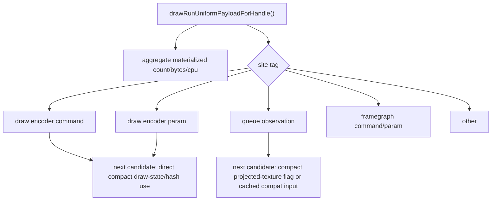

# Encode Phase 126 - Uniform Materialization Site Attribution

**Question.** After removing PSO-prefetch materialization, which remaining
backend consumers still reconstruct the legacy `DrawUniformPayload` scratch?

**Implementation.** `drawRunUniformPayloadForHandle()` now takes a
`DrawUniformPayloadMaterializeSite` tag and keeps the existing aggregate
materialization counters while adding site-specific count, byte, and CPU
counters. Production callers are tagged explicitly:

- `DrawEncoderCommand`
- `DrawEncoderParam`
- `FramegraphCommand`
- `FramegraphParam`
- `QueueObservation`
- `Other`



`summarize_3dmark05_perf.py` and
`compare_3dmark05_perf_counters.py` now expose derived rows such as
`uniform_backend_materialize_queue_observation_share_pct`,
`uniform_backend_materialize_*_bytes_per_present`, and
`uniform_backend_materialize_*_cpu_ms_per_present`.

**Probe.**

```sh
bash scripts/tools/run_3dmark05_perf_probe.sh \
  --suffix uniform-materialize-site-attribution-r1 \
  --frame 60 \
  --no-gputrace \
  --no-encoder-breakdown \
  --frame-sampling \
  --timeout 120 \
  --wait-unlocked-sec 1 \
  --wait-unlocked-interval-sec 1
```

The run completed with `status=pass`, normal GT1 high-effect output, and clean
health counters: `draw_skipped_no_pipeline=0`,
`gpu_command_buffer_errors=0`, `render_split_hazard=0`, and
`draw_uniform_payload_materialize_fallbacks=0`.

## Result

| Site | Calls | Share | Bytes / present | CPU ms / present |
|---|---:|---:|---:|---:|
| Draw encoder command | `540,884` | `36.81%` | `3,304,543.676` | `0.146` |
| Draw encoder param | `387,866` | `26.40%` | `2,369,676.562` | `0.104` |
| Queue observation | `540,629` | `36.79%` | `3,302,985.748` | `0.133` |
| Framegraph command | `0` | `0.00%` | `0.000` | `0.000` |
| Framegraph param | `0` | `0.00%` | `0.000` | `0.000` |
| Other | `0` | `0.00%` | `0.000` | `0.000` |

Aggregate materialization is `1,469,379` calls /
`8,977,205.986 bytes/present` / `0.382ms/present`.
P4 remains no-enqueue dominated:
`completion_wait_without_enqueue_ms_per_present=26.053`,
`completion_wait_overlap_share=0.273%`.

## Interpretation

The remaining legacy scratch owner is split almost exactly between two base
draw-run consumers plus per-draw override uniforms:

- The **draw encoder command** lane is required today because pass open,
  hazards, tile-FFP eligibility, and argbuf payload deltas read fields through
  `FlatDrawStateView::uniformPayload()`.
- The **queue observation** lane is not a Metal encode consumer, but
  `compatFlagsForDraw()` currently reads `textureTransforms` to set the
  projected-texture compatibility flag. This is the cleanest next local
  candidate because it can likely be converted to a compact/cached projected
  flag without changing draw encoding.
- The **draw encoder param** lane is the true per-draw override consumer. It is
  smaller than the two base lanes, but remains relevant for future direct compact
  argbuf/cbuf paths.

Do not treat this run as an FPS proof. It is an attribution gate that identifies
which direct compact consumers are worth designing next. The next low-risk
candidate is queue-observation projected-texture compat input, followed by draw
encoder command-state direct compact reads.

**Related.** [state-churn-encode-encode-phase.125](state-churn-encode-encode-phase.125.md) -
[state-churn-encode](index.md).
