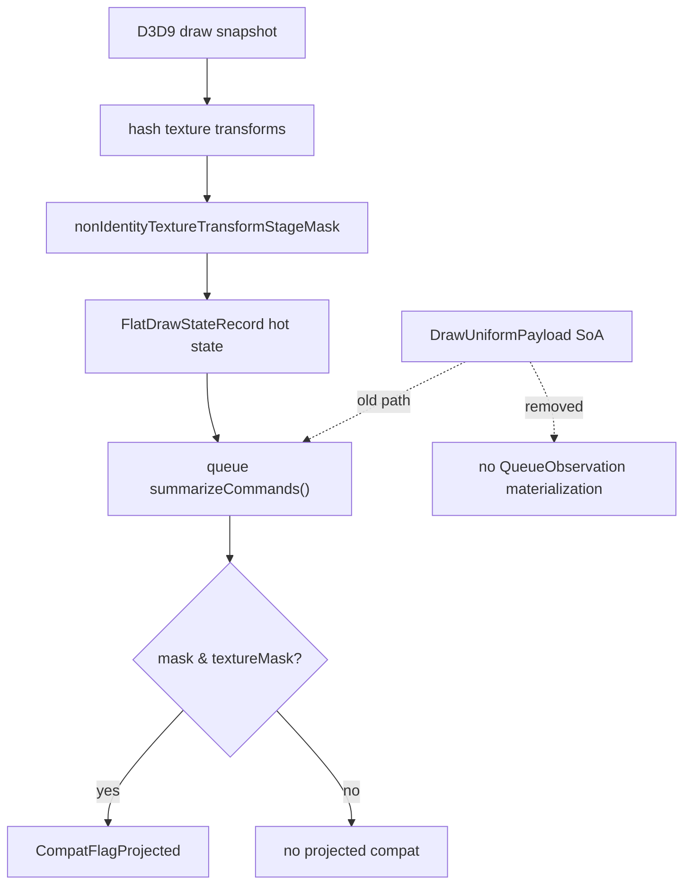

# Encode Phase 127 - Queue Observation Uniform Materialization Elision

**Question.** Can queue diagnostics preserve the projected-texture compatibility
flag without reconstructing the legacy `DrawUniformPayload` scratch for every
draw-run command?

**Implementation.** `FlatDrawStateKey`, `FlatDrawStateRecord`, and
`DrawUniformPayloadHashes` now carry `nonIdentityTextureTransformStageMask`.
The mask is computed alongside `textureTransformsHash`, copied through the
cache refresh path by `applyDrawUniformPayloadHashes()`, and preserved in the
compact hot state without increasing `FlatDrawStateRecord` size
(`7,984B` after the patch). `compatFlagsForDraw()` now derives
`CompatFlagProjected` from:

```cpp
hot.nonIdentityTextureTransformStageMask & hot.textureMask
```

and `makeChunkObservation()` no longer calls
`drawRunUniformPayloadForHandle(... QueueObservation)`.



`dxmt9-state-draw-transform-spec` pins the mask contract and
`dxmt9-dod-replay-observer-spec` clears the draw-run uniform SoA before queue
diagnostics, proving the projected flag is read from compact hot state rather
than by materializing the uniform payload.

**Probe.**

```sh
bash scripts/tools/run_3dmark05_perf_probe.sh \
  --suffix uniform-queue-observation-hot-mask-r1 \
  --no-gputrace \
  --timeout 120
```

The run completed with `status=pass` and a normal high-effect GT1 screenshot:
bright muzzle/beam/bloom particles are present, and health counters remain
clean (`draw_skipped_no_pipeline=0`, `gpu_command_buffer_errors=0`,
`render_split_hazard=0`, `draw_uniform_payload_materialize_fallbacks=0`).

## Result

| Metric | Value |
|---|---:|
| `draw_uniform_payload_materialized` | `1,006,595` |
| `uniform_backend_materialized_bytes_per_present` | `5,679,874.151` |
| `uniform_backend_materialize_cpu_ms_per_present` | `0.237` |
| `uniform_backend_materialize_draw_encoder_command_bytes_per_present` | `3,320,897.733` |
| `uniform_backend_materialize_draw_encoder_command_cpu_ms_per_present` | `0.139` |
| `uniform_backend_materialize_draw_encoder_param_bytes_per_present` | `2,358,976.418` |
| `uniform_backend_materialize_draw_encoder_param_cpu_ms_per_present` | `0.098` |
| `uniform_backend_materialize_queue_observation_share_pct` | `0.00%` |
| `uniform_backend_materialize_queue_observation_bytes_per_present` | `0.000` |
| `uniform_backend_materialize_queue_observation_cpu_ms_per_present` | `0.000` |

The phase 126 attribution run measured queue observation at
`3,302,985.748 bytes/present` and `0.133ms/present`. This run removes that site
entirely; the remaining legacy scratch work is draw-encoder command
materialization plus per-draw param materialization.

Pacing and owner rows are unchanged in shape:

| Metric | Value |
|---|---:|
| `completion_wait_without_enqueue_ms_per_present` | `25.390` |
| `completion_wait_overlap_share` | `0.000%` |
| `gpu_command_buffer_time_ms_per_present` | `3.087` |
| `commit_chunk_replay_cpu_ms_per_present` | `8.323` |
| `encode_chunk_cpu_ms_per_present` | `13.670` |

## Interpretation

This is an accepted local cleanup and a useful proof that more queue/observer
work should consume compact state instead of legacy uniform scratch. It is not
an FPS proof. The removed queue site was about `0.13ms/present` in phase 126,
and the current run still has no producer overlap while waiting for completion.

The remaining materialization candidates are now real draw-encoder consumers:

- **Draw encoder command**: pass open, hazard/tile-FFP/argbuf state consumers
  still read through a command-level legacy payload view.
- **Draw encoder param**: true per-draw override uniforms still require a
  materialized view until the argbuf/cbuf path can consume compact fixed/stage
  payload records directly.

Next CPU cleanup should target those encoder consumers only if it also reduces
larger P2/P3 work or prepares a direct compact argbuf/cbuf path. Otherwise the
average-FPS investigation should stay on P4 producer run-ahead / present
completion overlap and the larger replay/encode stage shape.

**Related.** [[state-churn-encode-encode-phase.126]] -
[[state-churn-encode]].
