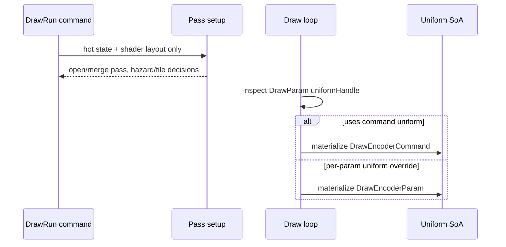

# Encode Phase 128 - Lazy Command Uniform Materialization Rejected

> **Outdated — every artifact this leaf cites in `source:` is gone from disk.** The numbers below cannot be re-derived or re-checked. Kept as history; do not cite it as current evidence.

**Question.** Is the remaining `DrawEncoderCommand` legacy
`DrawUniformPayload` materialization mostly pass-setup waste that can be
removed by delaying the lookup until the draw loop actually consumes the
command-level uniform?

**Temporary probe.** A local, non-retained patch changed
`encodeDrawRunCommand()` so render-pass setup, hazard probing, and tile-FFP
selection used the `FlatDrawStateView` without a materialized uniform payload.
The command-level uniform was resolved lazily only when a `DrawParam` used the
draw-run record's uniform handle. Per-draw override uniforms still resolved
through the existing `DrawEncoderParam` site.



The patch was reverted after the probe because it did not move the GT1
materialization rate.

**Probe.**

```sh
bash scripts/tools/run_3dmark05_perf_probe.sh \
  --suffix lazy-command-uniform-materialize-r1 \
  --no-gputrace \
  --timeout 120
```

The run completed with `status=pass`. The screenshot is visually normal for the
high-effect section: muzzle flashes, bloom beams, sparks, and particles are
present. Health counters stayed clean (`draw_skipped_no_pipeline=0`,
`gpu_command_buffer_errors=0`, `render_split_hazard=0`).

## Result

| Metric | Phase 127 | Lazy probe |
|---|---:|---:|
| `present_encoded` | `1,819` | `1,857` |
| `draw_uniform_payload_materialized_draw_encoder_command/present` | `323.548` | `323.233` |
| `draw_uniform_payload_materialized_draw_encoder_command_bytes/present` | `3,320,897.734` | `3,317,659.748` |
| `draw_uniform_payload_materialize_draw_encoder_command_cpu_ms/present` | `0.139` | `0.136` |
| `draw_encoder_param_materialized/present` | `229.830` | `229.792` |
| `queue_observation_materialized/present` | `0.000` | `0.000` |
| `completion_wait_without_enqueue_ms/present` | `25.390` | `25.515` |
| `gpu_command_buffer_time_ms/present` | `3.087` | `3.091` |
| `commit_chunk_replay_cpu_ms/present` | `8.323` | `8.099` |
| `encode_chunk_cpu_ms/present` | `13.670` | `13.251` |

The command materialization rate is effectively unchanged. That means GT1's
`DrawEncoderCommand` site is not mostly commands that only need pass setup and
then draw with param-specific uniforms. Almost every draw-run that reaches this
site consumes the command uniform in the draw loop.

## Interpretation

Lazy command lookup is rejected as a retained cleanup for GT1. The useful
conclusion is narrower and stronger: the remaining command/param materialization
is a real draw-encoder consumer, not an obvious pass-open observer like the
phase 127 queue site.

The next viable uniform-storage work is therefore not another lookup-delay
micro-optimization. It must change the consumer shape:

- build VS/PS dirty constant uploads directly from compact fixed/stage records,
  without reconstructing full legacy `DrawUniformPayload`;
- keep FFP VS/PS builders correct for texture transforms, material, lights,
  fog, viewport, and clip planes while reading compact records;
- prove the direct compact path moves more than the current
  `~0.231ms/present` total materialization bucket before treating it as an FPS
  owner.

For average FPS, this result keeps the priority on larger P2/P3/P4 overlap and
replay/encode stage shape. The no-enqueue completion wait remains about
`25.5ms/present`, while GPU command-buffer execution is about `3.1ms/present`.

**Related.** [state-churn-encode-encode-phase.127](state-churn-encode-encode-phase.127.md) -
[state-churn-encode](index.md).
