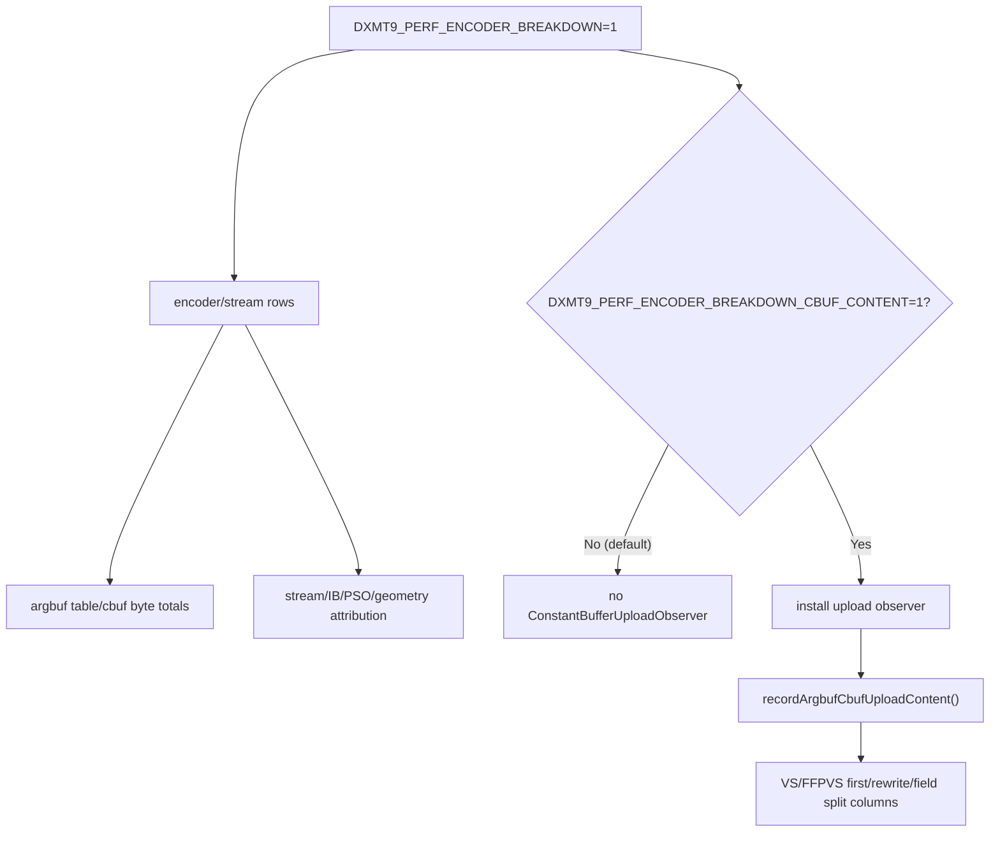
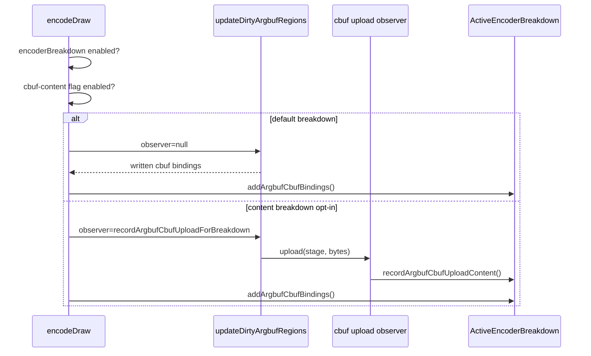

# Encode Phase 129 - Cbuf Content Breakdown Default-Off

**Question.** Should `DXMT9_PERF_ENCODER_BREAKDOWN=1` keep scanning uploaded
VS/FFPVS cbuf bytes to classify first/rewrite/field deltas during normal CPU
baseline runs?

**Verdict.** No. The content-history scan is useful attribution, but it is a
heavy extension of the encoder breakdown, not part of the low-overhead
breakdown baseline. The default breakdown still records argbuf table/cbuf byte
totals, while the byte-by-byte VS/FFPVS content scan now requires
`DXMT9_PERF_ENCODER_BREAKDOWN_CBUF_CONTENT=1`.



## Implementation

`encoderBreakdownCbufContentEnabled()` reads the new env once. `encodeDraw()`
uses it to decide whether to install the argbuf hybrid
`ConstantBufferUploadObserver`. The direct FFPVS upload path still contributes
to `argbuf_cbuf_*_bytes` when the encoder breakdown is enabled, but it calls
`recordArgbufCbufUploadContent()` only when the new content flag is set.



## Why This Matters

The phase 128 scout left `encode_draw_argbuf_cbuf_observer_cpu_ms` visible in
the current ranking. That bucket is diagnostic work: `recordVsUploadContent()`
and `recordFfpVsUploadContent()` compare uploaded cbuf bytes against
encoder-local history and split deltas by VS float/int/bool or FFPVS matrix,
material, light, texture-transform, clip, viewport, and fog/point groups.

Reading that bucket as renderer cost would mis-rank the next owner. After this
change, a normal `DXMT9_PERF_ENCODER_BREAKDOWN=1` run should show the observer
CPU counters at zero while preserving the byte totals needed by encoder/Xcode
joins. Enable `DXMT9_PERF_ENCODER_BREAKDOWN_CBUF_CONTENT=1` only when the
question is specifically cbuf content volatility.

## Runtime Proof

Run the usual 120s no-gputrace scout with a later screenshot capture point so
the captured frame lands in the active GT1 scene instead of the early black HUD
transition:

```sh
bash scripts/tools/run_3dmark05_perf_probe.sh \
  --suffix encoder-breakdown-cbuf-content-defaultoff-r3 \
  --no-gputrace \
  --timeout 120 \
  --capture-delay-sec 85
```

The run completed with `status=pass`. `actual.png` is a normal GT1 scene with
fog and scene geometry visible, not a black/HUD-only capture. Health counters
are clean:

| Counter | Value |
|---|---:|
| `present_encoded` | `1,440` |
| `draw_skipped_no_pipeline` | `0` |
| `gpu_command_buffer_errors` | `0` |
| `render_split_hazard` | `0` |

The default breakdown keeps byte totals while the content-history observer stays
off:

| Metric | Value |
|---|---:|
| `encode_draw_argbuf_cbuf_observer_cpu_ms` | `0.000` |
| `encode_draw_argbuf_cbuf_observer_vs_cpu_ms` | `0.000` |
| `encode_draw_argbuf_cbuf_observer_ffp_vs_cpu_ms` | `0.000` |
| `encode_draw_argbuf_cbuf_update_cpu_ms` | `1,707.156` |
| `encode_draw_argbuf_cbuf_update_vs_bytes` | `784,391,776` |
| encoder CSV `argbuf_cbuf_bytes` | `882,765,800` |
| encoder CSV `argbuf_table_bytes` | `26,087,584` |
| encoder CSV `argbuf_cbuf_vs_first_bytes` | `0` |
| encoder CSV `argbuf_cbuf_vs_rewrite_changed_bytes` | `0` |
| encoder CSV `argbuf_cbuf_ffp_vs_first_bytes` | `0` |

This proves the intended split: `DXMT9_PERF_ENCODER_BREAKDOWN=1` still exposes
argbuf table/cbuf traffic for encoder/Xcode joins, while the VS/FFPVS
first/rewrite/field split columns are zero unless
`DXMT9_PERF_ENCODER_BREAKDOWN_CBUF_CONTENT=1` is set.

Do not read this as an FPS win. It removes a diagnostic observer from default
CPU attribution so the next owner ranking does not confuse measurement work with
renderer work.

The resulting r3 owner ranking still points away from this observer:

| Bucket | r3 ms/present |
|---|---:|
| `completion_wait_without_enqueue_ms` | `25.390` |
| `encode_chunk_cpu_ms` | `15.271` |
| `encode_draw_cpu_ms` | `11.797` |
| `commit_chunk_replay_cpu_ms` | `10.336` |
| `commit_chunk_queue_draw_submission_snapshot_cpu_ms` | `4.516` |
| `encode_draw_argbuf_setup_cpu_ms` | `2.324` |
| `encode_draw_stream_bind_cpu_ms` | `1.811` |
| `encode_slot_pso_prefetch_cpu_ms` | `1.431` |

The next CPU-side work should therefore stay on P4 overlap/producer cadence,
snapshot/cache replay cost, argbuf table/cbuf update frequency, stream binding,
or PSO prefetch. The cbuf content observer is no longer a valid default-profile
owner.

**Related.** state-churn-encode-encode-phase.128 -
[state-churn-encode](index.md).
