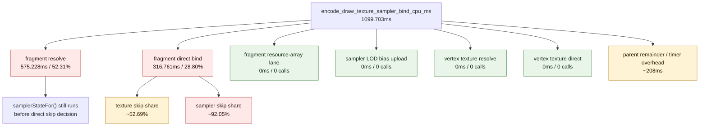

# Texture Sampler Phase Split

> **Outdated — every artifact this leaf cites in `source:` is gone from disk.** The numbers below cannot be re-derived or re-checked. Kept as history; do not cite it as current evidence.

**Question / hypothesis.** [state-churn-encode-encode-phase.12](state-churn-encode-encode-phase.12.md) identified
texture/sampler binding as the largest child of `stream_bind`
(`1065.369ms`). Split that phase before trying a broad bind-cache or
resource-array change.

**Implementation.** Retained attribution counters split the existing
`encode_draw_texture_sampler_bind_cpu_ms` parent:

- `encode_draw_texture_sampler_fragment_resolve_*`
- `encode_draw_texture_sampler_fragment_resource_array_*`
- `encode_draw_texture_sampler_fragment_direct_*`
- `encode_draw_texture_sampler_lod_bias_*`
- `encode_draw_texture_sampler_vertex_resolve_*`
- `encode_draw_texture_sampler_vertex_direct_*`

The summary script also exposes the existing `bind_texture`,
`bind_texture_skipped`, `bind_sampler`, and `bind_sampler_skipped` counters so
skip ratios are visible in the same report.

**Method.**

```bash
bash scripts/tools/run_3dmark05_perf_probe.sh \
  --suffix texture-sampler-phase-split-r1 \
  --frame 50 \
  --no-gputrace \
  --no-encoder-breakdown \
  --timeout 180

python3 scripts/tools/compare_3dmark05_perf_counters.py \
  experiments/output/app-d3d9-3dmark05-stream-bind-phase-split-r1 \
  experiments/output/app-d3d9-3dmark05-texture-sampler-phase-split-r1 \
  --before-label stream-bind-phase-split \
  --after-label texture-sampler-phase-split \
  --output experiments/output/app-d3d9-3dmark05-texture-sampler-phase-split-r1/dxmt9-perf-counter-comparison-vs-stream-split.md
```

The run hit the expected watchdog status `124` after writing artifacts.
`actual.png` is a normal visible GT1 frame with robot, flare, and HUD visible
(`FPS: 18`, `Time: 0:55.05`, `Frame: 991`).

**Result.** This is a same-present comparison (`1740 -> 1740`) with stable
shape: `draws_per_present` moves only `-0.11%`, tile preservation moves
`-0.04%`, and GPU command-buffer time per present moves
`3.051 -> 3.025ms`. The added timers raise CPU parent counters, so this is
attribution only.

| Counter | Stream split | Texture split | Reading |
|---|---:|---:|---|
| `present_encoded` | 1,740 | 1,740 | same run length |
| `draw_calls` | 1,274,427 | 1,273,026 | -0.11% |
| `encode_draw_texture_sampler_bind_cpu_ms` | 1,020.916 | 1,099.703 | parent perturbed by extra timers |
| `encode_draw_texture_sampler_fragment_resolve_cpu_ms` | - | 575.228 | largest child, 52.31% of parent |
| `encode_draw_texture_sampler_fragment_resolve_calls` | - | 345,145 | 198.36 calls/present |
| `encode_draw_texture_sampler_fragment_direct_cpu_ms` | - | 316.761 | second child, 28.80% of parent |
| `encode_draw_texture_sampler_fragment_direct_calls` | - | 345,145 | same call count as resolve |
| `encode_draw_texture_sampler_fragment_resource_array_cpu_ms` | - | 0.000 | resource-array lane unused in this GT1 path |
| `encode_draw_texture_sampler_lod_bias_cpu_ms` | - | 0.000 | LOD-bias upload unused |
| `encode_draw_texture_sampler_vertex_resolve_cpu_ms` | - | 0.000 | vertex textures unused |
| `encode_draw_texture_sampler_vertex_direct_cpu_ms` | - | 0.000 | vertex texture direct lane unused |
| `bind_texture / bind_texture_skipped` | 1,083,228 / 1,206,236 | 1,081,783 / 1,204,743 | texture skip share ~52.69% |
| `bind_sampler / bind_sampler_skipped` | 181,860 / 2,107,604 | 181,697 / 2,104,829 | sampler skip share ~92.05% |



**Verdict.** Accepted attribution. GT1's texture/sampler CPU path is almost
entirely fragment-stage. The resource-array lane, vertex texture lane, and
LOD-bias upload are not load-bearing. The largest visible child is fragment
resolve, followed by fragment direct bind/shadow/set calls.

**Next.** The strongest next hypothesis is that sampler resolution work is done
too early: the direct path resolves a sampler handle via `samplerStateFor()`
before it can discover that the sampler bind will be skipped, and this workload
skips ~92% of sampler binds. A targeted next split should separate texture
record lookup, `textureForShaderRead`, sampler cache lookup, shadow hash/match,
and actual Metal set calls, then test whether sampler shadow identity can avoid
most cache lookups before materializing a `MTLSamplerState`.

**Related.** [state-churn-encode](index.md) ·
[state-churn-encode-encode-phase.12](state-churn-encode-encode-phase.12.md) · [present-pacing](../present-pacing/index.md).
