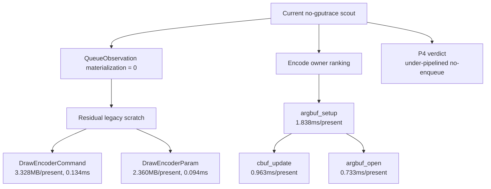

# Encode Phase 130 - Current Materialization And Argbuf Owner Refresh

**Question.** After queue-observation materialization was removed and cbuf
content-history scanning became opt-in, is backend uniform materialization still
the next average-FPS owner?

**Verdict.** No. The current run confirms the queue-observation site is still
closed (`0` calls), and the remaining legacy `DrawUniformPayload` scratch work
is only `0.228ms/present`. It is a valid local cleanup target, but smaller than
the exposed encode owners: `argbuf_setup=1.838ms/present`, including
`cbuf_update=0.963ms/present` and `argbuf_open=0.733ms/present`. The broader
P4/P2/P3 shape is unchanged: no-enqueue completion wait is
`26.586ms/present`, replay is `8.104ms/present`, and encode is
`10.949ms/present`.



## Probe

```sh
bash scripts/tools/run_3dmark05_perf_probe.sh \
  --suffix current-materialization-sites-r1-20260615 \
  --no-gputrace \
  --no-encoder-breakdown \
  --frame-sampling \
  --timeout 120 \
  --capture-delay-sec 45 \
  --wait-unlocked-sec 1 \
  --wait-unlocked-interval-sec 1
```

The run completed with `status=pass`, `present_encoded=1,868`, and
`sampled_avg_fps=17.086`. The captured frame is visually normal for the
high-effect GT1 section: muzzle flashes, bloom discs, tracers, fog, and bright
floor/beam lighting are present.

## Result

| Metric | Value |
|---|---:|
| `completion_wait_without_enqueue_ms_per_present` | `26.586` |
| `completion_wait_with_enqueue_ms_per_present` | `0.681` |
| `gpu_command_buffer_time_ms_per_present` | `3.186` |
| `commit_chunk_replay_cpu_ms_per_present` | `8.104` |
| `commit_chunk_queue_draw_submission_cpu_ms_per_present` | `4.064` |
| `d3d9_snapshot_draw_submission_cpu_ms_per_present` | `3.367` |
| `encode_chunk_cpu_ms_per_present` | `10.949` |
| `encode_draw_cpu_ms_per_present` | `8.497` |
| `encode_draw_argbuf_setup_cpu_ms_per_present` | `1.838` |
| `encode_draw_argbuf_cbuf_update_cpu_ms_per_present` | `0.963` |
| `encode_draw_argbuf_open_cpu_ms_per_present` | `0.733` |
| `draw_uniform_payload_materialized` | `1,035,145` |
| `uniform_backend_materialized_bytes_per_present` | `5,687,756.039` |
| `uniform_backend_materialize_cpu_ms_per_present` | `0.228` |
| `uniform_backend_materialize_draw_encoder_command_bytes_per_present` | `3,327,722.869` |
| `uniform_backend_materialize_draw_encoder_command_cpu_ms_per_present` | `0.134` |
| `uniform_backend_materialize_draw_encoder_param_bytes_per_present` | `2,360,033.169` |
| `uniform_backend_materialize_draw_encoder_param_cpu_ms_per_present` | `0.094` |
| `uniform_backend_materialize_queue_observation_bytes_per_present` | `0.000` |
| `uniform_backend_materialize_queue_observation_cpu_ms_per_present` | `0.000` |
| `draw_uniform_payload_materialize_fallbacks` | `0` |
| `uniform_append_bytes_per_present` | `489,597.525` |

## Interpretation

Phase 126's queue-observation row was a transient attribution target, not the
current next step. Phase 127 already removed it by carrying
`nonIdentityTextureTransformStageMask` in hot state, and this run reconfirms
that current code has no queue-observation legacy scratch path.

The remaining draw-encoder command/param materialization is real, but its CPU
cost is too small to outrank the current encode tree. A direct compact consumer
can still reduce copied bytes, but an average-FPS claim should first move one of
these larger gates:

- `encode_draw_argbuf_setup_cpu_ms`, especially dirty VS cbuf update and table
  open/reopen frequency;
- `commit_chunk_replay_cpu_ms` / snapshot queue-submission work;
- P4 overlap, proven by increasing `completion_wait_with_enqueue` or lowering
  `completion_wait_without_enqueue`.

**Related.** [[state-churn-encode]] ·
[[state-churn-encode-encode-phase.127]] ·
[[state-churn-encode-encode-phase.128]] · [[present-pacing]].
