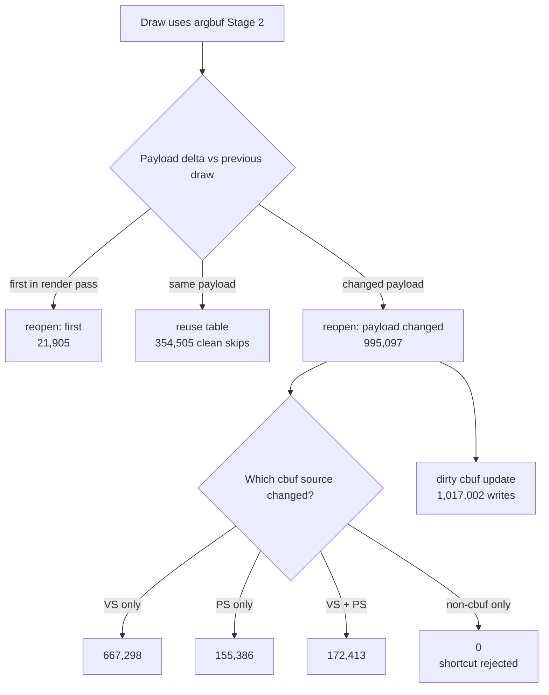

# Encode Phase 131 - Current Argbuf Payload Delta Recheck

**Question.** After the compact-uniform and argbuf-open cleanup work, is the
current `reopenArgbuf` pressure still partly caused by broad uniform-payload
hash changes that do not affect cbuf sources?

**Verdict.** No. The current GT1 run again reports
`changed_nonconst_only=0`. Every payload-change reopen is explained by VS and/or
PS constant-source hash movement, so replacing the full uniform payload hash
with only cbuf-source hashes would not reduce GT1 argbuf reopen count. The
remaining argbuf owner is real source churn plus table/storage shape, not an
over-broad reopen predicate.



## Probe

```sh
DXMT9_PERF_ARGBUF_PAYLOAD_DELTA=1 \
DXMT9_PERF_ARGBUF_REOPEN_SPLIT=1 \
bash scripts/tools/run_3dmark05_perf_probe.sh \
  --suffix argbuf-payload-delta-current-r1-20260615 \
  --no-gputrace \
  --no-encoder-breakdown \
  --frame-sampling \
  --timeout 120 \
  --capture-delay-sec 45 \
  --wait-unlocked-sec 1 \
  --wait-unlocked-interval-sec 1
```

The run completed with `status=pass`, `present_encoded=1,860`, and
`sampled_avg_fps=17.026`. The captured frame is visually normal for the GT1
muzzle-flash/fog section. This is an attribution run with opt-in hot-path
payload/reopen timers, so the absolute argbuf CPU parent movement is not a
representative FPS A/B.

## Result

| Metric | Value |
|---|---:|
| `payload_delta_probe_calls` | `1,371,507` |
| `payload_delta_first` | `21,905` |
| `payload_delta_same` | `354,505` |
| `payload_delta_changed` | `995,097` |
| `payload_delta_changed_vs_only` | `667,298` |
| `payload_delta_changed_ps_only` | `155,386` |
| `payload_delta_changed_vs_ps` | `172,413` |
| `payload_delta_changed_nonconst_only` | `0` |
| `payload_delta_reopen_first` | `21,905` |
| `payload_delta_reopen_payload_changed` | `995,097` |
| `payload_delta_reopen_payload_same` | `0` |
| `payload_delta_reopen_resource_array` | `0` |
| `argbuf_cbuf_update_dirty_calls` | `1,017,002` |
| `argbuf_cbuf_update_skipped_clean` | `354,505` |
| `argbuf_cbuf_update_vs_calls` | `861,616` |
| `argbuf_cbuf_update_vs_bytes` | `828,725,744` |
| `argbuf_cbuf_update_ps_calls` | `351,300` |
| `argbuf_cbuf_update_ps_bytes` | `43,293,456` |
| `argbuf_setup_ms_per_present` | `2.292` |
| `argbuf_cbuf_update_ms_per_present` | `0.984` |
| `argbuf_open_ms_per_present` | `1.162` |
| `completion_wait_without_enqueue_ms_per_present` | `26.840` |
| `gpu_command_buffer_time_ms_per_present` | `3.127` |

## Interpretation

This refresh reproduces the earlier phase63 conclusion on the current code:
GT1's argbuf table reopens are not caused by unrelated fixed-function,
texture-transform, or other non-cbuf uniform bits. The broad-payload hash is
therefore not the immediate owner.

The useful positive signal is the shape of the cbuf source churn. VS-only
changes dominate (`667,298` draws, `48.65%` of all probes), followed by
VS+PS (`172,413`) and PS-only (`155,386`). Dirty VS updates remain the largest
argbuf cbuf child (`861,616` calls, `828.7MB` copied). The next argbuf work
should focus on persistent/segmented cbuf storage, reducing upstream VS constant
generation churn, or a table model that avoids mutable-table reopen side
effects when cbuf pointers change. It should not be another "ignore non-cbuf
payload bits" shortcut unless a future workload first shows nonzero
`changed_nonconst_only`.

**Related.** [[state-churn-encode]] ·
[[state-churn-encode-encode-phase.63]] ·
[[state-churn-encode-encode-phase.123]] ·
[[state-churn-encode-encode-phase.130]].
