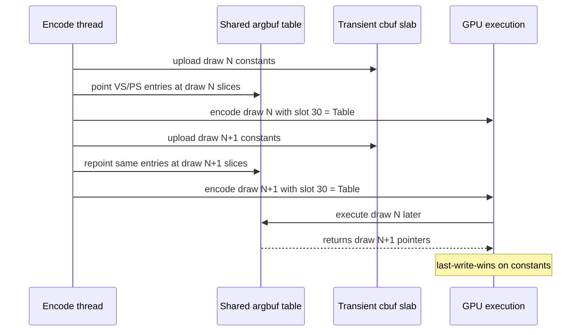
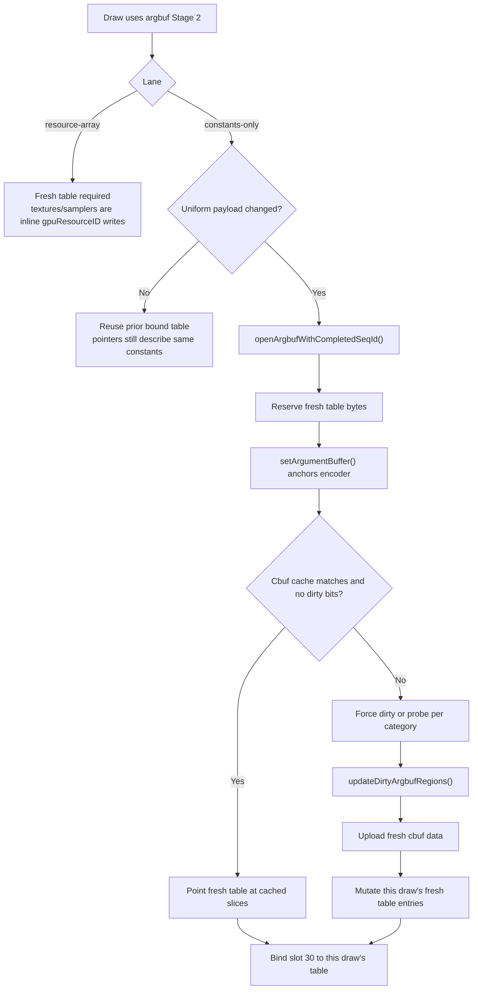

# Encode Phase 132 - Argbuf Table Lifetime Code Review

**Question.** Can the current constants-only Stage 2 path reduce
`argbuf_open` by sharing one argument-buffer table across multiple draws and
only mutating cbuf pointers as constants change?

**Verdict.** No, not with the current mutable-table model. In this path the cbuf
data already goes to fresh transient storage, but the argument-buffer descriptor
table is mutated in place by `updateDirtyArgbufRegions()`. If multiple draws in
one render pass share that table and the table is rewritten before the GPU
executes, each draw sees the last cbuf pointer written. The source comments
already call this out as the `dxut-simple` overlay PassMix failure mode, so
"reuse the mutable table and repoint cbuf entries" is correctness-invalid.

## Current Lifetime Model

The safe reuse case is narrow: the constants-only lane may leave slot 30 bound
when the current draw's uniform payload is unchanged from the previous draw on
the same encoder. That is not table mutation; it is reuse of a table whose
pointers still describe the same payload.

Phase 131 closes the obvious predicate shortcut. The current payload-delta run
reported `changed_nonconst_only=0`, with every payload-change reopen explained
by VS and/or PS source movement. A cbuf-source-only reopen predicate therefore
does not save GT1 reopens.

## Candidate Directions

| Direction | Why it can be correct | Required proof |
|---|---|---|
| Keep fresh per-draw tables, make them cheaper | Preserves current per-draw descriptor-table lifetime | Reduce `argbuf_open`, `reopen_post`, table bytes, or reserve/bind CPU without visual drift |
| Split cbufs out of the mutable argbuf table | Metal command-buffer `set*Buffer` bindings are recorded per draw instead of later-read mutable table bytes | Prove slot pressure, cbuf bind CPU, and shader access changes do not regress visual output or P4 |
| Stable cbuf indirection table plus per-draw scalar index/offset | The argbuf descriptor stays stable while the per-draw selector changes in command-recorded state | Prove shader transformation and indexed access semantics, then show fewer table reopens |
| Persistent segmented cbuf storage with immutable descriptor pages | Each draw still owns the descriptor page it references, but page allocation/reuse is amortized | Prove no overwrite before completion waterline and lower table open/reserve CPU |

## Rejected Shortcuts

| Shortcut | Reason |
|---|---|
| Share one mutable constants table across changed draws | Last-write-wins on cbuf pointers when the GPU reads the table later |
| Replace the full payload hash with cbuf-source hashes | Phase 131 measured `changed_nonconst_only=0`, so GT1 saves no reopens |
| Dirty VS identity repoint | Phase 123 measured `0` dirty VS identity hits on current code |
| Completed-seq snapshot plumbing as the argbuf answer | Phase 124 only trimmed reserve child CPU and did not move the parent or FPS |

## Next Gate

The next argbuf implementation should declare which lifetime model it changes
before writing code. A valid A/B needs:

- normal GT1 visual smoke, including muzzle flashes, bloom discs, tracers, fog,
  particles, and HUD;
- clean skipped/error/hazard/map-wait/sequence-wait counters;
- reduced `encode_draw_argbuf_setup_cpu_ms`, split into table-open/reopen and
  cbuf-update movement;
- no new `changed_nonconst_only` shortcut claim unless the probe first becomes
  nonzero on the target workload;
- frame sampling plus P4 counters, because a local argbuf CPU win is not an FPS
  win unless completion wait or producer overlap moves.

**Related.** [state-churn-encode](../state-churn-encode.md) ·
[state-churn-encode-encode-phase.55](state-churn-encode-encode-phase.55.md) ·
[state-churn-encode-encode-phase.56](state-churn-encode-encode-phase.56.md) ·
[state-churn-encode-encode-phase.123](state-churn-encode-encode-phase.123.md) ·
[state-churn-encode-encode-phase.131](state-churn-encode-encode-phase.131.md).
