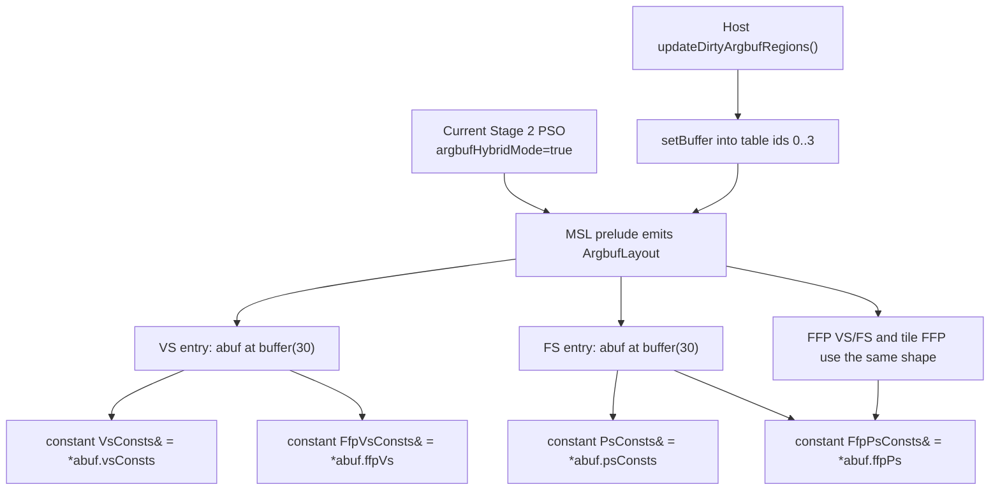
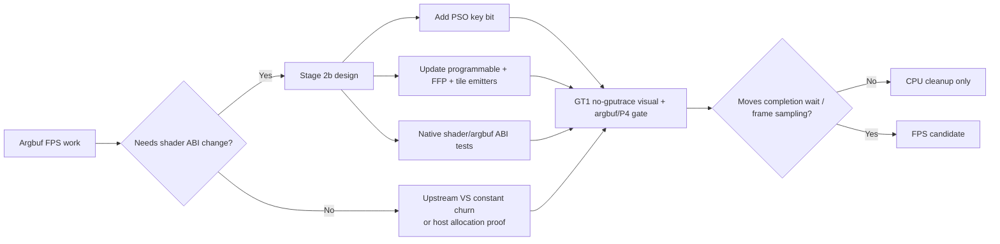

# Encode Phase 133 - Stage 2 Argbuf ABI Candidate Triage

**Question.** After rejecting shared mutable argbuf tables, which Stage 2
argbuf model is small enough to try next?

**Verdict.** The source layout makes a host-only fix unlikely. Current Stage 2
shader variants bind one `ArgbufLayout` at slot 30 and dereference
`abuf.vsConsts`, `abuf.ffpVs`, `abuf.psConsts`, and `abuf.ffpPs` in
programmable, FFP, and tile-FFP paths. Moving cbufs out of that table means a
new shader/PSO ABI bit, not just a draw-encoder change. It also overlaps the
already-measured Stage 1 direct-cbuf path, which was a local CPU win but failed
the low-overhead FPS/P4 gate.

## ABI Facts

| Fact | Source implication |
|---|---|
| `makeShaderPreludeArgbufHybrid()` declares four pointer fields in `ArgbufLayout` | Constants are not independent Metal buffer params in Stage 2 |
| Programmable VS and FS entry points re-alias cbuf names from `abuf` | A direct-cbuf experiment needs new entry-point generation |
| FFP shaders and tile FFP also read through `abuf` under Stage 2 | The variant must cover all shader emitters, not just DXBC shaders |
| `buildArgumentDescriptors()` mirrors ids `0..3` as buffer descriptors | Host table layout and shader layout are coupled |
| Resource-array mode extends the same cbuf table with texture/sampler arrays | Resource-array does not solve constants lifetime; it increases the mutable table surface |

## Candidate Ranking

| Candidate | Scope | Current read |
|---|---|---|
| Direct cbuf bind Stage 2b | New shader/PSO ABI bit plus encoder branch; close to Stage 1 uniform ABI | Not the next small patch. Phase 67/68 already showed `DXMT9_DISABLE_ARGBUF_HYBRID=1` cuts local encode CPU but does not promote FPS/P4 |
| Stable cbuf indirection with per-draw selector | New shader ABI: stable buffers plus draw-local offsets/indices, likely through `DrawVolatile` or a new tiny per-draw record | Plausible structural experiment, but requires deterministic shader/ABI tests before GT1 |
| Immutable descriptor pages with cheaper allocation | Host-side only if Metal argument table bytes can be copied or prebuilt safely | Needs a Metal table-copy oracle; do not assume opaque argument-buffer bytes are portable without capture/test evidence |
| Reduce upstream VS constant churn | Frontend/state-cache work, no shader ABI change | Still viable because phase 131 shows VS-only changes dominate reopen pressure |

## Decision

Treat "split cbufs out of the mutable table" as a Stage 2b shader ABI project,
not as the immediate argbuf micro-optimization. The next low-risk work should
therefore be one of:

- prove an upstream VS-constant churn reduction that lowers
  `payload_delta_changed_vs_only` and dirty VS cbuf calls;
- design a Stage 2b ABI with explicit PSO keying and native shader tests before
  any GT1 run;
- gather a Metal/Xcode oracle for immutable descriptor-page copying once
  `.gputrace` is available again.

## Next Gate

Before implementing Stage 2b, add or identify deterministic tests that prove:

- generated programmable VS/FS MSL uses the intended cbuf binding shape;
- generated FFP VS/FS and tile FFP use the same binding shape;
- the PSO cache key distinguishes Stage 2 current ABI from Stage 2b;
- host encoder binds the exact cbuf slots that the generated MSL declares.

For GT1 runtime proof, use the same visual/P4 gate as phase 132. A local
`encode_draw_argbuf_setup_cpu_ms` reduction is not enough if
`completion_wait_without_enqueue` rises or frame sampling stays flat.

**Related.** [[state-churn-encode]] ·
[[state-churn-encode-encode-phase.67]] ·
[[state-churn-encode-encode-phase.68]] ·
[[state-churn-encode-encode-phase.131]] ·
[[state-churn-encode-encode-phase.132]].
