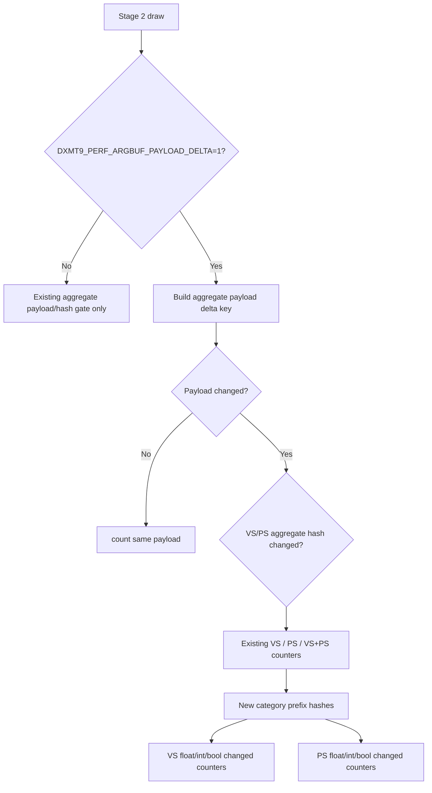

# Encode Phase 134 - Argbuf Payload Delta Component Split Instrumentation

**Question.** Phase 131 proves Stage 2 argbuf reopens are shader-constant
driven, with VS-only changes dominating. Can the next no-gputrace probe split
that VS churn into float/int/bool constant categories without changing the
default render path?

**Verdict.** Instrumentation added and measured. `DXMT9_PERF_ARGBUF_PAYLOAD_DELTA=1`
now computes opt-in prefix hashes for VS/PS float, int, and bool constant arrays
and compares them against the previous successfully encoded draw in the same
Metal render encoder. The default path is unchanged: the component hashes are
built only inside the existing heavy payload-delta probe branch. The runtime
result classifies the current Stage 2 argbuf reopen churn as float-constant
turnover, not int/bool invalidation.



## Added Counters

| Counter | Meaning |
|---|---|
| `encode_draw_argbuf_payload_delta_changed_vs_float` | Previous and current VS aggregate hashes differ, and the live VS float prefix differs |
| `encode_draw_argbuf_payload_delta_changed_vs_int` | Previous and current VS aggregate hashes differ, and the live VS int prefix differs |
| `encode_draw_argbuf_payload_delta_changed_vs_bool` | Previous and current VS aggregate hashes differ, and the live VS bool prefix differs |
| `encode_draw_argbuf_payload_delta_changed_ps_float` | Previous and current PS aggregate hashes differ, and the live PS float prefix differs |
| `encode_draw_argbuf_payload_delta_changed_ps_int` | Previous and current PS aggregate hashes differ, and the live PS int prefix differs |
| `encode_draw_argbuf_payload_delta_changed_ps_bool` | Previous and current PS aggregate hashes differ, and the live PS bool prefix differs |

The counters are non-exclusive. For example, one VS aggregate change may count
both `vs_float` and `vs_int` if both live prefixes changed.

## Runtime Result

Probe:

```sh
DXMT9_PERF_ARGBUF_PAYLOAD_DELTA=1 \
DXMT9_PERF_ARGBUF_REOPEN_SPLIT=1 \
bash scripts/tools/run_3dmark05_perf_probe.sh \
  --suffix argbuf-payload-delta-components-r2-20260615 \
  --no-gputrace \
  --no-encoder-breakdown \
  --frame-sampling \
  --timeout 120 \
  --capture-delay-sec 45 \
  --wait-unlocked-sec 1 \
  --wait-unlocked-interval-sec 1
```

Artifacts:

| Artifact | Path |
|---|---|
| Summary | `experiments/output/app-d3d9-3dmark05-argbuf-payload-delta-components-r2-20260615/3dmark05-perf-summary.md` |
| Raw counters | `experiments/output/app-d3d9-3dmark05-argbuf-payload-delta-components-r2-20260615/result.json` |
| Visual smoke | `experiments/output/app-d3d9-3dmark05-argbuf-payload-delta-components-r2-20260615/actual.png` |

| Counter | Value |
|---|---:|
| `present_encoded` | `1,868` |
| `sampled_avg_fps` | `17.089` |
| `encode_draw_argbuf_payload_delta_probe_calls` | `1,375,882` |
| `encode_draw_argbuf_payload_delta_first` | `21,992` |
| `encode_draw_argbuf_payload_delta_same` | `355,645` |
| `encode_draw_argbuf_payload_delta_changed` | `998,245` |
| `encode_draw_argbuf_payload_delta_changed_vs` | `843,136` |
| `encode_draw_argbuf_payload_delta_changed_ps` | `328,826` |
| `encode_draw_argbuf_payload_delta_changed_vs_ps` | `173,717` |
| `encode_draw_argbuf_payload_delta_changed_nonconst_only` | `0` |
| `encode_draw_argbuf_payload_delta_changed_vs_float` | `843,136` |
| `encode_draw_argbuf_payload_delta_changed_vs_int` | `0` |
| `encode_draw_argbuf_payload_delta_changed_vs_bool` | `0` |
| `encode_draw_argbuf_payload_delta_changed_ps_float` | `328,826` |
| `encode_draw_argbuf_payload_delta_changed_ps_int` | `0` |
| `encode_draw_argbuf_payload_delta_changed_ps_bool` | `0` |
| `encode_draw_argbuf_payload_delta_reopen_first` | `21,992` |
| `encode_draw_argbuf_payload_delta_reopen_payload_changed` | `998,245` |
| `encode_draw_argbuf_payload_delta_reopen_payload_same` | `0` |
| `encode_draw_argbuf_payload_delta_reopen_resource_array` | `0` |
| `encode_draw_argbuf_setup_cpu_ms_per_present` | `2.275` |
| `encode_draw_argbuf_open_cpu_ms_per_present` | `1.157` |
| `encode_draw_argbuf_reopen_post_cpu_ms_per_present` | `0.771` |
| `encode_draw_argbuf_cbuf_update_cpu_ms_per_present` | `0.971` |
| `encode_draw_argbuf_cbuf_update_vs_cpu_ms_per_present` | `0.552` |
| `encode_draw_argbuf_cbuf_update_ps_cpu_ms_per_present` | `0.208` |
| `completion_wait_without_enqueue_ms_per_present` | `26.833` |
| `completion_wait_with_enqueue_ms_per_present` | `0.198` |
| `gpu_command_buffer_time_ms_per_present` | `3.153` |

The equalities are the key result:

```text
changed_vs       == changed_vs_float == 843,136
changed_ps       == changed_ps_float == 328,826
changed_vs_int   == changed_vs_bool  == 0
changed_ps_int   == changed_ps_bool  == 0
changed_nonconst_only == 0
```

The normal scene screenshot and clean health counters (`draw_skipped_no_pipeline=0`,
`gpu_command_buffer_errors=0`, `render_split_hazard=0`, `map_buffer_wait_ms=0`,
`queue_sequence_wait_ms=0`) make this a usable attribution run rather than a
black-screen or visual-divergence sample.

## Interpretation

The current GT1 argbuf reopen branch is not an int/bool generation bug and not a
non-cbuf payload hash artifact. Both VS and PS aggregate changes are fully
explained by float constant prefix movement; VS dominates in absolute count and
dirty upload bytes. The next local argbuf work should therefore target one of:

| Target | Gate |
|---|---|
| Upstream VS float constant churn | Fewer `changed_vs_float` rows, fewer dirty VS cbuf updates, normal visual smoke |
| Cheaper immutable per-draw table/cbuf storage | Lower `argbuf_open` / `reopen_post` / table-bind CPU without mutable table last-write-wins |
| Stage 2b direct/segmented cbuf ABI | Explicit shader/PSO variant plan plus normal visual and P4/frame gates |

Do not spend another iteration on VS/PS int/bool invalidation or generic
non-cbuf payload hash pruning unless a future counter first becomes non-zero.
This probe is CPU attribution only; `.gputrace` is still needed for GPU backend
storage questions, but the argbuf component split does not need Xcode replay.

**Related.** [state-churn-encode](../state-churn-encode.md) ·
[state-churn-encode-encode-phase.131](state-churn-encode-encode-phase.131.md) ·
[state-churn-encode-encode-phase.132](state-churn-encode-encode-phase.132.md) ·
[state-churn-encode-encode-phase.133](state-churn-encode-encode-phase.133.md) ·
[state-churn-encode-encode-phase.135](state-churn-encode-encode-phase.135.md).
