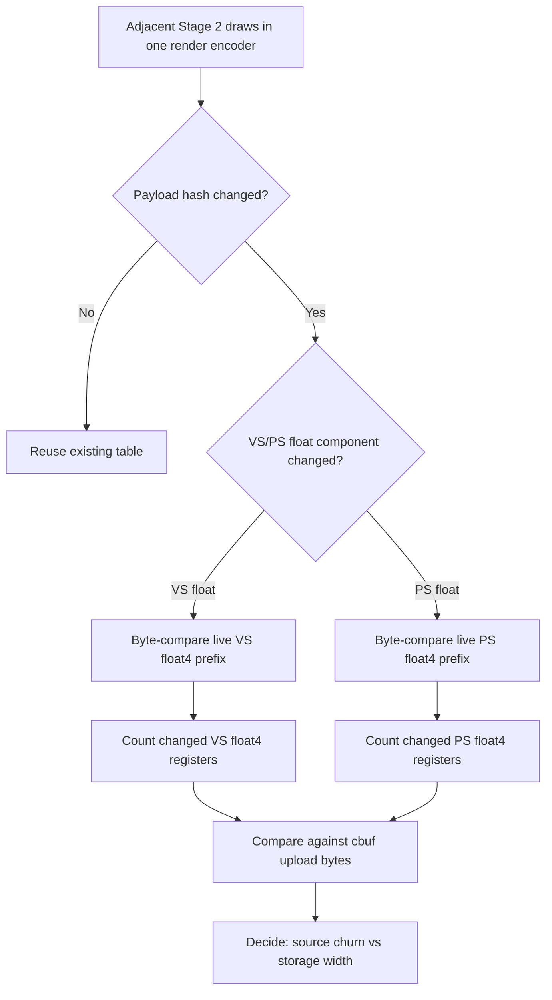

# Encode Phase 135 - Argbuf Payload Delta Float Width Attribution

**Question.** Phase 134 proves the Stage 2 argbuf payload churn is float-only.
Is that churn usually a wide full-cbuf rewrite, or do small float register
changes force much wider immutable argbuf/cbuf work?

**Verdict.** Superseded by phase 136. This run correctly proved that the
remaining payload churn was float-only, but the first width counter retained a
pointer to the previous `DrawUniformPayload`. Per-draw override payloads can be
materialized into loop-local scratch, so the width totals in this leaf are not
authoritative. Phase 136 fixes the probe by keeping an owned previous payload
copy and replaces the numeric width verdict.

Do not use this leaf's `13.665` VS-register average or `4.50x` upload ratio as
current evidence. Keep the component attribution from phase 134 and the
corrected width histogram from phase 136.



## Probe

```sh
DXMT9_PERF_ARGBUF_PAYLOAD_DELTA=1 \
DXMT9_PERF_ARGBUF_REOPEN_SPLIT=1 \
bash scripts/tools/run_3dmark05_perf_probe.sh \
  --suffix argbuf-payload-delta-width-r1-20260615 \
  --no-gputrace \
  --no-encoder-breakdown \
  --frame-sampling \
  --timeout 120 \
  --capture-delay-sec 45 \
  --wait-unlocked-sec 1 \
  --wait-unlocked-interval-sec 1
```

Artifacts:

| Artifact | Path |
|---|---|
| Summary | `experiments/output/app-d3d9-3dmark05-argbuf-payload-delta-width-r1-20260615/3dmark05-perf-summary.md` |
| Raw counters | `experiments/output/app-d3d9-3dmark05-argbuf-payload-delta-width-r1-20260615/result.json` |
| Visual smoke | `experiments/output/app-d3d9-3dmark05-argbuf-payload-delta-width-r1-20260615/actual.png` |

## Runtime Counters (Superseded)

These values are kept to preserve the experiment record, but the width totals
below are superseded by phase 136 because the previous-payload ownership bug
described above affected the register-delta calculation.

| Counter | Value |
|---|---:|
| `present_encoded` | `1,872` |
| `sampled_avg_fps` | `17.119` |
| `encode_draw_argbuf_payload_delta_probe_calls` | `1,377,906` |
| `encode_draw_argbuf_payload_delta_changed` | `999,789` |
| `encode_draw_argbuf_payload_delta_changed_vs` | `844,619` |
| `encode_draw_argbuf_payload_delta_changed_ps` | `329,088` |
| `encode_draw_argbuf_payload_delta_changed_vs_float` | `844,619` |
| `encode_draw_argbuf_payload_delta_changed_vs_int` | `0` |
| `encode_draw_argbuf_payload_delta_changed_vs_bool` | `0` |
| `encode_draw_argbuf_payload_delta_changed_ps_float` | `329,088` |
| `encode_draw_argbuf_payload_delta_changed_ps_int` | `0` |
| `encode_draw_argbuf_payload_delta_changed_ps_bool` | `0` |
| `encode_draw_argbuf_payload_delta_changed_vs_float_regs` | `11,541,570` |
| `encode_draw_argbuf_payload_delta_changed_vs_float_regs_max` | `256` |
| `encode_draw_argbuf_payload_delta_changed_ps_float_regs` | `286,955` |
| `encode_draw_argbuf_payload_delta_changed_ps_float_regs_max` | `10` |
| `encode_draw_argbuf_cbuf_update_vs_cpu_ms_per_present` | `0.547` |
| `encode_draw_argbuf_cbuf_update_vs_calls` | `866,648` |
| `encode_draw_argbuf_cbuf_update_vs_bytes` | `831,251,920` |
| `encode_draw_argbuf_cbuf_update_ps_cpu_ms_per_present` | `0.205` |
| `encode_draw_argbuf_cbuf_update_ps_calls` | `352,721` |
| `encode_draw_argbuf_cbuf_update_ps_bytes` | `43,458,992` |
| `completion_wait_without_enqueue_ms_per_present` | `26.559` |
| `gpu_command_buffer_time_ms_per_present` | `3.198` |

Derived:

| Metric | Value |
|---|---:|
| VS float4 regs per VS-float-changed draw | `13.665` |
| PS float4 regs per PS-float-changed draw | `0.872` |
| VS cbuf upload bytes per dirty VS update | `959.2B` |
| Observed VS changed-reg bytes | `184,665,120B` |
| VS upload bytes / observed changed-reg bytes | `4.50x` |

Health counters are clean: `draw_skipped_no_pipeline=0`,
`gpu_command_buffer_errors=0`, `render_split_hazard=0`,
`map_buffer_wait_ms=0`, and `queue_sequence_wait_ms=0`.

## Interpretation

The current VS lane has two different costs:

| Cost | Reading |
|---|---|
| Source volatility | Real: `844,619` VS float component changes, int/bool `0` |
| Storage width amplification | Real: uploaded VS cbuf bytes are about `4.50x` the observed changed-register bytes |

This does **not** mean a simple partial write is automatically correct. The
current Stage 2 table is immutable per changed payload to avoid mutable
descriptor last-write-wins, and shaders still read the `ArgbufLayout` cbuf
pointers. A production change needs one of these shapes:

| Candidate | Required proof |
|---|---|
| Segment/ring small VS float cbuf slices | Draws bind stable per-draw slice identities; visual smoke clean; `argbuf_open`, `reopen_post`, or VS cbuf update bytes/CPU move |
| Stage 2b direct/segmented cbuf ABI | Shader/PSO variant plan, no last-write-wins, normal visual output, P4/frame gate |
| Upstream setter/run grouping | Fewer `changed_vs_float` rows and dirty VS cbuf updates, not just narrower uploads |

The follow-up phase 136 replaces this leaf's width numbers with an owned-payload
histogram. It shows `<=16` VS rows are still common, but the `>64` tail is not a
small artifact and the VS upload/changed-byte ratio is only `1.13x`.

**Related.** [state-churn-encode](index.md) ·
[state-churn-encode-encode-phase.131](state-churn-encode-encode-phase.131.md) ·
[state-churn-encode-encode-phase.134](state-churn-encode-encode-phase.134.md) ·
[state-churn-encode-encode-phase.136](state-churn-encode-encode-phase.136.md).
