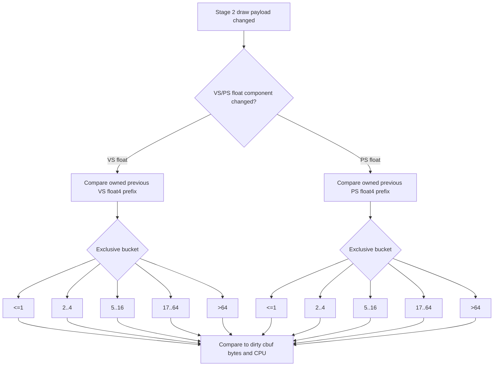

# Encode Phase 136 - Argbuf Payload Delta Width Histogram

**Question.** Phase 135 tried to measure how wide each float-constant delta is,
but the first implementation kept a pointer to the previous uniform payload.
Per-draw override payloads can live in loop-local scratch, so the probe needed
an owned previous-payload copy. With that fixed, is the remaining Stage 2 argbuf
cbuf churn mostly small register deltas or wide source churn?

**Verdict.** The corrected probe weakens the storage-width-amplification theory.
Small VS deltas are common by row count (`76.86%` are `<=16` float4 registers),
but the wide tail is significant (`21.48%` are `>64`) and observed changed VS
bytes are already close to uploaded VS cbuf bytes (`1.13x` ratio). PS remains
narrow (`100.00%` `<=16`, max `10`) but is much smaller in absolute bytes. The
current first-order argbuf owner is therefore real VS float source churn plus
table/cbuf frequency, not a huge full-cbuf width multiplier.



## Probe

```sh
DXMT9_PERF_ARGBUF_PAYLOAD_DELTA=1 \
DXMT9_PERF_ARGBUF_REOPEN_SPLIT=1 \
bash scripts/tools/run_3dmark05_perf_probe.sh \
  --suffix argbuf-payload-delta-width-buckets-r2-20260615 \
  --no-gputrace \
  --no-encoder-breakdown \
  --frame-sampling \
  --timeout 120 \
  --capture-delay-sec 45 \
  --wait-unlocked-sec 1 \
  --wait-unlocked-interval-sec 1
```

Artifacts:

| Artifact | Path |
|---|---|
| Summary | `experiments/output/app-d3d9-3dmark05-argbuf-payload-delta-width-buckets-r2-20260615/3dmark05-perf-summary.md` |
| Raw counters | `experiments/output/app-d3d9-3dmark05-argbuf-payload-delta-width-buckets-r2-20260615/result.json` |
| Visual smoke | `experiments/output/app-d3d9-3dmark05-argbuf-payload-delta-width-buckets-r2-20260615/actual.png` |

The wrapper timeout-finalized the run after complete artifacts were written:
`status=pass`, `timed_out=true`, `returncode=143`. Per the 3DMark05 probe rule,
this is a valid sample because the useful artifacts and finalizer output exist.

## Runtime Counters

| Counter | Value |
|---|---:|
| `present_encoded` | `1,860` |
| `sampled_avg_fps` | `17.032` |
| `gpu_command_buffer_time_ms_per_present` | `3.167` |
| `completion_wait_without_enqueue_ms_per_present` | `26.517` |
| `commit_chunk_replay_cpu_ms_per_present` | `8.131` |
| `encode_chunk_cpu_ms_per_present` | `12.270` |
| `encode_draw_argbuf_cbuf_update_cpu_ms_per_present` | `0.960` |
| `encode_draw_argbuf_cbuf_update_vs_cpu_ms_per_present` | `0.544` |
| `encode_draw_argbuf_payload_delta_probe_calls` | `1,369,613` |
| `encode_draw_argbuf_payload_delta_changed` | `993,738` |
| `encode_draw_argbuf_payload_delta_changed_vs_float` | `839,414` |
| `encode_draw_argbuf_payload_delta_changed_ps_float` | `327,290` |
| `encode_draw_argbuf_payload_delta_changed_vs_float_regs` | `45,574,773` |
| `encode_draw_argbuf_payload_delta_changed_vs_float_regs_max` | `256` |
| `encode_draw_argbuf_payload_delta_changed_ps_float_regs` | `747,303` |
| `encode_draw_argbuf_payload_delta_changed_ps_float_regs_max` | `10` |
| `encode_draw_argbuf_cbuf_update_vs_calls` | `861,310` |
| `encode_draw_argbuf_cbuf_update_vs_bytes` | `826,524,384` |
| `encode_draw_argbuf_cbuf_update_ps_calls` | `350,781` |
| `encode_draw_argbuf_cbuf_update_ps_bytes` | `43,216,080` |

Bucket names are threshold labels; each row below is an exclusive bucket except
the first.

| Stage | Bucket | Rows | Share of stage float-changed rows |
|---|---:|---:|---:|
| VS | `<=1` | `1,362` | `0.16%` |
| VS | `2..4` | `375,740` | `44.76%` |
| VS | `5..16` | `268,044` | `31.93%` |
| VS | `17..64` | `13,993` | `1.67%` |
| VS | `>64` | `180,275` | `21.48%` |
| PS | `<=1` | `101,830` | `31.11%` |
| PS | `2..4` | `204,963` | `62.62%` |
| PS | `5..16` | `20,497` | `6.26%` |
| PS | `17..64` | `0` | `0.00%` |
| PS | `>64` | `0` | `0.00%` |

Derived:

| Metric | Value |
|---|---:|
| VS float4 regs per VS-float-changed draw | `54.294` |
| PS float4 regs per PS-float-changed draw | `2.283` |
| VS `<=16` cumulative row share | `76.86%` |
| PS `<=16` cumulative row share | `100.00%` |
| VS changed-reg bytes | `729,196,368B` |
| PS changed-reg bytes | `11,956,848B` |
| VS dirty upload bytes per call | `959.6B` |
| PS dirty upload bytes per call | `123.2B` |
| VS upload bytes / observed changed-reg bytes | `1.13x` |
| PS upload bytes / observed changed-reg bytes | `3.61x` |

Health counters are clean: `draw_skipped_no_pipeline=0`,
`gpu_command_buffer_errors=0`, `render_split_hazard=0`,
`map_buffer_wait_ms=0`, and `queue_sequence_wait_ms=0`. The screenshot shows a
normal GT1 combat frame with muzzle/bloom/tracer effects, not a black/yellow
failure mode.

## Interpretation

The corrected histogram changes the next-step ranking:

| Fact | Implication |
|---|---|
| `76.86%` of VS-float-changed rows are `<=16` regs | A small-delta fast path could cover many draws by count |
| `21.48%` of VS-float-changed rows are `>64` regs | The wide tail is too large to ignore; a small-only design needs a full/prefix fallback |
| VS upload/changed-byte ratio is only `1.13x` | Full cbuf width is not the dominant byte amplifier after correcting payload ownership |
| PS is `100.00% <=16` but only `43.2MB` uploaded | PS segmentation is lower priority than VS/table frequency |
| `changed_nonconst_only=0`, int/bool changes `0` | The owner remains real float-constant source churn |

This keeps segmented/range-aware storage as a possible local cleanup, but it is
no longer a strong standalone FPS hypothesis. A prototype should only be pursued
if it reduces table/cbuf CPU or avoids expensive table reopen work, not merely
because it writes fewer bytes. The larger wall-clock owners remain
`completion_wait_without_enqueue` (`26.517ms/present`), `encode_chunk`
(`12.270ms/present`), and `commit_chunk_replay` (`8.131ms/present`).

Recommended next gate:

1. Prefer reducing argbuf table reopen frequency or VS constant update frequency
   before a pure byte-width micro-optimization.
2. If prototyping segmented VS cbuf storage, gate it to the `<=16` bucket first,
   keep the existing full/prefix fallback for wide rows, and require movement in
   `argbuf_setup`, `argbuf_cbuf_update_vs`, and P4/frame metrics.
3. Do not use phase 135 width numbers; phase 136's owned-payload copy is the
   authoritative width distribution.

**Related.** [[state-churn-encode]] ·
[[state-churn-encode-encode-phase.134]] ·
[[state-churn-encode-encode-phase.135]] ·
[[state-churn-encode-encode-phase.137]].
