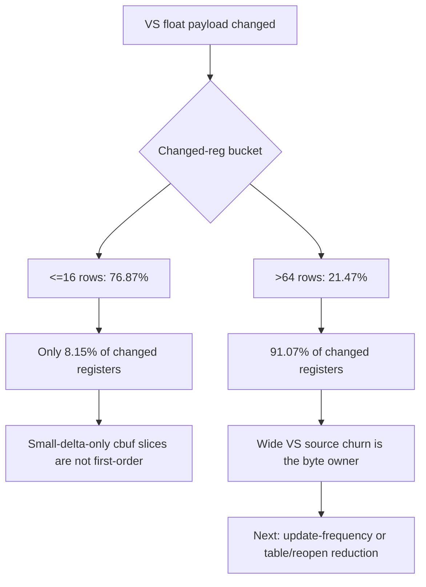

# Encode Phase 137 - Argbuf Payload Delta Bucket Register Share

**Question.** Phase 136 shows many VS-float-changed rows are small by row
count, but does that small-delta majority own enough register bytes to justify
optimizing it first?

**Verdict.** No. The `>64` VS bucket is only `21.47%` of VS-float-changed rows,
but it owns `91.07%` of changed VS float4 registers. The `<=16` rows are
`76.87%` by row count but only `8.15%` by register count. This rejects a
small-delta-only segmented cbuf path as the next first-order argbuf lever. The
better target is reducing wide VS constant source churn or reducing table/cbuf
reopen frequency around those wide updates.



## Probe

```sh
DXMT9_PERF_ARGBUF_PAYLOAD_DELTA=1 \
DXMT9_PERF_ARGBUF_REOPEN_SPLIT=1 \
bash scripts/tools/run_3dmark05_perf_probe.sh \
  --suffix argbuf-payload-delta-regsum-r3-20260615 \
  --no-gputrace \
  --no-encoder-breakdown \
  --frame-sampling \
  --timeout 120 \
  --capture-delay-sec 45 \
  --wait-unlocked-sec 1 \
  --wait-unlocked-interval-sec 1
```

Artifacts:

| Artifact | Path |
|---|---|
| Summary | `experiments/output/app-d3d9-3dmark05-argbuf-payload-delta-regsum-r3-20260615/3dmark05-perf-summary.md` |
| Raw counters | `experiments/output/app-d3d9-3dmark05-argbuf-payload-delta-regsum-r3-20260615/result.json` |
| Visual smoke | `experiments/output/app-d3d9-3dmark05-argbuf-payload-delta-regsum-r3-20260615/actual.png` |

## Runtime Counters

| Counter | Value |
|---|---:|
| `present_encoded` | `1,850` |
| `sampled_avg_fps` | `16.915` |
| `completion_wait_without_enqueue_ms_per_present` | `26.987` |
| `commit_chunk_replay_cpu_ms_per_present` | `8.133` |
| `encode_chunk_cpu_ms_per_present` | `12.247` |
| `gpu_command_buffer_time_ms_per_present` | `3.135` |
| `encode_draw_argbuf_cbuf_update_cpu_ms_per_present` | `0.974` |
| `encode_draw_argbuf_cbuf_update_vs_cpu_ms_per_present` | `0.551` |
| `encode_draw_argbuf_payload_delta_probe_calls` | `1,362,730` |
| `encode_draw_argbuf_payload_delta_changed` | `988,824` |
| `encode_draw_argbuf_payload_delta_changed_vs_float` | `835,207` |
| `encode_draw_argbuf_payload_delta_changed_vs_float_regs` | `45,350,717` |
| `encode_draw_argbuf_payload_delta_changed_vs_float_regs_max` | `256` |
| `encode_draw_argbuf_cbuf_update_vs_calls` | `856,978` |
| `encode_draw_argbuf_cbuf_update_vs_bytes` | `820,063,920` |

VS bucket row and register ownership:

| Bucket | Rows | Row Share | Register Sum | Register Share |
|---|---:|---:|---:|---:|
| `<=1` | `1,349` | `0.16%` | `1,349` | `0.00%` |
| `2..4` | `373,739` | `44.75%` | `1,487,739` | `3.28%` |
| `5..16` | `266,968` | `31.96%` | `2,205,061` | `4.86%` |
| `17..64` | `13,829` | `1.66%` | `356,091` | `0.79%` |
| `>64` | `179,322` | `21.47%` | `41,300,477` | `91.07%` |

PS bucket row and register ownership:

| Bucket | Rows | Row Share | Register Sum | Register Share |
|---|---:|---:|---:|---:|
| `<=1` | `101,332` | `31.11%` | `101,332` | `13.62%` |
| `2..4` | `203,994` | `62.63%` | `511,669` | `68.79%` |
| `5..16` | `20,400` | `6.26%` | `130,770` | `17.58%` |
| `17..64` | `0` | `0.00%` | `0` | `0.00%` |
| `>64` | `0` | `0.00%` | `0` | `0.00%` |

Derived:

| Metric | Value |
|---|---:|
| VS `<=16` cumulative row share | `76.87%` |
| VS `<=16` cumulative register share | `8.15%` |
| VS `>64` row share | `21.47%` |
| VS `>64` register share | `91.07%` |
| VS float4 regs per VS-float-changed draw | `54.299` |
| VS upload bytes / observed changed-reg bytes | `1.13x` |
| PS float4 regs per PS-float-changed draw | `2.283` |

Health counters are clean: `draw_skipped_no_pipeline=0`,
`gpu_command_buffer_errors=0`, `render_split_hazard=0`,
`map_buffer_wait_ms=0`, and `queue_sequence_wait_ms=0`. The screenshot is a
normal GT1 combat frame with muzzle/bloom/tracer effects.

## Interpretation

The row-count view and byte-count view disagree:

| View | Reading |
|---|---|
| Row count | Many rows are small, so a small-delta path would fire often |
| Register count | The wide `>64` tail owns almost all changed VS registers |
| Upload ratio | Current dirty VS upload bytes are only `1.13x` observed changed-reg bytes |

That means a segmented cbuf path restricted to `<=16` rows is unlikely to move
`argbuf_cbuf_update_vs` enough to justify the complexity. It may still be useful
as a secondary cleanup if it also avoids table/reopen work, but the first-order
targets should be:

1. Attribute the `>64` VS updates to shader pairs, constant ranges, or D3D9
   setter patterns.
2. Reduce the number of argbuf table reopens caused by wide VS updates.
3. Keep P4/frame gates as promotion criteria; local `0.55ms/present` VS cbuf
   CPU cannot explain the full `8-22fps` wall-clock limit alone.

**Related.** [state-churn-encode](../state-churn-encode.md) ·
[state-churn-encode-encode-phase.134](state-churn-encode-encode-phase.134.md) ·
[state-churn-encode-encode-phase.136](state-churn-encode-encode-phase.136.md) ·
[state-churn-encode-encode-phase.138](state-churn-encode-encode-phase.138.md).
