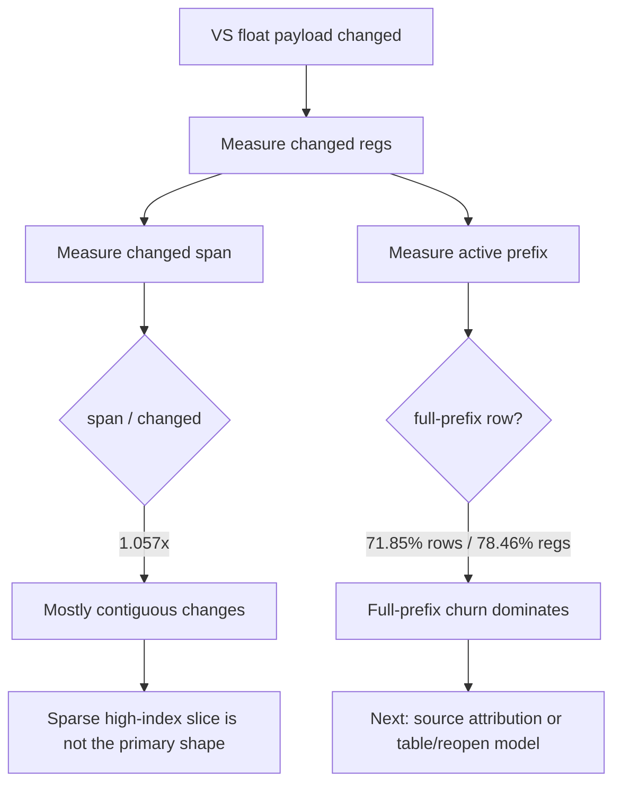

# Encode Phase 138 - Argbuf VS Float Prefix and Span Shape

**Question.** Phase 137 proves the `>64` VS float-delta bucket owns almost all
changed-register bytes. Is that because a few high-index registers create a
wide prefix/span, or because GT1 really changes large contiguous VS constant
ranges?

**Verdict.** The wide tail is real large-range churn. The run reports
`span / changed = 1.057x`, so changed registers are nearly contiguous rather
than sparse high-index outliers. `full_prefix` rows are `71.85%` of VS
float-changed draws and own `78.46%` of changed registers. This further rejects
a small-delta-only cbuf segmentation path as the next first-order lever. The
next useful probe should attribute the full-prefix VS updates to shader pairs,
constant ranges, or D3D9 setter patterns.



## Probe

```sh
DXMT9_PERF_ARGBUF_PAYLOAD_DELTA=1 \
DXMT9_PERF_ARGBUF_REOPEN_SPLIT=1 \
bash scripts/tools/run_3dmark05_perf_probe.sh \
  --suffix argbuf-payload-delta-prefix-span-r4-20260615 \
  --no-gputrace \
  --no-encoder-breakdown \
  --frame-sampling \
  --timeout 120 \
  --capture-delay-sec 45 \
  --wait-unlocked-sec 1 \
  --wait-unlocked-interval-sec 1
```

Artifacts:

| Artifact | Path |
|---|---|
| Summary | `experiments/output/app-d3d9-3dmark05-argbuf-payload-delta-prefix-span-r4-20260615/3dmark05-perf-summary.md` |
| Raw counters | `experiments/output/app-d3d9-3dmark05-argbuf-payload-delta-prefix-span-r4-20260615/result.json` |
| Visual smoke | `experiments/output/app-d3d9-3dmark05-argbuf-payload-delta-prefix-span-r4-20260615/actual.png` |

The run timeout-finalized with complete artifacts (`status=pass`,
`timed_out=true`, `returncode=143`). This is valid for this probe because the
wrapper owns the positive timeout and the screenshot/counters were written.

## Runtime Counters

| Counter | Value |
|---|---:|
| `present_encoded` | `1,800` |
| `sampled_avg_fps` | `16.926` |
| `completion_wait_without_enqueue_ms_per_present` | `26.349` |
| `commit_chunk_replay_cpu_ms_per_present` | `8.239` |
| `encode_chunk_cpu_ms_per_present` | `12.486` |
| `gpu_command_buffer_time_ms_per_present` | `3.197` |
| `encode_draw_argbuf_payload_delta_probe_calls` | `1,335,046` |
| `encode_draw_argbuf_payload_delta_changed` | `970,117` |
| `encode_draw_argbuf_payload_delta_changed_vs_float` | `820,563` |
| `encode_draw_argbuf_payload_delta_changed_vs_float_regs` | `44,366,977` |
| `encode_draw_argbuf_payload_delta_changed_vs_float_regs_max` | `256` |
| `encode_draw_argbuf_payload_delta_changed_vs_float_prefix_regs` | `63,364,568` |
| `encode_draw_argbuf_payload_delta_changed_vs_float_prefix_regs_max` | `256` |
| `encode_draw_argbuf_payload_delta_changed_vs_float_span_regs` | `46,893,544` |
| `encode_draw_argbuf_payload_delta_changed_vs_float_span_regs_max` | `256` |
| `encode_draw_argbuf_payload_delta_changed_vs_float_full_prefix` | `589,543` |
| `encode_draw_argbuf_payload_delta_changed_vs_float_full_prefix_regs` | `34,811,978` |
| `encode_draw_argbuf_cbuf_update_vs_calls` | `841,808` |
| `encode_draw_argbuf_cbuf_update_vs_bytes` | `803,560,512` |

Derived:

| Metric | Value |
|---|---:|
| VS float4 regs per VS-float-changed draw | `54.069` |
| VS active prefix regs per VS-float-changed draw | `77.221` |
| VS changed span regs per VS-float-changed draw | `57.148` |
| Span / changed regs | `1.057x` |
| Prefix / changed regs | `1.428x` |
| Full-prefix row share | `71.85%` |
| Full-prefix register share | `78.46%` |
| VS `<=16` row share | `76.99%` |
| VS `<=16` register share | `8.23%` |
| VS `>64` row share | `21.37%` |
| VS `>64` register share | `90.98%` |

Health counters are clean: `gpu_command_buffer_errors=0` and
`draw_skipped_no_pipeline=0`. The screenshot is a normal GT1 scene with fog,
particle streaks, and muzzle/glow effects visible.

## Interpretation

The prefix/span counters separate two possible explanations:

| Hypothesis | Evidence | Result |
|---|---|---|
| Sparse high-index changes inflate upload width | `span / changed` would be much larger than `1x` | Rejected-current (`1.057x`) |
| Full-prefix VS constant churn dominates | `full_prefix` owns most rows and changed regs | Accepted-current (`71.85%` rows, `78.46%` regs) |

The current dirty VS cbuf path is close to the observed changed-register byte
floor (`803.56MB` uploaded for `44.37M` changed float4 regs, about `1.13x`).
That means host-side segmented upload width is unlikely to produce a large FPS
win unless it also changes argbuf table/reopen frequency or removes the
upstream full-prefix constant churn.

Next gates:

1. Attribute `full_prefix` events by shader pair / source hash / constant
   usage bounds.
2. Attribute `full_prefix` events by D3D9 constant setter range if PE-side
   instrumentation is cheaper.
3. Only prototype a new cbuf/table ABI if it can reduce reopen count or
   per-draw table mutation cost, not just upload bytes.

**Related.** [[state-churn-encode]] ·
[[state-churn-encode-encode-phase.136]] ·
[[state-churn-encode-encode-phase.137]].
