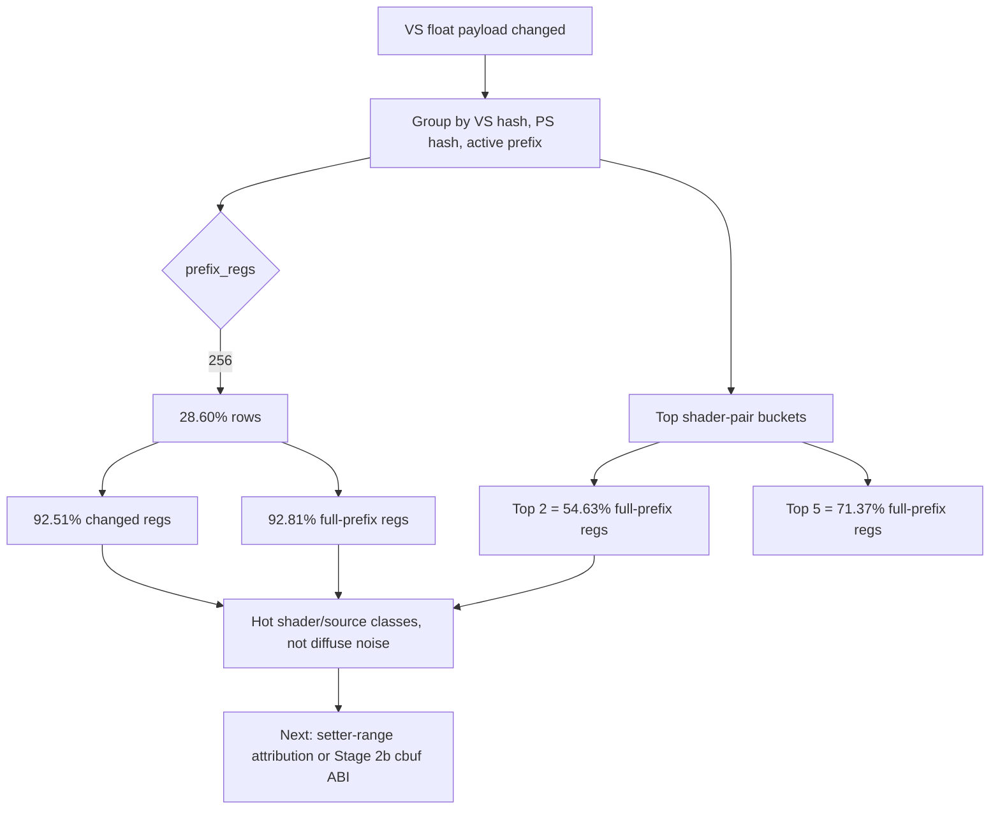

# Encode Phase 139 - Argbuf VS Float Source Attribution

**Question.** Phase 138 shows the wide VS float argbuf deltas are mostly
contiguous full-prefix churn. Is that churn diffuse across many shader pairs,
or concentrated in a small number of source shapes that can guide the next
constant-storage or setter-range probe?

**Verdict.** Full-prefix VS churn is concentrated. In the source-attribution
CSV, `prefix_regs=256` rows are only `28.60%` of source rows but own `92.51%`
of changed VS float4 registers and `92.81%` of full-prefix registers. The top
two shader-pair buckets own `54.63%` of full-prefix registers, and the top
five own `71.37%`. This rejects a broad small-delta or generic table-hash
explanation. The next useful work is to reduce full-prefix updates for the hot
shader/source classes, or to change the Stage 2 cbuf/table ABI so full-prefix
constant turnover does not force the same mutable-table reopen cost.



## Probe

```sh
DXMT9_PERF_ARGBUF_PAYLOAD_DELTA=1 \
DXMT9_PERF_ARGBUF_PAYLOAD_DELTA_SOURCE=1 \
DXMT9_PERF_ARGBUF_REOPEN_SPLIT=1 \
bash scripts/tools/run_3dmark05_perf_probe.sh \
  --suffix argbuf-payload-delta-source-r5-20260615 \
  --no-gputrace \
  --no-encoder-breakdown \
  --frame-sampling \
  --timeout 120 \
  --capture-delay-sec 45 \
  --wait-unlocked-sec 1 \
  --wait-unlocked-interval-sec 1
```

Artifacts:

| Artifact | Path |
|---|---|
| Summary | `experiments/output/app-d3d9-3dmark05-argbuf-payload-delta-source-r5-20260615/3dmark05-perf-summary.md` |
| Source attribution CSV | `experiments/output/app-d3d9-3dmark05-argbuf-payload-delta-source-r5-20260615/3dmark05-perf-argbuf-payload-delta-sources.csv` |
| Raw counters | `experiments/output/app-d3d9-3dmark05-argbuf-payload-delta-source-r5-20260615/result.json` |
| Visual smoke | `experiments/output/app-d3d9-3dmark05-argbuf-payload-delta-source-r5-20260615/actual.png` |

The run timeout-finalized with complete artifacts (`status=pass`,
`timed_out=true`, `returncode=143`). The screenshot is a normal GT1 scene at
frame `643` with rifle/machine-gun bloom disks, fog, light beams, and particles
visible.

## Runtime Counters

| Counter | Value |
|---|---:|
| `present_encoded` | `1,860` |
| `sampled_avg_fps` | `17.034` |
| `draw_calls` | `1,370,805` |
| `gpu_command_buffer_time_ms_per_present` | `3.245` |
| `completion_wait_without_enqueue_ms_per_present` | `26.217` |
| `commit_chunk_replay_cpu_ms_per_present` | `8.180` |
| `encode_chunk_cpu_ms_per_present` | `12.484` |
| `encode_draw_argbuf_payload_delta_probe_calls` | `1,370,805` |
| `encode_draw_argbuf_payload_delta_changed` | `994,965` |
| `encode_draw_argbuf_payload_delta_changed_vs_float` | `839,712` |
| `encode_draw_argbuf_payload_delta_changed_vs_float_regs` | `45,624,690` |
| `encode_draw_argbuf_payload_delta_changed_vs_float_full_prefix` | `606,287` |
| `encode_draw_argbuf_payload_delta_changed_vs_float_full_prefix_regs` | `35,841,946` |
| `encode_draw_argbuf_cbuf_update_vs_calls` | `861,599` |
| `encode_draw_argbuf_cbuf_update_vs_bytes` | `827,972,240` |

Health counters are clean: `draw_skipped_no_pipeline=0` and
`gpu_command_buffer_errors=0`.

## Source Distribution

The CSV contains `95` source buckets with no source-attribution overflow. The
CSV aggregate is slightly larger than the global perf-counter total
(`840,352` source rows vs `839,712` VS-float-changed rows, `+0.08%`), so the
distribution below uses the CSV-internal denominator.

| Group | Source buckets | Rows | Changed regs | Full-prefix rows | Full-prefix regs |
|---|---:|---:|---:|---:|---:|
| All source buckets | `95` | `840,352` | `45,666,770` | `606,833` | `35,878,500` |
| `prefix_regs=256` | `35` | `240,305` (`28.60%`) | `42,244,795` (`92.51%`) | `130,069` | `33,297,664` (`92.81%`) |
| `prefix_regs=4` | `4` | `337,668` (`40.18%`) | `1,345,702` (`2.95%`) | `334,994` | `1,339,976` (`3.73%`) |
| Other prefixes | `56` | `262,379` (`31.22%`) | `2,076,273` (`4.55%`) | `141,770` | `1,240,860` (`3.46%`) |

Top source buckets by full-prefix registers:

| Rank | VS hash | PS hash | Prefix regs | Rows | Changed regs | Full-prefix rows | Full-prefix regs | Full-prefix share |
|---:|---|---|---:|---:|---:|---:|---:|---:|
| 1 | `0xcf219872fdbbb398` | `0x6f39a816200d9efe` | `256` | `38,621` | `9,886,937` | `38,582` | `9,876,992` | `27.53%` |
| 2 | `0x18ffaf75e52f4615` | `0x6f39a816200d9efe` | `256` | `95,048` | `12,497,321` | `37,960` | `9,717,760` | `27.09%` |
| 3 | `0xfea7cbe15a691f97` | `0xa0910f28e1ccfd71` | `256` | `12,084` | `2,490,720` | `8,548` | `2,188,288` | `6.10%` |
| 4 | `0xeeda5eb21a3557fe` | `0x58217dfc4408d6ac` | `256` | `11,473` | `2,313,985` | `7,860` | `2,012,160` | `5.61%` |
| 5 | `0xd835381bb196303e` | `0x11cc89f85cc54054` | `256` | `21,534` | `2,697,385` | `7,070` | `1,809,920` | `5.04%` |

Existing evidence already identifies two of these as important shapes:

| Shader pair | Prior evidence | Meaning |
|---|---|---|
| `0xcf219872fdbbb398 / 0x6f39a816200d9efe` | [[hidden-backend-storage-shape.08]] hot row `60/1`, `156` draws, `228,725` primitives, `686,175` vertices | A large geometry row that also dominates full-prefix argbuf churn |
| `0x18ffaf75e52f4615 / 0x6f39a816200d9efe` | [[state-churn-encode-encode-phase.66]] BLENDINDICES matrix-palette indexed VS; one sampled draw reaches `a0.x=255`, `a0.y=254` | A true full-range indexed-constant shader; broad packed-window fallback remains unsafe |

## Interpretation

This narrows the argbuf/cbuf problem to a small number of hot source shapes:

| Hypothesis | Evidence | Result |
|---|---|---|
| Small-delta rows dominate the remaining cost | `prefix_regs=4` is `40.18%` of rows but only `2.95%` of changed regs | Rejected-current |
| Full-prefix churn is diffuse across many shader pairs | Top two buckets own `54.63%` of full-prefix regs; top five own `71.37%` | Rejected-current |
| A broad indexed constant packing shortcut is safe | Known hot indexed VS can require full `c[0..255]` access | Rejected-current |
| The next cbuf work should target hot source classes or table ABI shape | `prefix=256` owns `92.51%` of changed regs and `92.81%` of full-prefix regs | Accepted-current |

The absolute `sampled_avg_fps` and P4 counters remain in the current baseline
band. This probe is attribution, not an FPS win: it points the next
implementation work away from generic small-delta segmentation and toward
either:

1. D3D9 setter-range attribution for the top VS hashes, to see whether the app
   really changes all `256` VS constants or whether frontend invalidation is
   over-broad.
2. A Stage 2b cbuf ABI where cbuf pointers are not embedded in the mutable
   argument table, so constant turnover does not force a fresh table/reopen per
   draw.
3. A shader/source-specific diagnostic for the top non-indexed hot pair
   (`0xcf219872fdbbb398 / 0x6f39a816200d9efe`) before attempting any new packed
   storage policy.

**Related.** [[state-churn-encode]] ·
[[state-churn-encode-encode-phase.138]] ·
[[state-churn-encode-encode-phase.66]] ·
[[hidden-backend-storage-shape.08]].
