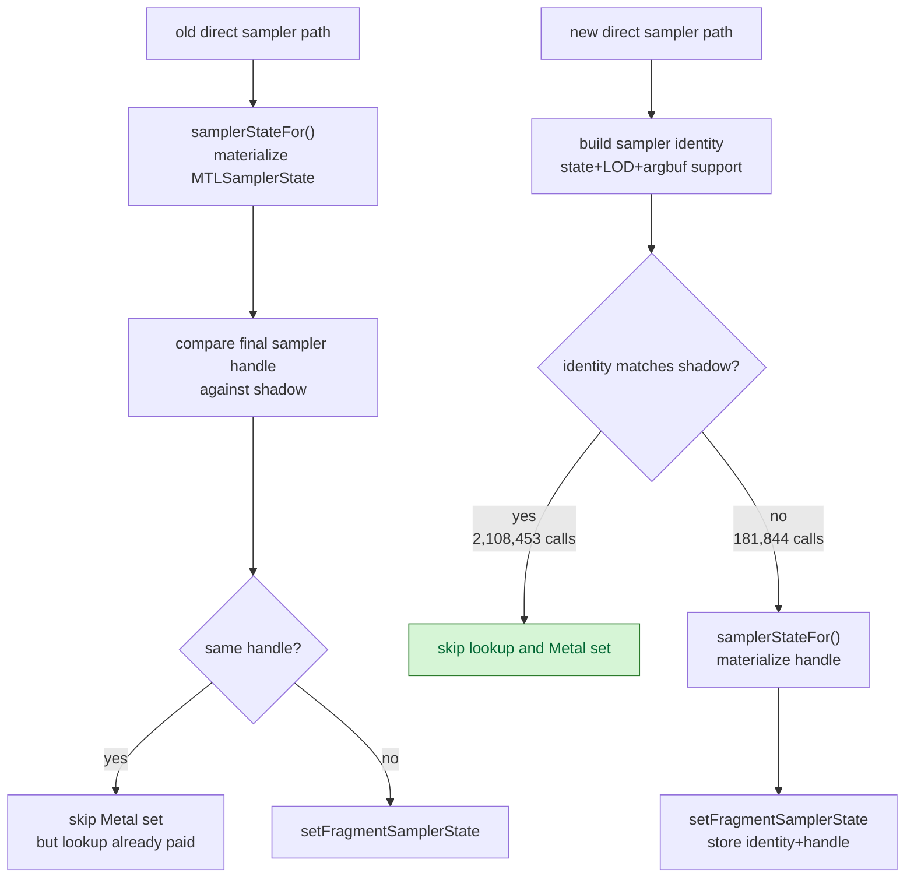

# Sampler Pre-Handle Skip

**Question / hypothesis.** [[state-churn-encode-encode-phase.13]] showed that
GT1 skips ~92% of fragment sampler binds, but the old path still materialized
the `MTLSamplerState` handle via `samplerStateFor()` before discovering the bind
would be skipped. Test whether the shadow cache can compare sampler identity
before resolving the Metal sampler handle.

**Implementation.** `TextureSamplerBindShadow` now stores sampler slots using a
sampler identity, not only the final Metal handle:

- stage tag
- `FlatStateSet<kMaxSamplerStates>`
- texture LOD
- argument-buffer support bit
- final Metal handle for the non-skip/store case

The direct fragment sampler path checks that identity before calling
`Cache::samplerStateFor()`. If it matches, it increments the existing sampler
skip counter and avoids sampler cache lookup/materialization entirely. Resource
array binding still resolves the sampler because it must populate the argbuf
resource array. Vertex sampler shadowing is kept identity-aware as well, though
GT1 does not use vertex texture samplers in this run.

New counters:

- `encode_draw_texture_sampler_sampler_lookup_cpu_ms`
- `encode_draw_texture_sampler_sampler_lookup_calls`
- `encode_draw_texture_sampler_sampler_lookup_skipped_prehandle`

**Method.**

```bash
bash scripts/tools/run_3dmark05_perf_probe.sh \
  --suffix sampler-prehandle-skip-r1 \
  --frame 50 \
  --no-gputrace \
  --no-encoder-breakdown \
  --timeout 180

python3 scripts/tools/compare_3dmark05_perf_counters.py \
  experiments/output/app-d3d9-3dmark05-texture-sampler-phase-split-r1 \
  experiments/output/app-d3d9-3dmark05-sampler-prehandle-skip-r1 \
  --before-label texture-sampler-phase-split \
  --after-label sampler-prehandle-skip \
  --output experiments/output/app-d3d9-3dmark05-sampler-prehandle-skip-r1/dxmt9-perf-counter-comparison-vs-texture-split.md
```

The run hit the expected watchdog status `124` after writing artifacts.
`actual.png` is a normal visible GT1 frame with robot, flare, and HUD visible
(`FPS: 16`, `Time: 0:55.91`, `Frame: 1007`).

**Result.** This is a same-present comparison (`1740 -> 1740`) with stable
shape: `draws_per_present` moves only `+0.10%`, tile preservation moves
`+0.04%`, and GPU command-buffer time per present moves
`3.025 -> 3.017ms`. The accepted win is CPU encode only.

| Counter | Texture split | Sampler pre-handle skip | Delta / reading |
|---|---:|---:|---|
| `present_encoded` | 1,740 | 1,740 | same run length |
| `draw_calls` | 1,273,026 | 1,274,257 | +0.10% |
| `encode_draw_cpu_ms` | 17,842.278 | 17,724.955 | -117.323ms (-0.66%) |
| `encode_draw_stream_bind_cpu_ms` | 3,072.862 | 2,863.101 | -209.761ms (-6.83%) |
| `encode_draw_stream_bind_texture_phase_cpu_ms` | 1,144.978 | 939.682 | -205.296ms (-17.93%) |
| `encode_draw_texture_sampler_bind_cpu_ms` | 1,099.703 | 892.480 | -207.223ms (-18.84%) |
| `encode_draw_texture_sampler_fragment_resolve_cpu_ms` | 575.228 | 185.568 | -389.660ms (-67.74%) |
| `encode_draw_texture_sampler_fragment_direct_cpu_ms` | 316.761 | 495.039 | +178.278ms; identity check moved work here |
| `encode_draw_texture_sampler_sampler_lookup_cpu_ms` | - | 51.536 | remaining lookup cost |
| `encode_draw_texture_sampler_sampler_lookup_calls` | - | 181,844 | equals actual sampler binds |
| `encode_draw_texture_sampler_sampler_lookup_skipped_prehandle` | - | 2,108,453 | equals skipped sampler binds |
| `bind_sampler / bind_sampler_skipped` | 181,697 / 2,104,829 | 181,844 / 2,108,453 | skip share remains ~92.06% |
| `gpu_command_buffer_time_ms` | 5,263.447 | 5,249.931 | flat/noisy |
| `completion_wait_ms` | 39,728.476 | 39,645.939 | flat/noisy |



**Verdict.** Accepted CPU win. The mechanism is exact: pre-handle skip count
matches skipped sampler binds (`2,108,453`), and remaining sampler lookup calls
match real sampler binds (`181,844`). The texture/sampler parent drops by
`207.223ms` in a same-present no-gputrace A/B.

**Next.** This closes the sampler resolve-before-skip hypothesis for GT1. The
remaining texture/sampler work is fragment texture handle lookup/direct bind
and the now-larger direct-phase shadow bookkeeping, not sampler cache lookup.
Broader FPS/GPU claims still need a vsync-on wallclock or Xcode frame gate.

**Related.** [[state-churn-encode]] ·
[[state-churn-encode-encode-phase.13]] · [[present-pacing]].
