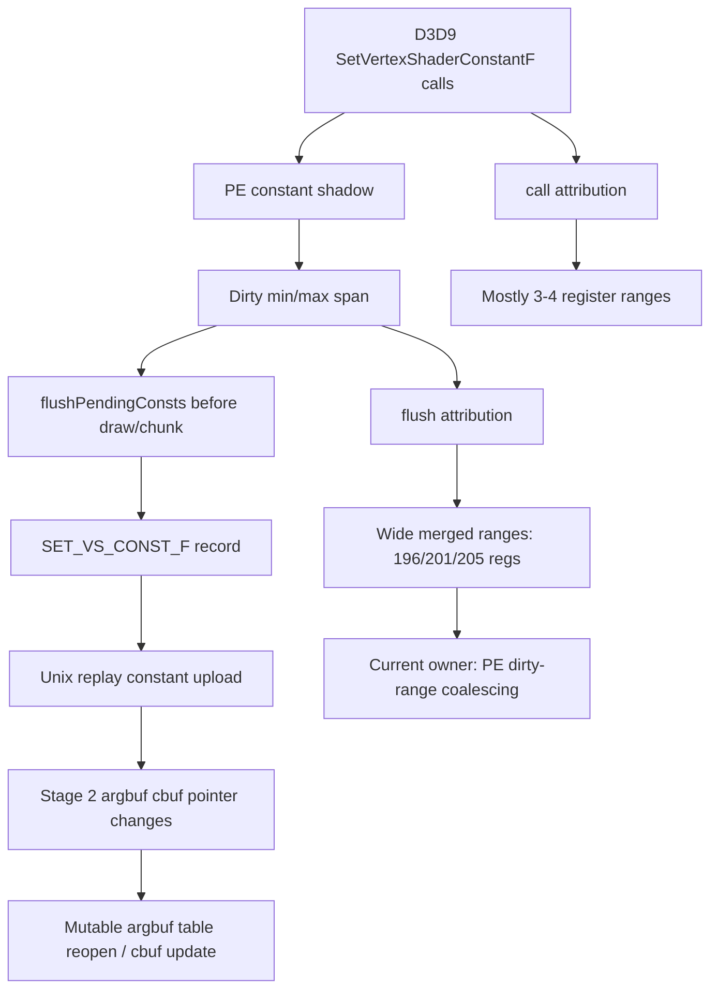
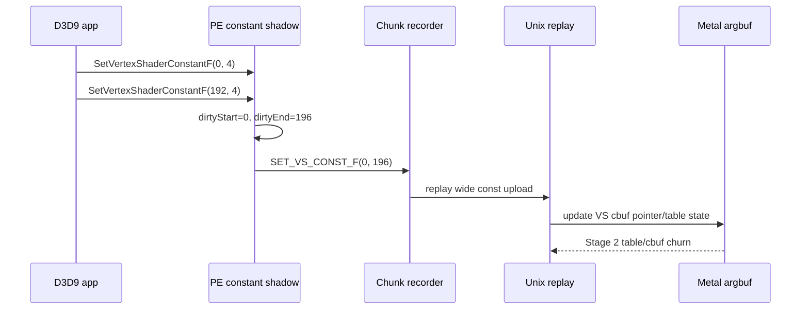

# Encode Phase 140 - VS Constant Setter Range Attribution

**Question.** Phase 139 proved that full-prefix VS argbuf churn is concentrated
in a few shader pairs. Does the D3D9 app really call
`SetVertexShaderConstantF` with full or very large ranges, or does the PE
constant-shadow flush merge many small app calls into wide records before the
backend ever sees them?

**Verdict.** The app-call side is mostly small. The PE flush side is where the
wide spans appear. In the current GT1 run, `call` and `flush` have the same
total changed-register count (`17,426,287`), but `flush` writes `24,670,044`
range registers (`1.416x` changed) while app calls request `21,578,169`
(`1.238x`). The key shape is the distribution: app calls have no non-overflow
large ranges, while flush ranges with `count >= 64` own `6,682,392` changed
regs (`38.35%`) and `10,304,650` range regs (`41.77%`). The hottest concrete
flush buckets are `start=0,count=196`, `start=0,count=201`, and
`start=0,count=205`; the hottest call buckets are `count=3` or `count=4`.



## Tooling Change

This phase adds `DXMT9_PERF_VS_CONST_SETTER_RANGE=1` and wrapper flag
`--probe-vs-const-setter-range`.

The PE side now records two phases by current VS hash, PS hash, start, and
count:

| Phase | Meaning |
|---|---|
| `call` | Original `SetVertexShaderConstantF(start,count)` app calls, with actual changed registers against the PE shadow before mutation |
| `flush` | Coalesced `D9C_COMMAND_RECORD_SET_VS_CONST_F` records emitted from the dirty constant shadow |

The perf lines are written directly to stderr as
`[dxmt9-perf-vs-const-setter-range ...]`, matching the other perf summary
surfaces instead of depending on the normal dxmt log level. The wrapper now
forwards the flag explicitly; passing it only as an outer shell env was not
sufficient for the standard 3DMark05 probe environment.

## Probe

```sh
bash scripts/tools/run_3dmark05_perf_probe.sh \
  --suffix vs-const-setter-range-r3-20260615 \
  --no-gputrace \
  --no-encoder-breakdown \
  --frame-sampling \
  --probe-vs-const-setter-range \
  --timeout 120 \
  --capture-delay-sec 45 \
  --wait-unlocked-sec 1 \
  --wait-unlocked-interval-sec 1
```

Artifacts:

| Artifact | Path |
|---|---|
| Summary | `experiments/output/app-d3d9-3dmark05-vs-const-setter-range-r3-20260615/3dmark05-perf-summary.md` |
| Setter range CSV | `experiments/output/app-d3d9-3dmark05-vs-const-setter-range-r3-20260615/3dmark05-perf-vs-const-setter-ranges.csv` |
| Raw counters | `experiments/output/app-d3d9-3dmark05-vs-const-setter-range-r3-20260615/result.json` |
| Visual smoke | `experiments/output/app-d3d9-3dmark05-vs-const-setter-range-r3-20260615/actual.png` |

The run completed with `status=pass`, `returncode=0`, and `timed_out=false`.
The screenshot is a normal GT1 frame (`623`) with soldiers, muzzle/bloom disks,
light beams, floor highlights, and HUD visible.

## Runtime Counters

| Counter | Value |
|---|---:|
| `present_encoded` | `1,787` |
| `sampled_avg_fps` | `16.360` |
| `completion_wait_without_enqueue_ms_per_present` | `27.999` |
| `commit_chunk_replay_cpu_ms_per_present` | `8.128` |
| `encode_chunk_cpu_ms_per_present` | `10.847` |
| `encode_draw_argbuf_cbuf_update_vs_bytes` | `796,988,128` |
| `draw_skipped_no_pipeline` | `0` |
| `gpu_command_buffer_errors` | `0` |

## Setter Range Totals

| Phase | Events | Range regs | Changed regs | Range / changed | Avg range / event | Avg changed / event |
|---|---:|---:|---:|---:|---:|---:|
| `call` | `7,364,634` | `21,578,169` | `17,426,287` | `1.238x` | `2.930` | `2.366` |
| `flush` | `816,608` | `24,670,044` | `17,426,287` | `1.416x` | `30.210` | `21.340` |

The equal changed-register total is expected: the flush path is draining the
same PE shadow changes that were observed at call time. The difference is how
many register slots are carried by the emitted record.

| Phase | Large range changed regs (`count >= 64`) | Large range share | Small range changed regs (`count <= 4`) | Small range share |
|---|---:|---:|---:|---:|
| `call` | `0` | `0.00%` | `8,587,905` | `49.28%` |
| `flush` | `6,682,392` | `38.35%` | `1,568,689` | `9.00%` |

Top concrete non-overflow rows:

| Rank | Phase | VS hash | PS hash | Start | Count | Events | Range regs | Changed regs | Range / changed |
|---:|---|---|---|---:|---:|---:|---:|---:|---:|
| 1 | `flush` | `0x18ffaf75e52f4615` | `0x6f39a816200d9efe` | `0` | `196` | `31,896` | `6,251,616` | `3,795,378` | `1.647x` |
| 2 | `flush` | `0xcf219872fdbbb398` | `0x6f39a816200d9efe` | `0` | `4` | `323,334` | `1,293,336` | `1,292,840` | `1.000x` |
| 3 | `flush` | `0x6d2bb311069a1829` | `0x0` | `0` | `196` | `9,298` | `1,822,408` | `1,195,819` | `1.524x` |
| 4 | `call` | `0xcf219872fdbbb398` | `0x6f39a816200d9efe` | `0` | `4` | `483,257` | `1,933,028` | `1,143,273` | `1.691x` |
| 5 | `flush` | `0xdee2a2c1e0557a9a` | `0x2f2090e9c1402459` | `0` | `201` | `8,011` | `1,610,211` | `1,137,028` | `1.416x` |

Overflow is still large (`call` overflow changed regs `8,838,382`, `flush`
overflow changed regs `8,501,780`), so exact per-shader ranking below the top
concrete rows remains bounded by the bucket cap. It does not change the main
call-vs-flush conclusion because the phase totals preserve the aggregate
shape.

## Interpretation

This phase rejects the strongest version of "the app is simply setting full
VS constant blocks." The hot app call pattern is many small setters:
`count=3`, `count=4`, and a few small matrix/vector windows. The PE constant
shadow then tracks only `dirtyStart` / `dirtyEnd` by default, so separated
small writes inside one draw/chunk are emitted as one wide span.



## Consequences

| Candidate | Current verdict | Reason |
|---|---|---|
| Blame backend table policy only | weakened | Backend still pays for cbuf pointer churn, but wide records are already created by PE dirty-span merging |
| Split sparse VS constant records | promoted | This directly targets the newly measured call-vs-flush widening |
| Full small-delta-only cbuf segmentation | still incomplete | Small app calls are common, but flush overflow and large merged spans remain significant |
| Shader-specific constant packing shortcut | still unsafe | The known BLENDINDICES indexed VS remains in the hot set and can use high constant indices |

The next experiment should enable or implement a sparse dirty-run flush for
VS float constants and gate it on:

1. `commit_chunk_draw_run_break_type_const_vs_f_registers` and
   `encode_draw_argbuf_cbuf_update_vs_bytes` decreasing.
2. No explosion in constant-upload break count beyond the existing
   `DXMT_3DMARK05_MAX_CONST_UPLOAD_BREAK_COUNT_RATIO` gate.
3. Normal visual smoke, because changing record segmentation changes draw-run
   boundaries and cbuf lifetime pressure.
4. P4/frame counters, because the current FPS limit still includes
   under-pipelined completion wait (`27.999ms/present`) and CPU replay/encode.

**Related.** [[state-churn-encode]] ·
[[state-churn-encode-encode-phase.139]] ·
[[state-churn-encode-encode-phase.138]].
