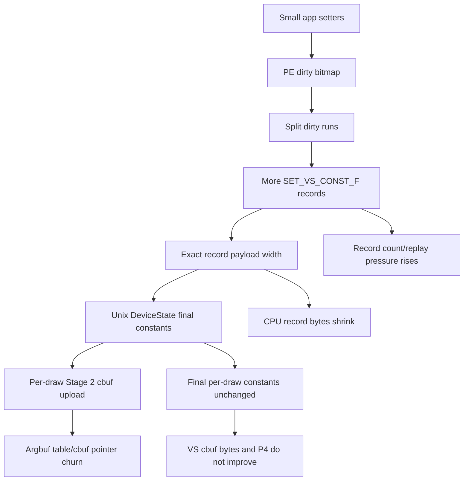

# Encode Phase 141 - Sparse VS Const Flush Current Gate

**Question.** Phase 140 showed that PE dirty-span flush merging, not full-range
app setters, creates many wide VS float constant records. Does the existing
`DXMT9_SPLIT_SPARSE_CONST_RECORDS=1` dirty-run splitter convert that width into
a current argbuf/P2/P3/P4 win?

**Verdict.** Mechanism accepted, current FPS lever rejected. The split makes
flushed VS records exact (`flush range / changed = 1.000x`) and lowers flush
range regs per present by `-28.59%` against phase 140, but it does not reduce
the backend VS cbuf upload lane or P4. It increases flush record events per
present by `+20.98%`, leaves VS cbuf update bytes per present essentially flat
(`+0.64%`), and the run is slower/noisier on every average-FPS owner:
`sampled_avg_fps 16.360 -> 14.938`, `commit_chunk_replay 8.128 -> 8.949ms/present`,
`encode_chunk 10.847 -> 11.643ms/present`, and no-enqueue completion wait
`27.999 -> 29.112ms/present`.

## Tooling Fix

This run exposed one malformed
`3dmark05-perf-vs-const-setter-ranges.csv` row: a PE-side
`[dxmt9-perf-vs-const-setter-range]` line interleaved with a unix-side
`[dxmt9-perf-frame]` line. The PE logger now formats each setter-range line into
a bounded buffer and writes it to stderr with one low-level write. The summary
parser also rejects unterminated or malformed setter-range rows before writing
CSV. The current artifact was regenerated with the hardened parser.

## Probe

```sh
bash scripts/tools/run_3dmark05_perf_probe.sh \
  --suffix split-sparse-vs-setter-current-r1-20260615 \
  --no-gputrace \
  --no-encoder-breakdown \
  --frame-sampling \
  --split-sparse-const-records \
  --probe-vs-const-setter-range \
  --timeout 120 \
  --capture-delay-sec 45 \
  --wait-unlocked-sec 1 \
  --wait-unlocked-interval-sec 1 \
  --min-free-mb 64
```

The run completed with `status=pass`, `returncode=0`, and `timed_out=false`.
Visual smoke is a normal GT1 frame (`563`) with soldiers, light shafts, muzzle
disks, floor highlights, and HUD visible. `draw_skipped_no_pipeline=0` and
`gpu_command_buffer_errors=0`.

## Runtime Counters

| Counter | Phase 140 no-split | Split sparse current | Delta |
|---|---:|---:|---:|
| `present_encoded` | `1,787` | `1,620` | `-9.35%` |
| `sampled_avg_fps` | `16.360` | `14.938` | `-8.69%` |
| `completion_wait_without_enqueue_ms_per_present` | `27.999` | `29.112` | `+3.98%` |
| `commit_chunk_replay_cpu_ms_per_present` | `8.128` | `8.949` | `+10.10%` |
| `encode_chunk_cpu_ms_per_present` | `10.847` | `11.643` | `+7.34%` |
| `encode_draw_argbuf_cbuf_update_vs_bytes_per_present` | `445,992.237` | `448,824.425` | `+0.64%` |
| `gpu_command_buffer_time_ms_per_present` | n/a | `3.282` | n/a |

The current run's P4 summary remains the same class: `completion_wait_with_enqueue`
is `0`, no-enqueue share is `100.000%`, and the verdict is
`under-pipelined-no-enqueue`.

## Setter Range Totals

| Phase | Phase 140 no-split | Split sparse current | Delta / verdict |
|---|---:|---:|---|
| `call range / changed` | `1.238x` | `1.237x` | app setter shape unchanged |
| `flush range / changed` | `1.416x` | `1.000x` | width mechanism fixed |
| `flush events / present` | `456.971` | `552.833` | `+20.98%` records |
| `flush range regs / present` | `13,805.285` | `9,857.734` | `-28.59%` payload width |
| `flush changed regs / present` | `9,751.699` | `9,857.734` | `+1.09%` same work band |

Top rows now show the expected exact dirty-run shape: every concrete flush row
has `range/changed = 1.000`. The historical `start=0,count=196/201/205` wide
merged records become smaller dirty runs such as `count=135/144/141`, while
the hottest small `count=4` row remains exact.



## Interpretation

This closes the narrow H150 follow-up: sparse dirty-run flushing is a real
record-payload mechanism, but not the current argbuf/FPS fix. The backend cbuf
update path is driven by the final per-draw shader-constant payload and Stage 2
table/cbuf pointer churn, not by the byte width of the PE const-upload record
that produced the same final state. Splitting records reduces const-record
payload bytes while adding replay records; it does not make the producer overlap
completion wait and does not reduce the immutable per-draw argbuf table pressure.

**Decision.** Do not promote `DXMT9_SPLIT_SPARSE_CONST_RECORDS` as a current
perf profile change and do not spend Xcode budget on this axis as a GPU fix.
Keep it as a diagnostic/CPU record-volume knob. Next argbuf work should either
change Stage 2 cbuf binding ABI/storage so cbuf pointer turnover no longer
forces table reopen, or return to larger P2/P3 replay/snapshot/encode reductions
paired with P4 overlap/frame gates.

**Related.** [[state-churn-encode]] ·
[[state-churn-encode-encode-phase.140]] ·
[[const-upload-sparse.01]] · [[const-upload-sparse.02]] · [[present-pacing]].
