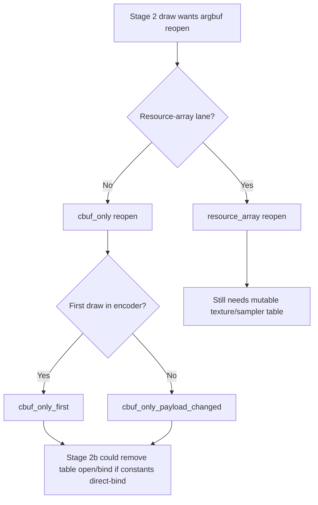

# Encode Phase 142 - Stage 2b Cbuf-Only Reopen Opportunity Counter

**Question.** Is GT1's Stage 2 argbuf table churn actually resource-array
pressure, or is it the constants-only cbuf pointer turnover that a Stage 2b
direct-cbuf ABI would target?

**Verdict.** The current GT1 run is constants-only table churn. The new
payload-delta counters split argbuf reopens into resource-array versus
cbuf-only buckets. In this run `resource_array=0`, while
`reopen_cbuf_only=1,004,713`, exactly matching
`encode_draw_argbuf_table_bind_calls=1,004,713`. This makes the Stage 2b/direct
cbuf ABI a correctly scoped table-churn candidate: it targets the table opens
and slot-30 binds currently caused only by cbuf pointer changes.

This is not an FPS proof. The screenshot captured for this run was mostly
black with the HUD visible, so treat the run as counter-only evidence. Health
counters were clean (`draw_skipped_no_pipeline=0`,
`gpu_command_buffer_errors=0`) and the app completed without timeout, but a
Stage 2b implementation still needs deterministic shader/PSO tests plus a
normal-visual P4/frame gate.

## Instrumentation

The counters are emitted only under `DXMT9_PERF_ARGBUF_PAYLOAD_DELTA=1`:

- `encode_draw_argbuf_payload_delta_reopen_cbuf_only`
- `encode_draw_argbuf_payload_delta_reopen_cbuf_only_first`
- `encode_draw_argbuf_payload_delta_reopen_cbuf_only_payload_changed`

They are disjoint from `encode_draw_argbuf_payload_delta_reopen_resource_array`.



## Probe

```sh
DXMT9_PERF_ARGBUF_PAYLOAD_DELTA=1 \
bash scripts/tools/run_3dmark05_perf_probe.sh \
  --suffix argbuf-stage2b-cbuf-only-r1-20260615 \
  --no-gputrace \
  --no-encoder-breakdown \
  --frame-sampling \
  --timeout 120 \
  --capture-delay-sec 45 \
  --wait-unlocked-sec 1 \
  --wait-unlocked-interval-sec 1 \
  --min-free-mb 256
```

The run completed with `status=pass`, `returncode=0`, `timed_out=false`, and
`capture_error=None`.

## Counters

| Counter | Value |
|---|---:|
| `encode_draw_argbuf_payload_delta_probe_calls` | `1,355,652` |
| `encode_draw_argbuf_payload_delta_reopen_first` | `21,720` |
| `encode_draw_argbuf_payload_delta_reopen_payload_changed` | `982,993` |
| `encode_draw_argbuf_payload_delta_reopen_payload_same` | `0` |
| `encode_draw_argbuf_payload_delta_reopen_resource_array` | `0` |
| `encode_draw_argbuf_payload_delta_reopen_cbuf_only` | `1,004,713` |
| `encode_draw_argbuf_payload_delta_reopen_cbuf_only_first` | `21,720` |
| `encode_draw_argbuf_payload_delta_reopen_cbuf_only_payload_changed` | `982,993` |
| `encode_draw_argbuf_table_bind_calls` | `1,004,713` |
| `encode_draw_argbuf_cbuf_update_vs_bytes` | `990,300,016` |

The split is internally consistent:

```text
cbuf_only = cbuf_only_first + cbuf_only_payload_changed
          = 21,720 + 982,993
          = 1,004,713

cbuf_only = argbuf_table_bind_calls
resource_array = 0
```

## Interpretation

The data removes one uncertainty from the Stage 2b plan. For this GT1 path,
resource-array table mutation is not the reason slot-30 argbuf tables are being
opened and rebound. The table churn follows cbuf payload changes. Therefore:

- a host-only "share the mutable table and update cbuf pointers" path remains
  rejected by the last-write-wins hazard from phase 132;
- a Stage 2b/direct-cbuf ABI would attack the whole current table-bind count,
  not a small resource-array subset;
- the dirty VS cbuf bytes remain large, so Stage 2b is a table/open/bind
  candidate first and only a cbuf-byte candidate if the new ABI also changes
  cbuf upload/storage policy.

**Next gate.** Do not implement this as an ad-hoc encoder branch. Add the
Stage 2b shader/PSO ABI tests from phase 133 first: programmable, FFP, tile FFP
MSL binding shape, PSO key bit separation, and host slot binding contract.
