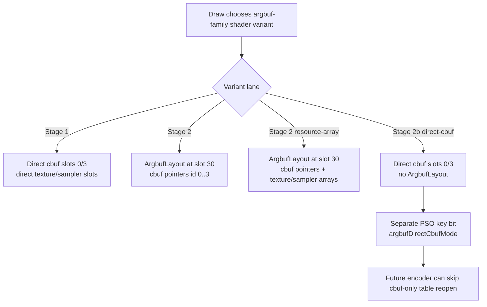

# Encode Phase 143 - Stage 2b Direct-Cbuf ABI Gate

**Question.** Can the Stage 2b/direct-cbuf path be given a deterministic
shader/PSO ABI before adding any runtime encoder branch for cbuf-only argbuf
table churn?

**Verdict.** The ABI gate is now covered by native tests. A new
`ShaderSourceContext::argbufDirectCbufMode` bit makes generated FFP,
translated-programmable, and tile-FFP MSL keep direct constant-buffer bindings
at slots `0` / `3` even when the argbuf family bit is present. A separate
`ShaderVariantKey::argbufDirectCbufMode` bit keeps Stage 2b from aliasing either
Stage 1 or Stage 2 in the PSO cache. Host slot constants pin the direct cbuf,
stream, volatile, and argbuf slots in one header.

This does **not** enable Stage 2b at runtime. It only closes the phase 142
precondition: a future encoder implementation can select a direct-cbuf ABI
without silently reusing the wrong Stage 1/Stage 2 PSO or emitting a shader that
still reads cbuf pointers through `ArgbufLayout`.

## ABI Shape



The pinned host/source slots are:

| Binding | Slot |
|---|---:|
| direct `VsConsts` / `PsConsts` | `0` |
| direct `FfpVsConsts` / `FfpPsConsts` | `3` |
| direct vertex stream0 | `1` |
| direct `DrawVolatile` | `5` |
| Stage 2 `ArgbufLayout` | `30` |

## Native Coverage

The source-contract tests now cover:

- FFP vertex Stage 2b direct cbuf bindings;
- FFP pixel Stage 2b direct cbuf bindings with a textured stage;
- tile-FFP Stage 2b direct `FfpPsConsts` binding;
- translated programmable vertex Stage 2b direct cbuf bindings;
- translated programmable pixel Stage 2b direct cbuf bindings with direct
  texture/sampler params;
- host slot constants for direct cbuf, vertex stream, `DrawVolatile`, and
  Stage 2 argbuf;
- PSO key equality/hash separation for Stage 1, Stage 2, and Stage 2b.

## Verification

```sh
meson compile -C build-arm64-nowine
meson test -C build-arm64-nowine \
  dxmt9-argbuf-hybrid-msl-spec \
  dxmt9-argbuf-hybrid-spec \
  dxmt9-backend-pipeline-key-spec
```

The focused test run passed: `3` tests OK, `0` failures.

## Next Gate

Runtime Stage 2b selection is still open. The next implementation should add a
bounded selector and encoder binding path that uses the new PSO/source lane only
when resource-array table mutation is not required, then verify:

- local `argbuf_setup` / `argbuf_open` / `argbuf_table_bind_calls` movement;
- no Stage 2 resource-array last-write-wins regression;
- normal GT1 visual output, not a black/HUD-only counter run;
- P4/frame-sampling movement on a low-overhead no-gputrace run;
- if local CPU movement is meaningful, a paired `.gputrace`/Xcode capture only
  for GPU-side invariance, not as the primary CPU proof.

**Related.** [[state-churn-encode]] ·
[[state-churn-encode-encode-phase.133]] ·
[[state-churn-encode-encode-phase.142]].
