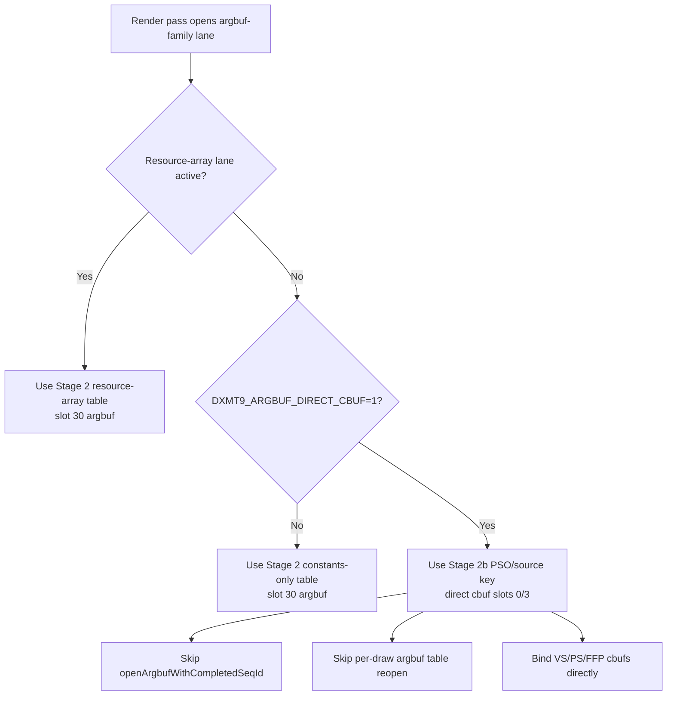
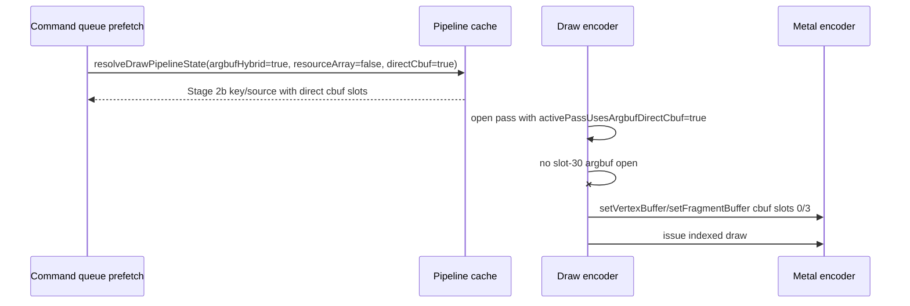

# Encode Phase 144 - Stage 2b Direct-Cbuf Runtime Scout

**Question.** After phase 143 gave Stage 2b a separate shader/PSO ABI, can an
opt-in runtime selector bind constant buffers directly and remove the
constants-only slot-30 argbuf table churn measured in phase 142?

**Verdict.** Yes for the local argbuf/table mechanism; no as an average-FPS
promotion. With `DXMT9_ARGBUF_DIRECT_CBUF=1`, the GT1 run still has
`588,953` Stage 2 candidates and `0` resource-array candidates, but all argbuf
table/open/cbuf-update counters drop to zero:

- `encode_draw_argbuf_table_bind_calls=0`
- `encode_draw_argbuf_open_cpu_ms=0.000`
- `encode_draw_argbuf_setup_cpu_ms=0.000`
- `encode_draw_argbuf_cbuf_update_calls=0`

The screenshot is a normal dark GT1 scene with HUD, not the earlier
black/HUD-only counter failure. Health counters are clean
(`draw_skipped_no_pipeline=0`, `gpu_command_buffer_errors=0`). However the
summary still reports `under-pipelined-no-enqueue`, and average FPS does not
promote: `sampled_avg_fps=16.864`, `completion_wait_ms_per_present=29.135`,
and `completion_wait_without_enqueue_ms_per_present=28.565`. The direct-cbuf
path removes the Stage 2 table cost but does not solve the P4/P2/P3 cadence
owner by itself.

## Implementation

The selector is default-off and controlled by `DXMT9_ARGBUF_DIRECT_CBUF=1`.
It is ignored when resource-array mode is active, because texture/sampler arrays
still require the mutable argbuf table.



The host/runtime changes are intentionally narrow:

- `ShaderVariantKey` and shader source context carry `argbufDirectCbufMode`;
- prefetch memo keys include the bit so Stage 2b cannot reuse Stage 2 handles;
- render-pass open marks `activePassUsesArgbufDirectCbuf` only for the
  constants-only lane;
- per-draw encode treats Stage 2b as `argbufHybridMode` for PSO/source shape
  but as direct cbuf binding for buffer slots;
- table mode remains the only path that reopens slot-30 argbuf state.



## Probe

```sh
DXMT9_ARGBUF_DIRECT_CBUF=1 \
bash scripts/tools/run_3dmark05_perf_probe.sh \
  --suffix argbuf-direct-cbuf-r1 \
  --no-gputrace \
  --no-encoder-breakdown \
  --frame-sampling \
  --timeout 120 \
  --capture-delay-sec 45 \
  --wait-unlocked-sec 1 \
  --wait-unlocked-interval-sec 1 \
  --min-free-mb 256
```

The wrapper timeout-finalized as expected for 3DMark05 final-frame behavior:
`status=pass`, `returncode=143`, `timed_out=true`,
`capture_error=None`.

## Counters

| Counter | Value |
|---|---:|
| `present_encoded` | `1,800` |
| `draw_calls` | `1,336,270` |
| `draw_skipped_no_pipeline` | `0` |
| `gpu_command_buffer_errors` | `0` |
| `encode_slot_pso_prefetch_argbuf_stage2_candidates` | `588,953` |
| `encode_slot_pso_prefetch_argbuf_resource_array_candidates` | `0` |
| `encode_draw_argbuf_table_bind_calls` | `0` |
| `encode_draw_argbuf_open_cpu_ms` | `0.000` |
| `encode_draw_argbuf_setup_cpu_ms` | `0.000` |
| `encode_draw_argbuf_cbuf_update_calls` | `0` |
| `encode_draw_cpu_ms_per_present` | `5.982` |
| `encode_chunk_cpu_ms_per_present` | `8.426` |
| `commit_chunk_replay_cpu_ms_per_present` | `8.286` |
| `completion_wait_ms_per_present` | `29.135` |
| `completion_wait_without_enqueue_ms_per_present` | `28.565` |
| `gpu_command_buffer_time_ms_per_present` | `3.001` |
| `sampled_avg_fps` | `16.864` |

The current encode ranking after table removal is no longer led by argbuf:

| Rank | Scope | Counter | ms/present |
|---:|---|---|---:|
| 1 | stream | `encode_draw_stream_bind_cpu_ms` | `1.223` |
| 2 | slot | `encode_slot_pso_prefetch_cpu_ms` | `1.169` |
| 3 | binding | `encode_draw_binding_packet_cpu_ms` | `1.027` |
| 4 | pipeline | `encode_draw_pipeline_lookup_cpu_ms` | `0.547` |
| 5 | draw issue | `encode_draw_issue_cpu_ms` | `0.506` |

## Interpretation

This closes the Stage 2b runtime-mechanism gate:

- phase 142's constants-only table-bind count was real and avoidable;
- phase 143's ABI separation is sufficient for runtime selection;
- the direct-cbuf path can remove the measured slot-30 table/open/cbuf-update
  counters without no-pipeline skips or command-buffer errors.

The paired compare against `current-lowoverhead-post-capture-r1` makes the gate
stronger: `encode_chunk_cpu_ms_per_present` drops `11.070 -> 8.426`
(`-23.88%`), `encode_draw_cpu_ms_per_present` drops `8.538 -> 5.982`
(`-29.94%`), and `argbuf_setup/open/cbuf_update` are all `-100%`. But
`completion_wait_ms_per_present` increases `27.511 -> 29.135` (`+5.90%`),
`completion_wait_without_enqueue_ms_per_present` increases
`27.441 -> 28.565` (`+4.10%`), and `sampled_avg_fps` is effectively flat
(`16.824 -> 16.864`). The exposed encode segment improves:
`encode dequeue -> command buffer commit` is `12.214 -> 9.706ms/present`
(`-20.54%`), while `commit entry -> publish` regresses
`15.060 -> 16.247ms/present` (`+7.88%`).

That demotes argbuf table churn as the immediate average-FPS owner. Once the
table disappears, the remaining frame sample is still dominated by no-enqueue
completion wait and serial CPU cadence. The summary names the largest exposed
no-enqueue p50 row as `commit entry -> publish`, with encode still a sizeable
but distributed child. Therefore the next FPS proof should target:

- replay/snapshot/submit path work that moves `commit entry -> publish`;
- stream-bind / PSO-prefetch / binding-packet width only if the change also
  moves `completion_wait` or frame sampling;
- producer overlap / earlier publish design, not another local argbuf table
  microfix.

Do not spend a `.gputrace` solely to prove this CPU-local change. A future
Xcode capture is useful only after a paired low-overhead run moves P4/frame
metrics and needs GPU invariance proof.

## Verification

```sh
meson compile -C build-arm64-nowine
meson test -C build-arm64-nowine \
  dxmt9-argbuf-hybrid-msl-spec \
  dxmt9-argbuf-hybrid-spec \
  dxmt9-backend-pipeline-key-spec \
  dxmt9-encode-draw-recorder-spec
meson compile -C build-x86_64-builtin
```

The focused native tests passed (`4` OK) and the x86_64 provider build linked.
The x86_64 compile still reports the pre-existing
`dxmt9_shader_decoder.cpp:161` unused-function warning.

**Related.** [[state-churn-encode]] ·
[[state-churn-encode-encode-phase.142]] ·
[[state-churn-encode-encode-phase.143]] · [[present-pacing]].
