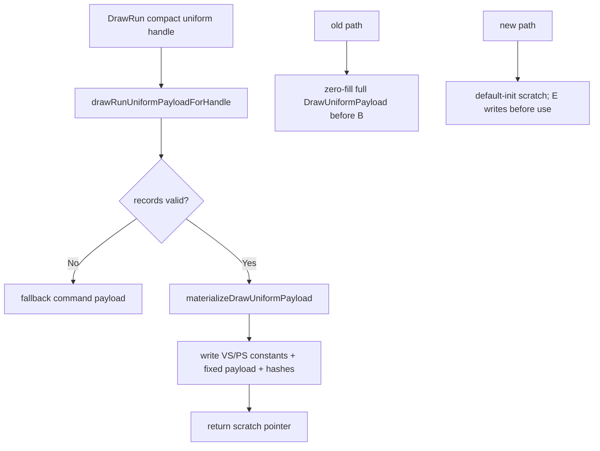

# Encode Phase 145 - Uniform Scratch Zero-Fill Cleanup

**Question.** After compact uniform storage, the draw encoder still materializes
legacy `DrawUniformPayload` scratch values for command-front and per-param
consumers. Does the encoder also pay an avoidable full-payload zero-fill before
the compact materializer overwrites the scratch?

**Verdict.** Yes as a local encode cleanup; no as an average-FPS owner. The
draw encoder no longer value-initializes `commandUniformScratch` and
`drawUniformScratch` before calling `drawRunUniformPayloadForHandle()` /
`drawRunUniformPayloadForParam()`. The materializer already writes every field
before returning the scratch pointer, including zeroing VS/PS constant tails via
`materializeDrawUniformStageConstants()`.



## Probe

Baseline:

```sh
bash scripts/tools/run_3dmark05_perf_probe.sh \
  --suffix snapshot-state-elision-current-r1 \
  --no-gputrace \
  --no-encoder-breakdown \
  --frame-sampling \
  --timeout 120 \
  --capture-delay-sec 45 \
  --wait-unlocked-sec 1 \
  --wait-unlocked-interval-sec 1 \
  --min-free-mb 256
```

Candidate:

```sh
bash scripts/tools/run_3dmark05_perf_probe.sh \
  --suffix uniform-scratch-nozerofill-r1 \
  --no-gputrace \
  --no-encoder-breakdown \
  --frame-sampling \
  --timeout 120 \
  --capture-delay-sec 45 \
  --wait-unlocked-sec 1 \
  --wait-unlocked-interval-sec 1 \
  --min-free-mb 256
```

Both runs completed with `status=pass`. The candidate screenshot is a normal
GT1 frame with ship engine glow, background lighting, HUD, and no black-frame
or skipped-pipeline symptoms.

## Result

| Metric | Baseline | Candidate | Delta |
|---|---:|---:|---:|
| `sampled_avg_fps` | `16.865` | `16.931` | `+0.39%` |
| `encode_draw_cpu_ms_per_present` | `8.580` | `8.426` | `-1.79%` |
| `encode_draw_cpu_ms` | `15,820.883` | `15,166.435` | `-4.14%` |
| `draw_uniform_payload_materialize_cpu_ms` | `432.728` | `422.435` | `-2.38%` |
| `draw_uniform_payload_materialize_draw_encoder_command_cpu_ms` | `257.438` | `249.460` | `-3.10%` |
| `draw_uniform_payload_materialize_draw_encoder_param_cpu_ms` | `175.290` | `172.975` | `-1.32%` |
| `commit_chunk_queue_draw_submission_cpu_ms_per_present` | `4.152` | `4.108` | `-1.06%` |
| `d3d9_snapshot_draw_submission_cpu_ms_per_present` | `3.436` | `3.397` | `-1.14%` |
| `completion_wait_without_enqueue_ms_per_present` | `27.429` | `27.154` | `-1.00%` |
| `draw_skipped_no_pipeline` | `0` | `0` | clean |
| `gpu_command_buffer_errors` | `0` | `0` | clean |

Interpretation:

- The local encode direction is positive, but small enough to treat as cleanup
  rather than an FPS promotion.
- The materialize timers do not include the old pre-call zero-fill, so the
  `encode_draw_cpu_ms` parent is the more useful movement signal here.
- P4 remains no-enqueue dominated and average FPS stays in the established
  noise band.

## Decision

Keep the patch. It removes avoidable work on a legacy scratch path that compact
uniform storage still needs, and it preserves normal GT1 visuals. Do not spend
new Xcode budget on this lane by itself. The next performance proof still needs
to move P4/P2/P3 cadence, producer overlap, or a larger encode child.

**Verification.**

- `meson compile -C build-arm64-nowine`
- `meson compile -C build-x86_64-builtin`
- `meson compile -C build-win32-x64-builtin`
- `meson compile -C build-win32-x86-builtin`
- `meson test -C build-arm64-nowine dxmt9-dod-replay-observer-spec`
- `meson test -C build-arm64-nowine dxmt9-state-draw-transform-spec`
- `git diff --check -- src/dxmt9/dxmt9_draw_encoder.mm`

**Related.** [state-churn-encode-encode-phase.121](state-churn-encode-encode-phase.121.md) ·
[state-churn-encode-encode-phase.122](state-churn-encode-encode-phase.122.md) ·
[state-churn-encode-encode-phase.144](state-churn-encode-encode-phase.144.md) · [present-pacing](../present-pacing.md).
