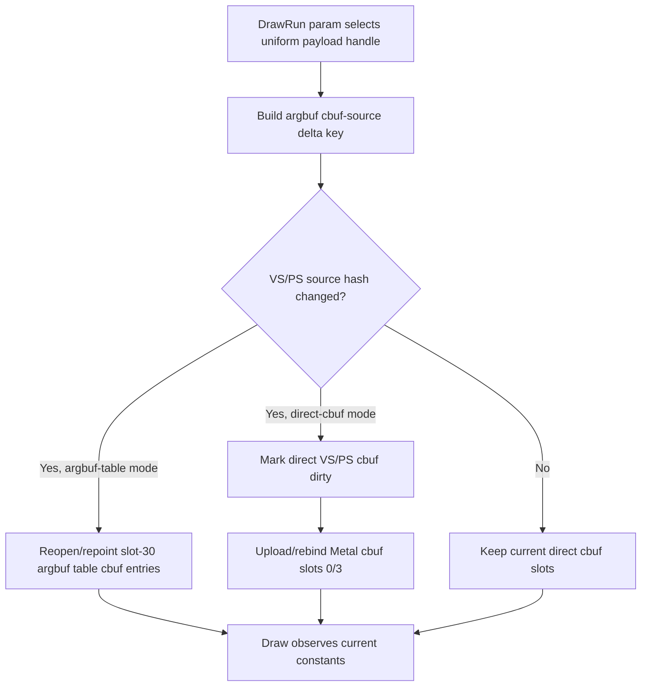

# Encode Phase 148 - Direct-Cbuf Dirty Payload Rebind Fix

## Question

Was the `v0.0.3` direct-cbuf corruption from phase 147 caused by a shader/PSO
ABI mismatch, or by stale direct cbuf bindings when the per-draw uniform
payload source changed?

## Verdict

The first-order corruption was stale direct cbuf binding. Stage 2b direct-cbuf
uses direct slots `0/3` instead of the slot-30 `ArgbufLayout`, but the runtime
only rebound those cbuf slots when the encoder's normal D3D constant dirty bits
were set. DrawRun params can switch to a different compact uniform payload
through `uniformHandle` without replaying a new D3D constant-set record at that
point. In argbuf-table mode, that source change reopens/repoints the argbuf
cbuf entries. In direct-cbuf mode, the same source change must explicitly mark
the direct VS/PS cbuf slots dirty.

The fix marks VS and PS dirty from the argbuf cbuf-source hash change before
the direct-cbuf upload path runs. The `v0.0.3` rerun returns to a normal GT1
frame with the expected muzzle flash/bloom family and without the black scene
or overexposed bands from phase 147.

This is a correctness fix for the opt-in path, not an average-FPS owner.
Direct-cbuf still removes the local argbuf table/open/cbuf-update costs, but
the run remains no-enqueue dominated and average FPS is noise-flat.

## Mechanism



The important distinction is that direct-cbuf mode removed the argbuf table
mutation side effect. It therefore needs an equivalent source-change dirty
edge for the direct slots.

## Implementation

`src/dxmt9/dxmt9_draw_encoder.mm` now derives direct dirty state from
`argbufVsPayloadSourceChanged` and `argbufPsPayloadSourceChanged` when
`activePassUsesArgbufDirectCbuf` is true. The helper marks only the live
payload ranges:

- VS float/int/bool counts call `applyConstantSetVsF/I/B`.
- PS float/int/bool counts call `applyConstantSetPsF/I/B`.
- an empty source payload still sets a sentinel VS/PS dirty bit so the direct
  slot binding can move to the minimum slab instead of keeping a stale buffer.

## Run

```sh
DXMT9_ARGBUF_DIRECT_CBUF=1 \
bash scripts/tools/run_3dmark05_perf_probe.sh \
  --suffix v003-direct-cbuf-dirtyfix-r1-20260618 \
  --no-gputrace \
  --no-encoder-breakdown \
  --frame-sampling \
  --timeout 120 \
  --capture-delay-sec 45 \
  --wait-unlocked-sec 1 \
  --wait-unlocked-interval-sec 1 \
  --compare-baseline-output experiments/output/app-d3d9-3dmark05-v003-current-baseline-r1-20260618
```

The run finished with `status=pass`, produced a comparison report, and used
the `v0.0.3` visual-safety anchor.

## Visual Gate

The direct-cbuf dirtyfix `actual.png` is visually back in the same GT1 frame
family as the `v0.0.3` baseline. It has normal scene lighting, visible soldiers,
rifle flash/bloom, floor highlights, and no obvious black-scene or white-band
corruption. The frames are not pixel-identical because the capture landed at
frame `651` versus baseline frame `654`, but this is no longer the gross
correctness failure from phase 147.

Health counters also stay clean:

| Counter | Value |
|---|---:|
| `draw_skipped_no_pipeline` | `0` |
| `gpu_command_buffer_errors` | `0` |
| `encode_draw_argbuf_table_bind_calls` | `0` |

## A/B Counters

| Metric | Baseline | Direct-cbuf dirtyfix | Delta |
|---|---:|---:|---:|
| `present_encoded` | `1,800` | `1,800` | `0` |
| `draws_per_present` | `738.806` | `739.908` | `+0.15%` |
| `sampled_avg_fps` | `16.832` | `16.894` | `+0.37%` |
| `gpu_command_buffer_time_ms_per_present` | `3.183` | `3.201` | `+0.56%` |
| `completion_wait_ms_per_present` | `26.890` | `28.592` | `+6.33%` |
| `completion_wait_without_enqueue_ms_per_present` | `26.839` | `28.354` | `+5.65%` |
| `commit_chunk_replay_cpu_ms_per_present` | `8.039` | `8.006` | `-0.41%` |
| `encode_chunk_cpu_ms_per_present` | `11.311` | `8.871` | `-21.57%` |
| `encode_draw_cpu_ms_per_present` | `8.750` | `6.359` | `-27.33%` |
| `argbuf_setup_cpu_ms_per_present` | `1.899` | `0.000` | `-100.00%` |
| `argbuf_open_cpu_ms_per_present` | `0.771` | `0.000` | `-100.00%` |
| `argbuf_cbuf_update_cpu_ms_per_present` | `0.981` | `0.000` | `-100.00%` |
| `encode_draw_argbuf_table_bind_calls` | `987,197` | `0` | `-100.00%` |

The local mechanism remains real: direct-cbuf eliminates the slot-30 argbuf
table path for this constants-only Stage 2b workload. The smaller `-21.57%`
encode win versus phase 147's `-25.10%` is acceptable variance after restoring
the required cbuf rebinding.

## P4 Shape

| Metric | Baseline | Direct-cbuf dirtyfix | Delta |
|---|---:|---:|---:|
| `completion_wait_with_enqueue_ms_per_present` | `0.051` | `0.238` | `+0.187` |
| `completion_wait_without_enqueue_ms_per_present` | `26.839` | `28.354` | `+1.516` |
| `completion_wait_no_enqueue_share_pct` | `99.809` | `99.167` | `-0.643` |
| `no_enqueue_stage_encode_dequeue_to_command_buffer_commit_ms_per_present` | `12.689` | `10.413` | `-2.276` |
| `no_enqueue_wait_to_next_enqueue_ms_per_present` | `32.911` | `31.049` | `-1.863` |

The encode segment shrinks, but completion wait is still almost entirely
no-enqueue wait. This means the frame cadence still does not overlap producer
work with completion enough for the local encode win to become an average-FPS
win.

## Decision

Keep `DXMT9_ARGBUF_DIRECT_CBUF=1` default-off unless broader visual coverage
and default-policy review promote it. The corruption root cause found here is
fixed, so the path is useful as an opt-in local CPU experiment. It should not
displace the next larger targets:

- P4 producer/run-ahead or winemac/main-thread present dependency attribution;
- raw DrawRun batch compatibility and N-1 state elision;
- replay/snapshot/publish copy and state-width reduction;
- only then additional argbuf/direct-cbuf cleanup, gated by `v0.0.3` visuals.
