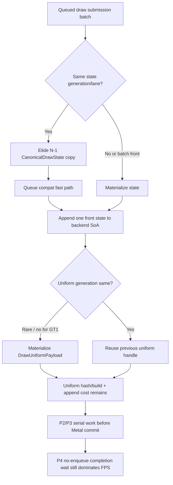

# Encode Phase 149 - Current V003 State-Elision Residual Review

## Question

After the direct-cbuf correctness fix, should the next CPU/P4 work return to
raw DrawRun batch compatibility and N-1 canonical-state materialization, or is
that branch already closed in the `v0.0.3`-anchored current run?

## Verdict

Do not reopen N-1 canonical-state materialization as the next implementation
target. The `v0.0.3`-anchored current run already has the accepted same-generation
/ lane state-elision path active, and the residual materialized-but-discarded
state count is now small. The remaining submit-side owner is uniform/hash/append
and the larger P4 no-enqueue cadence.

The important correction is scope: the old F1 critique was valid before phase
48. In current code, it is mostly solved for state. Uniform payloads still
materialize because GT1 changes `uniformGeneration` across those same state
groups, so the next work needs a uniform-specific design or a producer-overlap
design, not another state-copy pass.

## Current Evidence

Current same-day baseline:

`experiments/output/app-d3d9-3dmark05-v003-current-baseline-r1-20260618`

| Metric | Value |
|---|---:|
| `sampled_avg_fps` | `16.832` |
| `completion_wait_without_enqueue_ms_per_present` | `26.839` |
| `commit_chunk_replay_cpu_ms_per_present` | `8.039` |
| `commit_chunk_queue_draw_submission_cpu_ms_per_present` | `3.776` |
| `commit_chunk_queue_draw_submission_snapshot_cpu_ms_per_present` | `3.102` |
| `encode_chunk_cpu_ms_per_present` | `11.311` |

State-elision health:

| Metric | Value |
|---|---:|
| `d3d9_snapshot_state_elided` | `412,984` |
| `d3d9_snapshot_state_elided_bytes` | `4,225,652,288` |
| `submit_draw_run_batch_compat_same_generation_lane` | `410,551` |
| `submit_draw_run_batch_compat_same_generation_lane_compatible` | `410,551` |
| `submit_draw_run_batch_compat_same_generation_lane_incompatible` | `0` |
| `submit_draw_run_batch_discarded_state_records` | `3,925` |
| `submit_draw_run_batch_discarded_state_bytes` | `40,160,600` |

Residual submit-side work:

| Metric | Value |
|---|---:|
| `d3d9_snapshot_uniform_materialized` | `885,840` |
| `d3d9_snapshot_uniform_materialized_bytes` | `9,092,261,760` |
| `d3d9_snapshot_uniform_elided` | `0` |
| `d3d9_snapshot_uniform_build_hash_cpu_ms` | `1,702.902` |
| `d3d9_snapshot_uniform_build_vs_const_hash_cpu_ms` | `1,023.888` |
| `d3d9_snapshot_uniform_build_nonconst_hash_cpu_ms` | `296.518` |
| `submit_draw_run_batch_append_uniform_cpu_ms` | `1,176.066` |
| `draw_uniform_payload_lookup_bucket_cpu_ms` | `132.196` |

## Interpretation

The state branch is healthy: same-generation/lane has no observed incompatible
pairs, and more than four GiB of state copy is already elided in the current
run. The remaining discarded state is about `40.16MiB` over the whole run,
which is too small to be the next frame-rate owner.

The uniform branch is different. `d3d9_snapshot_uniform_elided=0` and
`885,840` payloads still materialize because the app changes constants across
the state-stable groups. Earlier snapshot-cache phase 17 already rejected
simple same-generation uniform N-1 elision for GT1; the current run gated by
the `v0.0.3` visual anchor repeats that shape.

## Next Target

Keep these as closed or lower-priority:

- raw same-generation/lane deep compatibility proof;
- N-1 canonical-state copy elision;
- simple uniform N-1 reuse tied to state generation;
- draw-uniform lookup reserve micro-optimizations.

Rank the next work in this order:

1. P4 / producer-overlap design that can reduce no-enqueue completion wait.
2. Snapshot uniform/hash work, especially the full indexed VS hash path and
   cache-owned compact consumers.
3. Backend uniform append count/storage shape if it reduces materialization or
   repeated VS constant component work.
4. Additional argbuf/direct-cbuf cleanup only when it also moves frame sampling
   or completion wait.

This keeps the current direct-cbuf result in context: phase 148 fixed an opt-in
correctness bug and removed local encode work, but average FPS stayed flat
because the serial submit/replay/encode and P4 wait shape did not change.
