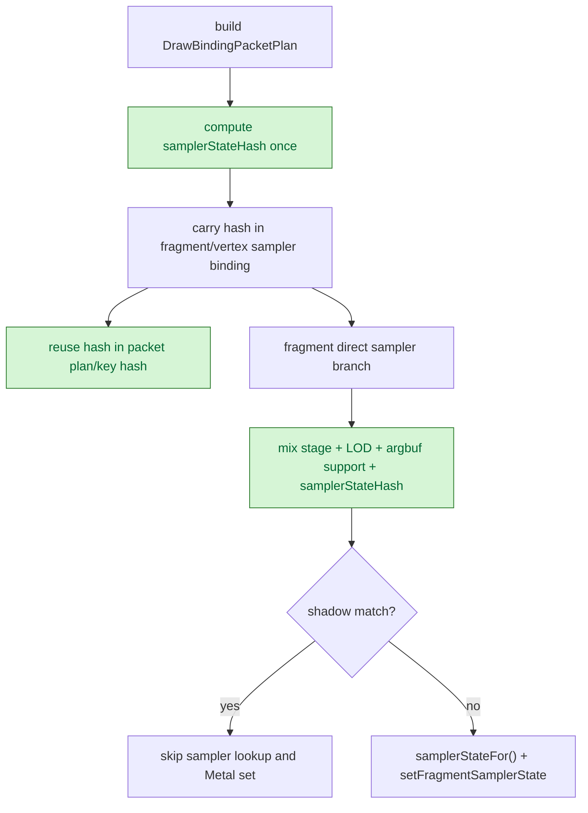

# Sampler State Hash Reuse

**Question / hypothesis.** [state-churn-encode-encode-phase.14](state-churn-encode-encode-phase.14.md) moved skipped
fragment sampler binds before `samplerStateFor()`, but the direct sampler lane
still rebuilt the full sampler-state hash for every texture/sampler entry. Can
the binding packet carry that hash once and reuse it in the sampler shadow key?

**Implementation.** `FragmentTextureSamplerBinding` and
`VertexTextureSamplerBinding` now carry `samplerStateHash`, computed when the
binding packet is built. The draw-binding packet key and plan hash reuse that
field, and `samplerBindShadowHash()` mixes the precomputed hash instead of
rehashing `FlatStateSet<kMaxSamplerStates>` on every direct sampler branch.

The fragment direct split counters added for this experiment are deliberately
heavy and default off behind `DXMT9_PERF_TEXTURE_SAMPLER_DIRECT_SPLIT=1`; the
default perf profile no longer pays the per-entry nested `PerfScope` cost.

**Method.**

```bash
# Heavy attribution run, before default-off gating:
bash scripts/tools/run_3dmark05_perf_probe.sh \
  --suffix fragment-direct-split-r1 \
  --frame 50 \
  --no-gputrace \
  --no-encoder-breakdown \
  --timeout 180

bash scripts/tools/run_3dmark05_perf_probe.sh \
  --suffix sampler-state-hash-r1 \
  --frame 50 \
  --no-gputrace \
  --no-encoder-breakdown \
  --timeout 180

# Production-shaped default perf profile after gating:
bash scripts/tools/run_3dmark05_perf_probe.sh \
  --suffix sampler-state-hash-default-r2 \
  --frame 50 \
  --no-gputrace \
  --no-encoder-breakdown \
  --timeout 180
```

All runs hit the expected watchdog status `124` after writing postprocess
artifacts.

**Attribution result.** Under the same heavy direct-split instrumentation,
precomputed sampler hashes reduce only the sampler branch; texture branch stays
flat.

| Counter | Direct split | Sampler hash | Delta / reading |
|---|---:|---:|---|
| `present_encoded` | 1,740 | 1,740 | same run length |
| `draw_calls` | 1,274,714 | 1,274,419 | -0.02% |
| `encode_draw_texture_sampler_fragment_direct_texture_cpu_ms` | 477.159 | 480.271 | flat/noisy |
| `encode_draw_texture_sampler_fragment_direct_sampler_cpu_ms` | 364.271 | 298.898 | -65.373ms (-17.95%) |
| `encode_draw_texture_sampler_fragment_direct_sampler_set_cpu_ms` | 28.420 | 27.460 | set cost is not the win |
| `encode_draw_texture_sampler_sampler_lookup_cpu_ms` | 53.428 | 51.971 | lookup cost is not the win |
| `encode_draw_texture_sampler_bind_cpu_ms` | 1831.135 | 1730.250 | -100.885ms with heavy counters |

**Default-profile result.** With `DXMT9_PERF_TEXTURE_SAMPLER_DIRECT_SPLIT`
default off and `PerfScope(nullptr)` fixed to avoid a clock read, the same
present comparison against [state-churn-encode-encode-phase.14](state-churn-encode-encode-phase.14.md) shows a small
accepted CPU win:

| Counter | Sampler pre-handle skip | Sampler hash default r2 | Delta / reading |
|---|---:|---:|---|
| `present_encoded` | 1,740 | 1,740 | same run length |
| `draw_calls` | 1,274,257 | 1,273,455 | -0.06% |
| `encode_draw_texture_sampler_bind_cpu_ms` | 892.480 | 822.864 | -69.616ms (-7.80%) |
| `encode_draw_texture_sampler_fragment_direct_cpu_ms` | 495.039 | 426.614 | -68.425ms (-13.82%) |
| `encode_draw_stream_bind_texture_phase_cpu_ms` | 939.682 | 867.411 | -72.271ms (-7.69%) |
| `encode_draw_cpu_ms` | 17,724.955 | 17,598.333 | -126.622ms (-0.71%) |
| `gpu_command_buffer_time_ms` | 5,249.931 | 5,259.535 | flat/noisy (+0.18%) |
| `completion_wait_ms` | 39,645.939 | 39,512.855 | flat/noisy (-0.34%) |

`actual.png` is a normal visible GT1 frame. The frame is later in the scene than
the prior sample (`Frame: 1031`, HUD `FPS: 12`), but geometry, lighting,
transparency, and HUD are present.



**Verdict.** Accepted CPU win, small and local. The mechanism is not GPU-side:
the only stable movement is the fragment direct sampler branch and its parent
texture/sampler bind bucket. The heavy split counters are useful for future
attribution, but they must remain opt-in because per-entry nested timing
perturbs the default perf profile.

**Next.** The remaining texture/sampler work is texture direct/shadow and
texture resolve, not sampler lookup or sampler hash. Broader frame-rate claims
still need vsync-on wallclock or Xcode frame-gated evidence.

**Related.** [state-churn-encode](../state-churn-encode.md) ·
[state-churn-encode-encode-phase.14](state-churn-encode-encode-phase.14.md) · [present-pacing](../present-pacing.md).
