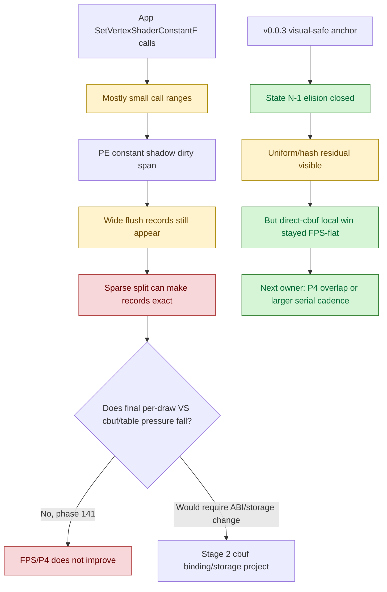

# Encode Phase 150 - V003 VS Setter-Range Refresh

## Question

After correcting the GT1 visual-safety anchor to `v0.0.3` and fixing the
direct-cbuf opt-in path, should the next work return to VS constant setter
range width / full-indexed uniform hash, or does the current evidence still
point at P4/replay-publish and larger serial CPU cadence?

## Verdict

The current refresh gated by the `v0.0.3` visual anchor keeps the phase 140/141
conclusion unchanged.
Wide flushed VS constant records still exist, but sparse record splitting is
already rejected as the FPS lever because it does not reduce the final per-draw
VS cbuf/table pressure or create P4 overlap. Do not reopen sparse const-record
splitting or full-indexed hash width as the next primary implementation target.

The next average-FPS target remains either:

- a P4 / producer-overlap carrier that preserves command-buffer, render-pass,
  and tile-preservation locality; or
- a larger replay/snapshot/encode cadence reduction that also moves
  `completion_wait_without_enqueue` or frame sampling.

## Probe

```sh
bash scripts/tools/run_3dmark05_perf_probe.sh \
  --suffix v003-vs-const-setter-range-r1-20260618 \
  --no-gputrace \
  --no-encoder-breakdown \
  --frame-sampling \
  --timeout 120 \
  --capture-delay-sec 45 \
  --wait-unlocked-sec 1 \
  --wait-unlocked-interval-sec 1 \
  --probe-vs-const-setter-range \
  --compare-baseline-output \
    experiments/output/app-d3d9-3dmark05-v003-current-baseline-r1-20260618
```

The run completed with `status=pass`, `1,740` presents, no `.gputrace`, and
`655` setter-range CSV rows. The compare report is run-length-normalized, and
the added setter-range probe is not a meaningful perturbation: replay, snapshot,
encode, uniform hash, and append per-present counters are all within noise.

## Current Evidence

Baseline comparison versus
`experiments/output/app-d3d9-3dmark05-v003-current-baseline-r1-20260618`:

| Metric | Baseline | Setter-range refresh | Delta |
|---|---:|---:|---:|
| `completion_wait_without_enqueue_ms_per_present` | `26.839` | `27.102` | `+0.264` |
| `commit_chunk_replay_cpu_ms_per_present` | `8.039` | `8.030` | `-0.009` |
| `d3d9_snapshot_draw_submission_cpu_ms_per_present` | `3.042` | `3.030` | `-0.012` |
| `encode_chunk_cpu_ms_per_present` | `11.311` | `11.164` | `-0.147` |
| `snapshot_cache_batch_miss_vs_const_hash_cpu_ms_per_present` | `0.273` | `0.272` | `-0.001` |
| `submit_draw_run_batch_append_uniform_cpu_ms_per_present` | `0.653` | `0.650` | `-0.003` |

Setter-range totals excluding the explicit overflow summary rows:

| Phase | Rows | Events | Range regs | Changed regs | Range / changed |
|---|---:|---:|---:|---:|---:|
| `call` | `586` | `3,316,477` | `10,254,539` | `8,540,499` | `1.201x` |
| `flush` | `67` | `516,930` | `12,568,723` | `8,902,224` | `1.412x` |

The overflow summary rows are also large (`call` changed-span regs
`8,818,606`, `flush` changed-span regs `11,981,857`), so the concrete rows are
not the full workload. They are still enough to repeat the shape: app calls are
mostly small, while PE flush produces wide ranges.

Top concrete flush rows:

| VS / PS | Start | Count | Events | Range regs | Changed regs | Range / changed |
|---|---:|---:|---:|---:|---:|---:|
| `0x18ffaf75e52f4615 / 0x6f39a816200d9efe` | `0` | `196` | `31,875` | `6,247,500` | `3,794,072` | `1.647x` |
| `0x6d2bb311069a1829 / 0x0` | `0` | `196` | `9,239` | `1,810,844` | `1,187,813` | `1.525x` |
| `0xdee2a2c1e0557a9a / 0x2f2090e9c1402459` | `0` | `201` | `7,943` | `1,596,543` | `1,129,375` | `1.414x` |
| `0xcf219872fdbbb398 / 0x6f39a816200d9efe` | `0` | `4` | `322,009` | `1,288,036` | `1,287,531` | `1.000x` |

Concrete flush range distribution:

| Count bucket | Rows | Events | Range regs | Changed regs | Range share |
|---|---:|---:|---:|---:|---:|
| `1..4` | `22` | `392,112` | `1,562,751` | `1,561,673` | `12.43%` |
| `5..15` | `24` | `68,598` | `653,270` | `598,401` | `5.20%` |
| `16..63` | `5` | `2,902` | `72,030` | `72,030` | `0.57%` |
| `64..127` | `5` | `773` | `88,584` | `88,584` | `0.70%` |
| `>=128` | `11` | `52,545` | `10,192,088` | `6,581,536` | `81.09%` |

## Interpretation



This refresh separates two facts:

1. The VS constant stream still has real width/churn, including large
   `start=0,count=196/201` flush rows and `159,905` full indexed-float VS hash
   calls in this run.
2. The currently tested width fixes are not the average-FPS owner. Sparse
   flush splitting already proved the width mechanism but failed the P4/FPS
   gate, while direct-cbuf removes the argbuf table path locally but remains
   FPS-flat after the correctness fix.

## Decision

Keep the setter-range evidence as current attribution only. Do not promote
`DXMT9_SPLIT_SPARSE_CONST_RECORDS` and do not spend `.gputrace` budget on
another const-width-only candidate. The next implementation needs a P4 proof:
`completion_wait_with_enqueue` must rise, `completion_wait_without_enqueue`
must fall, or frame sampling must move while command buffers, render passes,
and tile-preservation traffic do not regress.

**Related.** [state-churn-encode](../state-churn-encode.md) ·
[state-churn-encode-encode-phase.140](state-churn-encode-encode-phase.140.md) ·
[state-churn-encode-encode-phase.141](state-churn-encode-encode-phase.141.md) ·
[state-churn-encode-encode-phase.148](state-churn-encode-encode-phase.148.md) ·
[state-churn-encode-encode-phase.149](state-churn-encode-encode-phase.149.md) · [present-pacing](../present-pacing.md).
