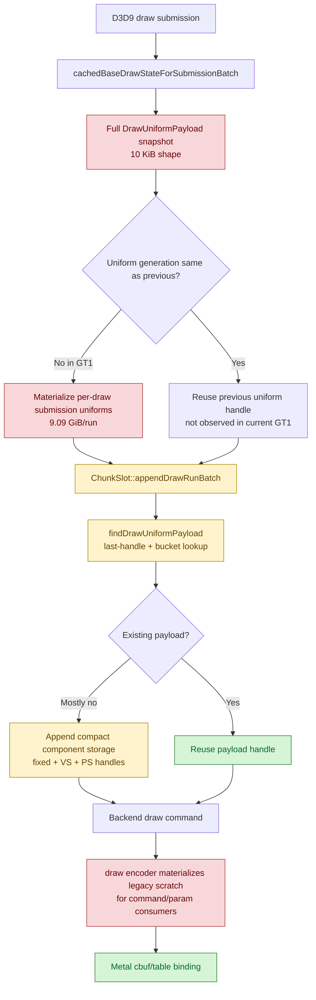

# Encode Phase 151 - V003 uniform append residual audit

## Question

After H149 named `submit_draw_run_batch_append_uniform_cpu_ms=1176.066`, is the
next safe implementation a batch-append lookup/candidate microfix, or is the
remaining uniform work elsewhere?

## Verdict

Do not treat batch uniform append lookup/reserve/copy as the next primary
implementation target. In the `v0.0.3`-anchored current run, backend append storage
is already compact component storage, and the visible child timers are smaller
than the frontend uniform hash/materialization lane and the remaining legacy
backend materialization lane.

The current append bucket is still real CPU, but the nearest simple microfix is
weak: `appendDrawRunBatch()` already benefits from `lastUniformHandle` inside
`findDrawUniformPayload()`, so passing the previous per-batch handle as a
candidate would mostly duplicate the same adjacent fast path. A larger win needs
to avoid creating/copying full frontend `DrawUniformPayload` snapshots, avoid
legacy full scratch materialization in draw-encoder consumers, or produce a P4
overlap change.

## Current evidence

Baseline:

`experiments/output/app-d3d9-3dmark05-v003-current-baseline-r1-20260618`

| Metric | Value |
|---|---:|
| `present_encoded` | `1800` |
| `d3d9_snapshot_uniform_materialized` | `885,840` |
| `d3d9_snapshot_uniform_materialized_bytes` | `9,092,261,760` |
| `d3d9_snapshot_uniform_elided` | `0` |
| `d3d9_snapshot_uniform_build_hash_cpu_ms` | `1702.902` |
| `d3d9_snapshot_uniform_build_vs_const_hash_cpu_ms` | `1023.888` |
| `d3d9_snapshot_uniform_build_nonconst_hash_cpu_ms` | `296.518` |
| `submit_draw_run_batch_append_uniform_cpu_ms` | `1176.066` |
| `draw_uniform_payload_lookup_cpu_ms` | `270.282` |
| `draw_uniform_payload_lookup_bucket_cpu_ms` | `132.196` |
| `draw_uniform_payload_append_reserve_cpu_ms` | `55.639` |
| `draw_uniform_payload_append_copy_cpu_ms` | `56.864` |
| `draw_uniform_payload_append_link_cpu_ms` | `64.749` |
| `draw_uniform_payload_materialize_cpu_ms` | `423.341` |

The derived summary already separates the byte shape:

| Derived metric | Value |
|---|---:|
| `uniform_materialized_bytes_per_present` | `5,051,256.533` |
| `uniform_compact_candidate_bytes_per_present` | `1,453,055.947` |
| `uniform_compact_saved_share_of_materialized_bytes` | `71.23%` |
| `uniform_append_bytes_per_present` | `491,221.742` |
| `uniform_append_bytes_share_of_materialized_bytes` | `9.72%` |
| `uniform_append_bytes_per_append` | `952.194` |
| `uniform_payload_record_append_bytes_per_append` | `96.000` |
| `uniform_vertex_constants_append_bytes_share_of_append_bytes` | `86.06%` |
| `uniform_pixel_constants_append_bytes_share_of_append_bytes` | `3.45%` |
| `uniform_backend_materialized_bytes_per_present` | `5,709,401.320` |
| `uniform_backend_materialize_cpu_ms_per_present` | `0.235` |
| `uniform_snapshot_elision_share` | `0.00%` |

Lookup health also argues against a hash-collision or candidate-only fix:

| Metric | Value |
|---|---:|
| `draw_uniform_payload_lookup_candidate_hits` | `0` |
| `draw_uniform_payload_lookup_last_hits` | `17,409` |
| `draw_uniform_payload_lookup_bucket_hits` | `56,807` |
| `draw_uniform_payload_lookup_bucket_misses` | `926,792` |
| `draw_uniform_payload_lookup_hash_collisions` | `0` |
| `draw_uniform_payload_lookup_semantic_hash_misses` | `0` |

## Code audit

`snapshotDrawSubmissionFromCurrentState()` still materializes a full
`DrawUniformPayload` for every non-elided draw submission:

- it stamps `uniformGeneration` and `uniformPayloadHash`;
- it only elides uniforms for the same state generation/lane and the same
  uniform generation;
- GT1 has `d3d9_snapshot_uniform_elided=0`, so every accepted draw carries the
  full snapshot.

`ChunkSlot::appendDrawRunBatch()` stores the payload more compactly:

- one `DrawUniformPayloadRecord` handle record per unique payload;
- one fixed-payload component record;
- usage-prefix VS/PS stage-constant byte arenas and component handles.

The storage width is therefore not the old full-payload record problem. The
remaining append bytes are mostly VS stage constants, and the append bucket also
contains repeated per-submission lookup and component interning work.

## Decision

Keep these lower-priority unless new counters change:

- previous-handle candidate plumbing inside `appendDrawRunBatch()`;
- lookup hash-collision handling;
- uniform payload append reserve/copy/link micro-optimizations;
- another same-generation uniform elision attempt tied to the current
  `uniformGeneration` gate.

Rank the next uniform work as:

1. frontend compact-owned uniform snapshots or consumers that avoid the full
   10 KiB `DrawUniformPayload` copy/materialization lane;
2. direct compact draw-encoder consumers that avoid legacy full scratch
   materialization for command and per-param uniform reads;
3. VS constant source churn reduction only if it also reduces hash/materialize
   CPU and survives the `v0.0.3` visual gate;
4. larger P4/serial-cadence overlap work, because local uniform reductions have
   repeatedly stayed FPS-flat without moving no-enqueue closure.

This audit narrows H149's "uniform/hash/append" bucket: append is a secondary
residual, while frontend hash/materialization and P4 remain the first-order
current targets.
