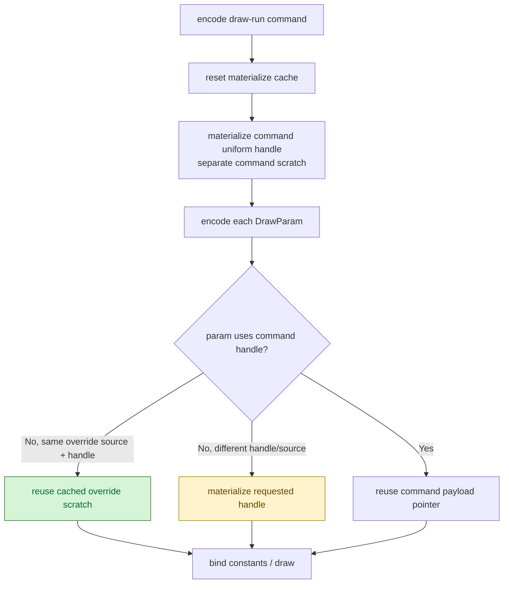

# Encode Phase 152 - Command uniform materialize cache

## Question

Can the H161 "legacy compact consumer" residual be reduced without changing the
frontend `DrawUniformPayload` snapshot policy or the Metal constant ABI?

## Verdict

Yes, but only as a scoped encode cleanup. The draw encoder now keeps a
command-local `DrawUniformPayloadMaterializeCache` for compact draw-run commands.
When a non-front per-draw override uniform handle repeats inside the same
DrawRun command, the encoder reuses the already materialized override scratch
instead of reconstructing the full legacy `DrawUniformPayload` again.

The command-front payload stays in its own scratch. This separation is required:
the cache owns one mutable scratch slot, so a cache miss for an override handle
would overwrite any retained command-front pointer if both used the same cache.

This does not solve the larger H161/H149 owners:

- frontend uniform materialization and hash still happen before the chunk reaches
  the backend;
- compact append storage is unchanged;
- the change is runtime-counter unmeasured until the next no-gputrace run;
- any FPS interpretation remains gated by the `v0.0.3` visual-safe anchor.

## Code shape

`DrawUniformPayloadMaterializeCache` is keyed by both the compact uniform handle
and the command's compact payload-record span. The extra source identity matters
because `DrawUniformHandle` indices are slot-local. The encoder resets the cache
at each draw-run command boundary and uses it only for per-param override
payloads; the command-front payload is materialized into a separate scratch.



## Verification

Native coverage now checks:

- a compact draw-run command view with no command-level legacy uniform pointer
  can resolve through the cache helper;
- a batched draw-run with two repeated non-front override uniform handles reuses
  the override scratch while keeping the command-front scratch stable.

Commands run:

```sh
meson test -C build-arm64-nowine dxmt9-state-draw-transform-spec
meson compile -C build-arm64-nowine
```

## Runtime follow-up

[[state-churn-encode-encode-phase.153]] runs the GT1 no-gputrace follow-up
against a current run gated by the `v0.0.3` visual anchor. It compares:

- `draw_uniform_payload_materialized`
- `draw_uniform_payload_materialized_bytes`
- `draw_uniform_payload_materialize_cpu_ms`
- `draw_uniform_payload_materialized_draw_encoder_command`
- `draw_uniform_payload_materialized_draw_encoder_param`
- `draw_uniform_payload_materialize_draw_encoder_command_cpu_ms`
- `draw_uniform_payload_materialize_draw_encoder_param_cpu_ms`

The counters do not move in the intended direction, so H162 is rejected as a
current GT1 owner. Keep H161's ranking unchanged and return to frontend
compact-owned snapshots, direct compact consumers with measured no-gputrace
movement, or P4/serial-cadence overlap.
