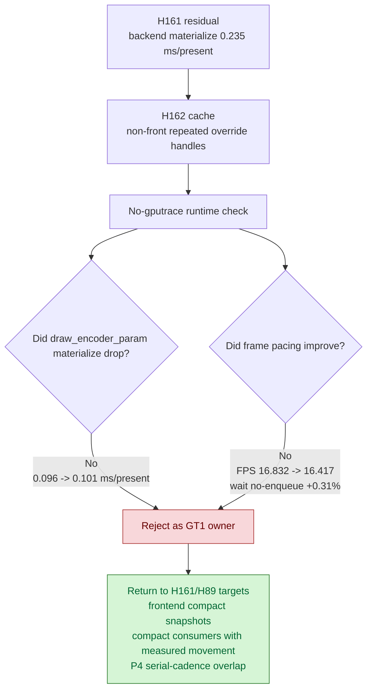

# Encode Phase 153 - Command uniform cache runtime check

## Question

Does H162's command-local compact uniform materialize cache reduce the current
GT1 backend uniform materialization bucket or average frame pacing?

## Verdict

No. The cache is correctness-safe after separating command-front scratch from
override scratch, but the current GT1 workload does not show useful repeated
non-front override handles. Treat this as a small hygiene cleanup, not a
performance owner.

The visual gross-check is normal: the captured frame shows the expected
machine-gun muzzle flash/bloom path and no obvious black-vertex or transparent
weapon regression. Runtime counters are clean (`gpu_command_buffer_errors=0`).
But the target materialization counters do not move in the intended direction,
and average FPS is lower.

## Run

Command shape:

```sh
scripts/tools/run_3dmark05_perf_probe.sh \
  --no-gputrace \
  --suffix h162-uniform-cache-r1 \
  --timeout 120 \
  --wait-unlocked-sec 60 \
  --frame-sampling
```

The wrapper reported `status: pass`, `gputrace: disabled`, and
`runner_timeout_sec: 120`.

## Comparison

Baseline:

`experiments/output/app-d3d9-3dmark05-v003-current-baseline-r1-20260618`

Candidate:

`experiments/output/app-d3d9-3dmark05-h162-uniform-cache-r1`

| Metric | `v0.0.3` baseline | H162 runtime | Delta |
|---|---:|---:|---:|
| `sampled_avg_fps` | `16.832` | `16.417` | `-2.47%` |
| `gpu_command_buffer_errors` | `0` | `0` | clean |
| `completion_wait_ms_per_present` | `26.890` | `26.971` | `+0.30%` |
| `completion_wait_without_enqueue_ms_per_present` | `26.839` | `26.921` | `+0.31%` |
| `encode_chunk_cpu_ms_per_present` | `11.311` | `12.997` | `+14.90%` |
| `encode_draw_cpu_ms_per_present` | `8.750` | `9.937` | `+13.56%` |
| `uniform_backend_materialize_cpu_ms_per_present` | `0.235` | `0.243` | `+3.21%` |
| `uniform_backend_materialized_bytes_per_present` | `5,709,401.320` | `5,749,202.634` | `+0.70%` |
| `uniform_backend_materialize_draw_encoder_command_cpu_ms_per_present` | `0.139` | `0.142` | `+2.2%` |
| `uniform_backend_materialize_draw_encoder_param_cpu_ms_per_present` | `0.096` | `0.101` | `+5.2%` |
| `uniform_backend_materialize_draw_encoder_param_bytes_per_present` | `2,368,480.724` | `2,387,099.660` | `+0.79%` |
| `submit_draw_run_batch_append_uniform_cpu_ms_per_present` | `0.653` | `0.666` | `+1.86%` |
| `no_enqueue_before_publish_closure_ms_per_present` | `15.831` | `15.294` | `-3.39%` |
| `no_enqueue_wait_to_next_enqueue_ms_per_present` | `32.911` | `34.455` | `+4.69%` |

The apparent lower total materialized count is not a win because the candidate
encoded fewer presents (`1800 -> 1740`). Per-present materialization and bytes
are flat-to-worse.



## Decision

Do not spend `.gputrace` on this cache. It did not move the no-gputrace CPU
owner, so Xcode encoder counters would only confirm the already-known GPU hot
frame without explaining average FPS.

Keep the active frontier from H161/H89:

- reduce frontend compact-owned uniform snapshot/hash work;
- remove direct compact consumer materialization only when a no-gputrace counter
  first proves movement;
- prioritize P4 / serial-cadence overlap designs that reduce
  `completion_wait_without_enqueue` or `no_enqueue_wait_to_next_enqueue`.
