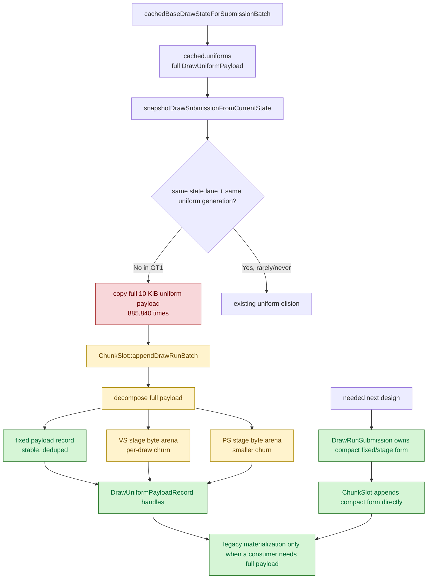

# Encode Phase 154 - Frontend compact uniform snapshot feasibility

## Question

After H163 rejected command-local uniform materialization caching as a GT1
owner, is "frontend compact-owned uniform snapshot" a real next lever, or is it
just another uniform-elision retry?

## Verdict

It is a real copy-width lever, but not a one-function microfix. The current
`v0.0.3` baseline proves that adjacent submissions always keep the same fixed
uniform payload, while shader constants almost always change. That explains why
the existing same-generation uniform elision remains at zero, and it also
defines the safe implementation boundary: keep fixed-payload equality explicit,
store shader constants as compact stage bytes, and teach `ChunkSlot` to consume
that compact owned form directly.

Do not try to fake this by partially filling `std::optional<DrawUniformPayload>`
or by trusting only `fixedPayloadHash`. `std::optional<DrawUniformPayload>`
still constructs a full 10 KiB object, and hash-only fixed reuse would weaken
the current semantic equality guard. The next implementation must introduce a
compact submission payload or compact submission arena with deterministic unit
coverage before a 3DMark05 runtime gate.

## Current baseline shape

Baseline:

`experiments/output/app-d3d9-3dmark05-v003-current-baseline-r1-20260618`

| Metric | Value |
|---|---:|
| `d3d9_snapshot_uniform_materialized` | `885,840` |
| `d3d9_snapshot_uniform_materialized_bytes` | `9,092,261,760` |
| `d3d9_snapshot_uniform_elided` | `0` |
| `d3d9_snapshot_uniform_materialized_compact_candidate_bytes` | `2,615,500,704` |
| `d3d9_snapshot_uniform_materialized_compact_saved_bytes` | `6,476,761,056` |
| `compact candidate / materialized` | `28.77%` |
| `compact saved / materialized` | `71.23%` |

The compact candidate is mostly fixed payload plus a much smaller stage-constant
prefix:

| Component | Bytes | Share of compact candidate | Approx bytes / materialized draw |
|---|---:|---:|---:|
| Fixed payload | `1,800,026,880` | `68.82%` | `2,032 B` |
| VS constants | `757,914,224` | `28.98%` | `856 B` |
| PS constants | `57,559,600` | `2.20%` | `65 B` |
| Full `DrawUniformPayload` copy | `9,092,261,760` | n/a | `10,264 B` |

Adjacent component hashes explain the failure mode:

| Metric | Value |
|---|---:|
| `d3d9_snapshot_uniform_adjacent_previous_payload` | `787,998` |
| `same fixed payload hash` | `787,998` (`100.00%`) |
| `same fixed payload hash + same state lane` | `412,984` (`52.41%`) |
| `same fixed payload hash + different generation` | `787,998` (`100.00%`) |
| `same VS const hash` | `137,002` (`17.39%`) |
| `same PS const hash` | `505,444` (`64.14%`) |
| `same VS and PS const hashes` | `4,928` (`0.63%`) |
| `same fixed and shader const hashes + same state lane` | `39` (`0.005%`) |

So the residual is not "missed whole-payload elision". The fixed part is
stable; the shader-constant part is the per-draw churn.

## Code boundary

Current submission path:

1. `Device::snapshotDrawSubmissionFromCurrentState()` copies
   `cached.uniforms` into `DrawRunSubmission::uniforms`.
2. `ChunkSlot::appendDrawRunBatch()` receives a full `DrawUniformPayload`, then
   decomposes it into fixed payload, VS stage bytes, PS stage bytes, and a
   `DrawUniformPayloadRecord`.
3. Draw encoder command/param consumers may materialize a legacy
   `DrawUniformPayload` scratch from those compact records.

The fixed payload is already deduplicated once it reaches `ChunkSlot`, but the
frontend has already paid the full owned snapshot copy.

## Implementation constraints

- The compact form must be owned by the submission batch, not borrowed from
  `Device::CachedBaseDrawState`, because later D3D9 state changes can refresh
  the cache before unix-side queue append consumes the batch.
- Fixed-payload reuse must preserve the current equality guard. A same
  `fixedPayloadHash` is an opportunity signal, not a correctness proof by
  itself.
- Stage constants must preserve the existing ABI-prefix rule from
  [snapshot-cache-visual.01](../snapshot-cache/snapshot-cache-visual.01.md): when int/bool constants are live, the required
  float/int prefix must still be present. This is why the current compact byte
  helpers use `makeDrawUniformVertexConstantsSpan()` and
  `makeDrawUniformPixelConstantsSpan()`.
- A `std::optional<DrawUniformPayload>` partial-copy shortcut is not sufficient:
  constructing the optional still writes the full object, and leaving fixed
  fields zero would make the current append equality checks invalid unless the
  append API is changed too.
- Promotion must use the `v0.0.3` visual-safety anchor. Uniform/timing changes
  have already produced HUD-only black-scene failures in H99/H88 despite clean
  explicit error counters.

## Next implementation unit

1. Add a compact owned submission payload type that stores fixed payload
   explicitly only when needed, plus VS/PS stage byte spans or inline arenas
   sized by `DrawUniformPayloadHashes`.
2. Add native tests that prove compact submission append produces the same
   `DrawUniformFixedPayloadRecord`, stage constant records, payload record
   hashes, and materialized fallback payload as the full path.
3. Switch `snapshotDrawSubmissionFromCurrentState()` to the compact form only
   after the append API can consume it directly.
4. Run a no-gputrace `v0.0.3`-anchored GT1 gate before spending Xcode budget:
   the target counters are `d3d9_snapshot_uniform_materialized_bytes`,
   `d3d9_snapshot_uniform_copy_cpu_ms`,
   `submit_draw_run_batch_append_uniform_cpu_ms`,
   `commit_chunk_queue_draw_submission_cpu_ms`, frame sampling, and
   `completion_wait_without_enqueue`.

This keeps H161's ranking intact but makes the "frontend compact-owned
snapshot" item concrete: it is a submission/storage boundary change, not a
same-generation elision tweak.
