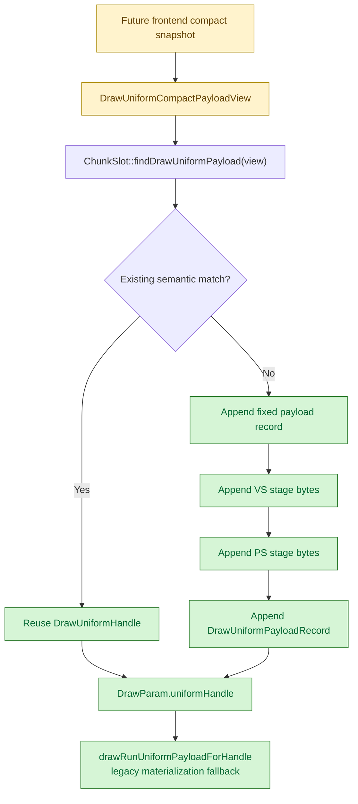

# Encode Phase 155 - Compact uniform append API gate

## Question

Can `ChunkSlot` consume an already-split compact uniform payload without first
receiving a full `DrawUniformPayload`, while preserving the same semantic
equality and legacy materialization behavior as the current full path?

## Verdict

Yes for the backend storage boundary. This does not yet reduce GT1 runtime
counters because `snapshotDrawSubmissionFromCurrentState()` still produces full
`DrawUniformPayload` snapshots, but it creates the deterministic append API that
H164 needs before frontend compact-owned submissions can be wired safely.

## Implementation

Added `DrawUniformCompactPayloadView` in `dxmt9_backend_types.hpp`. It carries:

- a borrowed fixed payload;
- VS and PS `DrawUniformStageConstantsSpan` metadata;
- borrowed VS and PS stage byte spans;
- vertex, pixel, fixed, and whole-payload hashes.

`ChunkSlot` now has compact overloads for:

- fixed payload find/append;
- VS/PS stage-constant find/append;
- whole uniform payload find/append.

The compact path reuses the existing slot-local hash chains and `last*Handle`
fast paths. It still compares fixed payload contents and stage bytes, not only
hashes, before reusing an existing handle.



## Native gate

Added `testChunkSlotCompactUniformPayloadAppendMatchesFullPath()` to
`dxmt9-dod-replay-observer-spec`.

The test:

1. builds a normal full `DrawUniformPayload`;
2. lets the existing full path append it once and produce compact fixed/stage
   records;
3. feeds those compact records into the new compact append path;
4. verifies the compact path appends one fixed record, one VS record, one PS
   record, and one payload record;
5. verifies compact lookup reuses the semantically matching handle;
6. verifies `drawRunUniformPayloadForHandle()` materializes the expected fixed,
   VS-prefix, PS-prefix, zero-filled outside-prefix, and whole payload hash.

Verification:

```sh
meson test -C build-arm64-nowine dxmt9-dod-replay-observer-spec
meson test -C build-arm64-nowine dxmt9-state-draw-transform-spec
```

Both passed.

## Runtime status

Runtime owner remains open. This gate only proves the backend storage API. The
next implementation step must move the producer side:

- add a compact owned submission carrier or replay scratch arena;
- make `snapshotDrawSubmissionFromCurrentState()` fill that compact form without
  copying a full 10 KiB `DrawUniformPayload` per draw;
- make `ChunkSlot::appendDrawRunBatch()` consume the compact form directly;
- rerun the `v0.0.3` no-gputrace GT1 gate and check
  `d3d9_snapshot_uniform_materialized_bytes`,
  `d3d9_snapshot_uniform_copy_cpu_ms`,
  `commit_chunk_queue_draw_submission_cpu_ms`, frame sampling, and P4
  no-enqueue counters.
