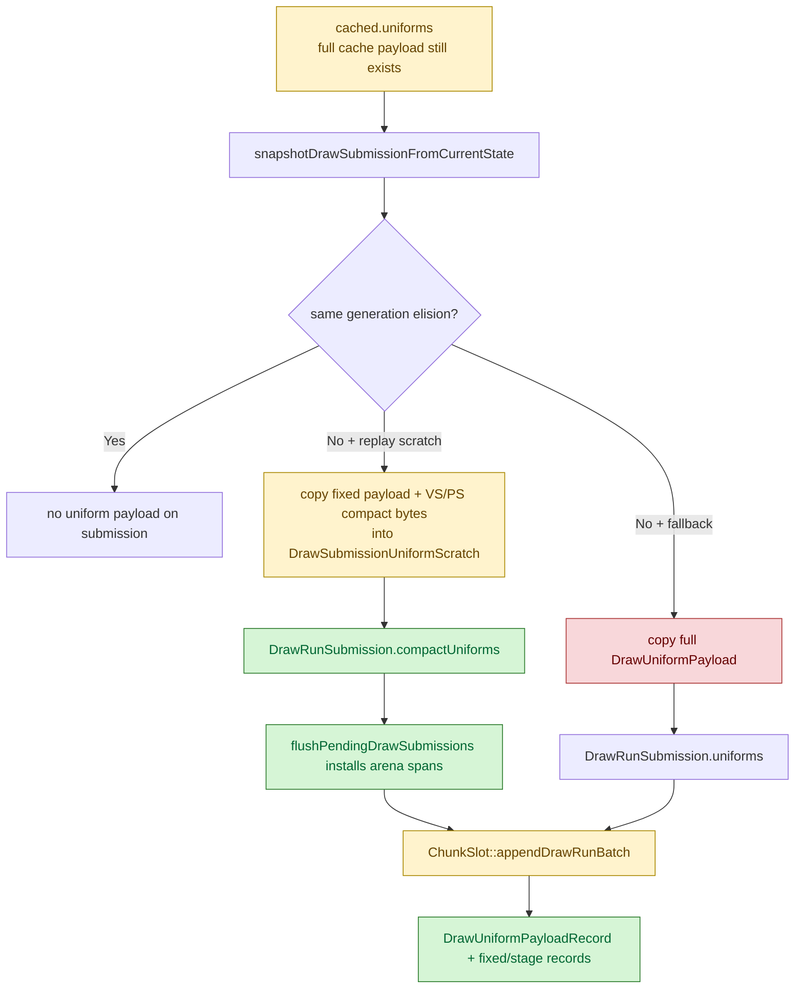
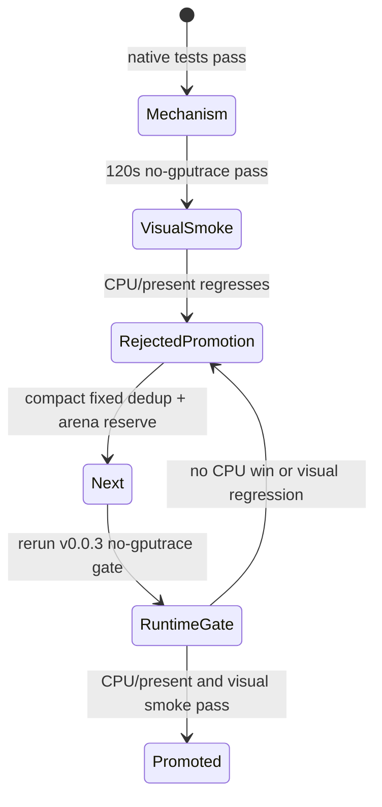

# Encode Phase 156 - Producer compact uniform submission runtime gate

## Question

Does wiring the H155 compact uniform append API back into the producer side
reduce the GT1 replay/snapshot owner, now that `v0.0.3` is the visual-safety
anchor?

## Verdict

Mechanism yes, runtime promotion no. The new opt-in path proves that
`snapshotDrawSubmissionFromCurrentState()` can queue a compact owned uniform
submission without materializing `DrawRunSubmission::uniforms`, and the backend
can append that compact form. It cuts measured materialized uniform bytes from a
full `10264B` payload to about `2922B` per materialized submission.

However, the current implementation does not improve the CPU owner. The 120s
no-gputrace gate is visually coherent, but normalized CPU time regresses:
`commit_chunk_queue_draw_submission_cpu_ms_per_present` moves
`3.776 -> 4.461ms`, and `sampled_avg_fps` moves `16.832 -> 14.441`. Do not
promote this as a performance win. Keep
`DXMT9_ENABLE_COMPACT_UNIFORM_SUBMISSIONS=1` default-off until the scratch-copy
shape is fixed.

## Implementation

The producer-side submission now has a compact carrier:

- `DrawUniformCompactSubmissionPayload`;
- `DrawUniformCompactPayloadArenaView`;
- `DrawSubmissionUniformScratch`.

When `DXMT9_ENABLE_COMPACT_UNIFORM_SUBMISSIONS=1` is set, chunk replay owns one
scratch arena per pending draw-submission batch. Each compact submission stores
an index into the fixed-payload scratch plus byte ranges for the VS and PS
stage-constant scratch. `flushPendingDrawSubmissions()` then installs stable
arena spans into every compact submission before `submitDrawSubmissionBatch()`.

The full path remains available for render trace and non-scratch callers.



## Native Gate

Focused native tests pass:

```sh
meson test -C build-arm64-nowine \
  dxmt9-dod-replay-observer-spec \
  dxmt9-core-device-com-spec \
  dxmt9-state-draw-transform-spec
```

Coverage added:

- producer snapshot can fill compact scratch without copying full
  `DrawUniformPayload`;
- compact batch submission is consumed by `ChunkSlot::appendDrawRunBatch()`;
- legacy materialization preserves fixed payload, hashes, counts, and used
  stage-constant prefix values.

## Runtime Gate

Command:

```sh
DXMT9_ENABLE_COMPACT_UNIFORM_SUBMISSIONS=1 \
bash scripts/tools/run_3dmark05_perf_probe.sh \
  --suffix h166-compact-submission-r1 \
  --no-gputrace \
  --timeout 120 \
  --frame-sampling
```

Output:

`experiments/output/app-d3d9-3dmark05-h166-compact-submission-r1`

The run is `status=pass` and timeout-finalized (`returncode=143`), which is
valid for this app because the wrapper supervised the known final-frame hang.
The broad smoke screenshot is visually coherent for the sampled frame: sparks,
bloom, geometry, and HUD are present, with no black/yellow screen or obvious
transparent-weapon regression. This is still a broad smoke, not an exact
same-frame diff against `v0.0.3`.

## Metrics

Baseline:

`experiments/output/app-d3d9-3dmark05-v003-current-baseline-r1-20260618`

| Metric | v0.0.3 baseline | H156 r1 | Direction |
|---|---:|---:|---:|
| `d3d9_snapshot_uniform_materialized_bytes / present` | `5.051MB` | `1.423MB` | `-71.83%` |
| bytes / materialized uniform | `10264B` | `2922B` | `-71.53%` |
| `d3d9_snapshot_uniform_copy_cpu_ms / present` | `0.144ms` | `0.160ms` | `+11.10%` |
| `d3d9_snapshot_draw_submission_cpu_ms / present` | `3.042ms` | `3.611ms` | `+18.70%` |
| `commit_chunk_queue_draw_submission_cpu_ms / present` | `3.776ms` | `4.461ms` | `+18.14%` |
| `submit_draw_run_batch_append_uniform_cpu_ms / present` | `0.653ms` | `0.715ms` | `+9.40%` |
| `commit_chunk_replay_cpu_ms / present` | `8.039ms` | `9.323ms` | `+15.96%` |
| `completion_wait_without_enqueue_ms / present` | `26.839ms` | `25.163ms` | `-6.24%` |
| `sampled_avg_fps` | `16.832` | `14.441` | worse |

The byte counter reports the compact candidate bytes because the producer path
actually stores compact data when the opt-in is enabled. The CPU movement says
the current carrier is not the right final shape.

## Interpretation

The old full `DrawUniformPayload` copy was real waste, but this patch replaces
one wide trivial copy with many smaller scratch appends and a second compact
append into `ChunkSlot`. That proves the storage boundary, not the final
low-cost implementation.

The next version must remove repeated compact-copy work instead of only
shrinking the payload:

1. deduplicate fixed payloads inside `DrawSubmissionUniformScratch` with an
   equality guard, because current GT1 adjacent fixed-payload hash remains
   effectively always stable;
2. reserve or size the scratch arenas from known batch/cardinality hints before
   filling them;
3. consider building the compact stage bytes directly from the uniform builder
   output rather than first building `cached.uniforms` and then gathering bytes
   out of it;
4. keep the H155 backend compact append API, but do not enable this producer
   path as a claimed performance win until per-present replay/snapshot CPU
   moves in the right direction.


