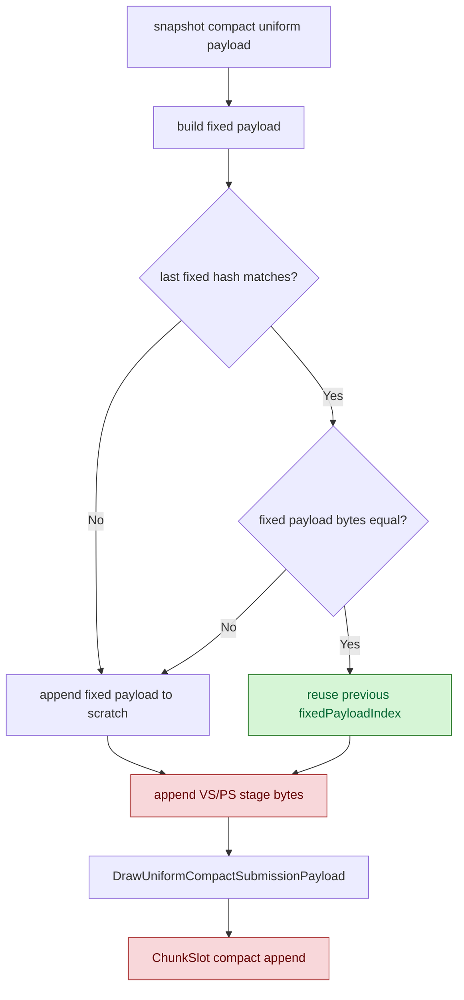
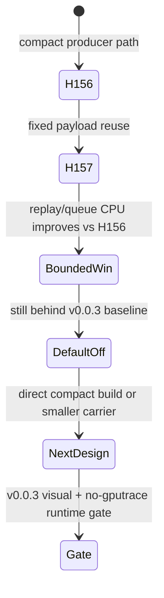

# Encode Phase 157 - Compact uniform fixed-payload reuse gate

> **Outdated — the knob or code path this experiment measured no longer exists in `src/`.** It cannot be re-run. Kept as history; do not cite it as current evidence.

## Question

Does reusing the previous compact fixed-payload record inside
`DrawSubmissionUniformScratch` remove enough scratch-copy overhead to make the
H156 compact producer path viable?

## Verdict

Fixed-payload reuse is a real bounded CPU improvement over H156, but it is not
enough to promote `DXMT9_ENABLE_COMPACT_UNIFORM_SUBMISSIONS=1` to default.

The no-gputrace runtime gate reports `763,709` fixed-payload reuses versus
`94,889` fixed-payload appends, saving a candidate `1.521GB` of fixed-payload
scratch copies. Normalized replay and submit-side CPU improve versus H156:
`commit_chunk_replay_cpu_ms_per_present` moves `9.323 -> 8.307ms`, and
`commit_chunk_queue_draw_submission_cpu_ms_per_present` moves
`4.461 -> 3.982ms`.

However, the path still does not beat the `v0.0.3` visual-safe baseline on the
same metric family. `v0.0.3` remains `8.039ms/present` replay,
`3.776ms/present` queue submission, and `16.832` sampled average FPS, while
H157 is `8.307ms/present`, `3.982ms/present`, and `16.377` sampled average FPS.
Keep the producer compact path opt-in/default-off.

## Implementation

`DrawSubmissionUniformScratch` now tracks the last appended fixed-payload hash
and index. When the next compact snapshot has the same fixed-payload hash, the
producer verifies byte equality against the existing scratch entry and reuses
the index instead of appending another fixed-payload copy. Stage constants still
use arena byte ranges.

The added counters are:

- `d3d9_snapshot_uniform_compact_fixed_payload_appends`;
- `d3d9_snapshot_uniform_compact_fixed_payload_reuses`;
- `d3d9_snapshot_uniform_compact_fixed_payload_reuse_saved_bytes`.



## Native Gate

Focused tests pass:

```sh
meson test -C build-arm64-nowine \
  dxmt9-core-device-com-spec \
  dxmt9-dod-replay-observer-spec \
  dxmt9-state-draw-transform-spec
```

The producer compact snapshot test now takes two snapshots with the same fixed
payload and different VS constants, and verifies that the fixed-payload scratch
entry count stays at `1`.

## Runtime Gate

Command:

```sh
DXMT9_ENABLE_COMPACT_UNIFORM_SUBMISSIONS=1 \
bash scripts/tools/run_3dmark05_perf_probe.sh \
  --suffix h167-compact-fixed-reuse-r1 \
  --no-gputrace \
  --timeout 120 \
  --frame-sampling
```

Output:

`experiments/output/app-d3d9-3dmark05-h167-compact-fixed-reuse-r1`

The run is `status=pass` and timeout-finalized (`returncode=143`), which is a
valid supervised 3DMark05 final-frame timeout. The broad smoke frame is
visually coherent against the `v0.0.3` anchor class: sparks, bloom, geometry,
and HUD are present, with no black/yellow screen or broad translucent-weapon
failure. This is still not a same-frame pixel diff.

## Metrics

| Metric | H156 compact | H157 fixed reuse | Direction |
|---|---:|---:|---:|
| `fixed_payload_appends` | n/a | `94,889` | observed |
| `fixed_payload_reuses` | n/a | `763,709` | observed |
| `fixed_payload_reuse_saved_bytes` | n/a | `1.521GB` | observed |
| `d3d9_snapshot_draw_submission_cpu_ms / present` | `3.611ms` | `3.216ms` | `-10.92%` |
| `commit_chunk_queue_draw_submission_cpu_ms / present` | `4.461ms` | `3.982ms` | `-10.73%` |
| `submit_draw_run_batch_append_uniform_cpu_ms / present` | `0.715ms` | `0.628ms` | `-12.08%` |
| `commit_chunk_replay_cpu_ms / present` | `9.323ms` | `8.307ms` | `-10.90%` |
| `d3d9_snapshot_uniform_copy_cpu_ms / present` | `0.160ms` | `0.257ms` | worse |
| `completion_wait_without_enqueue_ms / present` | `25.163ms` | `26.787ms` | worse |
| `sampled_avg_fps` | `14.441` | `16.377` | better than H156 |

Baseline comparison:

| Metric | `v0.0.3` baseline | H157 fixed reuse | Direction |
|---|---:|---:|---:|
| `d3d9_snapshot_uniform_materialized_bytes / present` | `4.817MiB` | `1.369MiB` | `-71.58%` |
| `d3d9_snapshot_draw_submission_cpu_ms / present` | `3.042ms` | `3.216ms` | worse |
| `commit_chunk_queue_draw_submission_cpu_ms / present` | `3.776ms` | `3.982ms` | worse |
| `submit_draw_run_batch_append_uniform_cpu_ms / present` | `0.653ms` | `0.628ms` | slightly better |
| `commit_chunk_replay_cpu_ms / present` | `8.039ms` | `8.307ms` | worse |
| `sampled_avg_fps` | `16.832` | `16.377` | worse/noisy |

## Interpretation

Adjacent fixed payload identity is real and cheap enough to exploit locally,
but the current producer compact path still carries too much overhead:

1. it still builds and hashes the full cached uniform payload before gathering a
   compact submission;
2. stage bytes still need per-draw range copying into the scratch arena;
3. `DrawRunSubmission` still carries the large optional full-payload storage
   footprint even when the compact path is used;
4. the runtime wall clock remains dominated by replay/publish plus
   completion-wait cadence, so local byte wins do not automatically become FPS.

The next compact-uniform work should target direct compact construction from
the uniform builder or a smaller submission carrier, not just more dedup inside
the scratch arena. Any promotion still needs the `v0.0.3` visual-safety gate.


